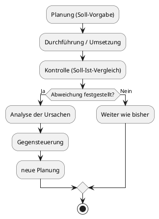
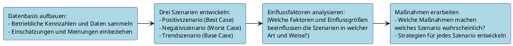

# Controlling

## 1. Aufgaben des Controllings

### 1.1 Was ist Controlling?

---

> [!IMPORTANT]
> **Wichtig:** Controlling ist **NICHT** gleichzusetzen mit Kontrolle!

---

Controlling ist ein **Prozess**, der vergleichbar ist mit dem **Führen eines Schiffes**: Es stellt die (Kenn-)Zahlen zur Verfügung, mit deren Hilfe der Betrieb **auf Kurs gehalten** werden kann.

Controlling unterstützt den Inhaber bei:

- **Zielbildung** – Was soll erreicht werden?
- **Zielsteuerung** – Wie steuern wir darauf hin?
- **Zielüberwachung** – Werden die Ziele erreicht?

### 1.2 Hauptaufgaben des Controllings im Handwerksbetrieb

| Aufgabe                             | Beschreibung                                            |
| ----------------------------------- | ------------------------------------------------------- |
| **Informationsbereitstellung**      | Dem Inhaber relevante Zahlen und Daten liefern          |
| **Anpassung von Führungsbereichen** | Bereiche koordinieren und bei Abweichungen gegensteuern |
| **Erkennung wichtiger Neuerungen**  | Entwicklungen und Veränderungen frühzeitig wahrnehmen   |

### 1.3 Ziel des Controllings

Das Ziel des Controllings ist es, **alle Unternehmensbereiche** (Beschaffung, Produktion, Absatz, Finanzen etc.) auf die **Unternehmensziele auszurichten**.

---

> [!IMPORTANT]
> **Prüfungshinweis:** Das Ziel ist die Ausrichtung **aller** Führungsbereiche – nicht nur der Produktion oder einzelner Abteilungen!

---

### 1.4 Controlling als Regelkreis (Prozess)



---

> [!NOTE]
> Controlling als Prozess bedeutet: **Ist- und Soll-Werte werden stets verglichen**, und bei Abweichungen **muss gegengesteuert werden**.

---

### 1.5 Operatives vs. Strategisches Controlling

| Merkmal          | Operatives Controlling                    | Strategisches Controlling                |
| ---------------- | ----------------------------------------- | ---------------------------------------- |
| **Zeithorizont** | Kurzfristig (bis 1 Jahr)                  | Mittel- und langfristig (> 1 Jahr)       |
| **Fokus**        | Laufende Betriebsabläufe                  | Zukunftssicherung, Erfolgspotenziale     |
| **Beispiele**    | Liquidität, Deckungsbeitrag, Jahresgewinn | Investitionen, Nachfolge, Produktpalette |
| **Planungsart**  | Detailliert, sofort umsetzbar             | Grob, qualitativ ausgerichtet            |

### 1.6 Instrumente des Controllings (Überblick)

- **Soll-Ist-Vergleich** – Planwerte vs. tatsächliche Werte
- **Branchenvergleich** – Eigene Zahlen vs. Branchendurchschnitt
- **Zeitvergleich** – Aktuelle Zahlen vs. Vorjahreswerte
- **Kennzahlenanalyse** – Regelmäßige Beobachtung ausgewählter Betriebskennzahlen
- **Schwachstellenanalyse** – Erkennen und Beseitigen von Schwächen
- **Szenariotechnik** – Vorhersage zukünftiger Entwicklungen
- **Balanced Scorecard (BSC)** – Ganzheitliche kennzahlenbasierte Managementmethode

## 2. Schwachstellenanalyse

### 2.1 Grundgedanke

---

> [!NOTE]
> In **jedem Betrieb sind** – unabhängig von seiner Größe – **Schwachstellen vorhanden**. Mithilfe der Schwachstellenanalyse gilt es, diese zu **erkennen und zu beseitigen**.

---

### 2.2 Die drei Schritte (Phasen) der Schwachstellenanalyse

```
┌─────────────────────────────────────────────────────────┐
│  SCHRITT 1: IST-ANALYSE                                 │
│  Gegenwärtigen Zustand erfassen                         │
│  → Alle betrieblichen Bereiche betrachten               │
│  → Nach Schwächen und Fehlern durchsuchen               │
│  → Schwachstellen festhalten                            │
└─────────────────────────────────────────────────────────┘
                          │
                          ▼
┌─────────────────────────────────────────────────────────┐
│  SCHRITT 2: URSACHENANALYSE                             │
│  Ursachen für die erkannten Schwachstellen suchen       │
│  → Warum existiert die Schwachstelle?                   │
│  → Welche internen/externen Faktoren wirken?            │
└─────────────────────────────────────────────────────────┘
                          │
                          ▼
┌─────────────────────────────────────────────────────────┐
│  SCHRITT 3: MASSNAHMENENTWICKLUNG                       │
│  Schwachstellen den Ursachen gegenüberstellen           │
│  → Maßnahmen zur Beseitigung der Schwächen entwickeln   │
│  → Umsetzung planen und kontrollieren                   │
└─────────────────────────────────────────────────────────┘
```

### 2.3 Unternehmensbereiche für die Schwachstellenanalyse

Die Schwachstellenanalyse kann in folgenden Bereichen eingesetzt werden:

- Rechnungswesen
- Kalkulation
- Marketing / Vertrieb
- Organisation
- Finanzwesen
- Personalwesen
- Planung

### 2.4 Tabellarische Schwachstellenübersicht (Beispiel aus der Fibel)

| Schwachstelle                                       | Ursache                                                        | Maßnahmen                                                                                                     |
| --------------------------------------------------- | -------------------------------------------------------------- | ------------------------------------------------------------------------------------------------------------- |
| Buchführung ist nicht auf dem neuesten Stand        | Rechnungen werden nur einmal im Monat erfasst bzw. geschrieben | Rechnungen werden ab sofort einmal pro Woche erfasst; zusätzliche Bürohilfe auf Stundenbasis wird eingestellt |
| Kunden haben Mühe, die Reparaturwerkstatt zu finden | Der Weg zur Werkstatt ist von der Straße aus nicht beschildert | Aufstellen von Hinweisschildern mit Firmenlogo                                                                |
| ...                                                 | ...                                                            | ...                                                                                                           |

---

> [!IMPORTANT]
> **Prüfungshinweis:** Die Schwachstellenübersicht enthält immer die drei Spalten: **Schwachstelle – Ursache – Maßnahmen**!

---

### 2.5 Werkzeuge zur Schwachstellenerkennung

| Methode                    | Beschreibung                                                                         |
| -------------------------- | ------------------------------------------------------------------------------------ |
| **Soll-Ist-Vergleich**     | Planwerte mit tatsächlichen Werten vergleichen → Abweichungen aufdecken              |
| **Branchenvergleich**      | Eigene Kennzahlen mit Branchendurchschnitt vergleichen → relative Schwächen erkennen |
| **Zeitvergleich**          | Aktuelle Zahlen mit Vorjahreswerten vergleichen → negative Trends erkennen           |
| **Jahresabschlussanalyse** | Durch Analyse von Bilanz und GuV Schwächestellen im Unternehmen erkennen             |

## 3. Szenariotechnik

### 3.1 Was ist die Szenariotechnik?

Die **Szenariotechnik** ist eine häufig verwendete Methode, um **zukünftige Entwicklungen vorherzusehen**. Dabei werden **Daten und Kennzahlen des Betriebes** mit **Einschätzungen und Meinungen** verknüpft.

### 3.2 Die drei Szenarien

| Szenario            | Beschreibung                                                            | Auch bekannt als     |
| ------------------- | ----------------------------------------------------------------------- | -------------------- |
| **Positivszenario** | Die **bestmögliche** denkbare Entwicklung für einen bestimmten Zeitraum | Best Case            |
| **Negativszenario** | Die **negativste** denkbare Entwicklung                                 | Worst Case           |
| **Trendszenario**   | Die **Fortsetzung der aktuellen Entwicklung** auf dem derzeitigen Stand | Base Case / Realcase |

### 3.3 Ablauf der Szenariotechnik (Schritt für Schritt)



### 3.4 Handwerker - Praxisbeispiel

---

> [!TIP]
> Ein Handwerksbetrieb prognostiziert seine **zukünftige Umsatzentwicklung** für das nächste Jahr:

---

| Szenario            | Annahme                          | Mögliche Maßnahme                                    |
| ------------------- | -------------------------------- | ---------------------------------------------------- |
| **Positivszenario** | Umsatzsteigerung von **+20 %**   | Einstellung eines zusätzlichen Vertriebsmitarbeiters |
| **Trendszenario**   | Umsatz wie im **Vorjahr** (±0 %) | Gleiche Vertriebsmannschaft beibehalten              |
| **Negativszenario** | Umsatzrückgang von **−20 %**     | Reduzierung des Vertriebsteams                       |

---

### 3.5 Wozu dient die Szenariotechnik?

- Vorbereitung auf **verschiedene Zukunftsentwicklungen**
- Frühzeitige Entwicklung von **Gegenmaßnahmen** für den Negativfall
- Erkennen von **Chancen** im Positivfall
- Grundlage für die **strategische Planung** im Betrieb
- Verknüpfung mit anderen Instrumenten wie der **SWOT-Analyse** und der **Balanced Scorecard**

## 4. Schnellübersicht: Die drei Controlling-Themen auf einen Blick

| Thema                     | Kernaussage                                                                   | Prüfungsrelevantes Stichwort                              |
| ------------------------- | ----------------------------------------------------------------------------- | --------------------------------------------------------- |
| **Aufgaben Controlling**  | Informationsbereitstellung, Koordination aller Bereiche auf Unternehmensziele | „Controlling ≠ Kontrolle", Regelkreis, Soll-Ist-Vergleich |
| **Schwachstellenanalyse** | 3 Schritte: Ist-Analyse → Ursachen → Maßnahmen                                | Tabelle: Schwachstelle / Ursache / Maßnahme               |
| **Szenariotechnik**       | 3 Szenarien: Positiv / Trend / Negativ + Maßnahmen                            | Best Case / Base Case / Worst Case                        |

## 5. Prüfungsrelevante Merksätze

---

> [!TIP]
>
> - **Controlling ist kein Synonym für Kontrolle** – es ist ein umfassender Steuerungsprozess!
> - **Ziel des Controllings:** Alle Führungsbereiche – nicht nur die Produktion – auf die Unternehmensziele ausrichten.
> - **Schwachstellenanalyse = 3 Phasen:** Ist-Analyse → Ursachenanalyse → Maßnahmenentwicklung.
> - **Szenariotechnik = 3 Szenarien:** Positiv (Best Case) + Negativ (Worst Case) + Trend (Base Case).
> - **Controlling als Prozess** bedeutet: Ist- und Soll-Werte werden stets verglichen, bei Abweichungen wird gegengesteuert.

---
