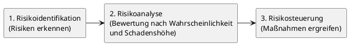

# Marketing I

## 1. Unternehmensziele, Unternehmensleitbild und Unternehmenskultur

### 1.1 Unternehmensziele

Ziele sind durch menschliches Handeln angestrebte zukünftige Zustände. Sie dienen als Maßstab, der es ermöglicht, Arbeitsergebnisse zu bewerten, und geben die Richtung vor, in die sich ein Unternehmen entwickeln soll. Da Handwerksbetriebe in der Regel eine Vielzahl von Zielen verfolgen, müssen diese systematisch geordnet und auf ihre gegenseitigen Wirkungen hin analysiert werden.

Ziele erfüllen dabei mehrere Funktionen:

- **Informationsfunktion** — sie informieren Bezugsgruppen (Banken, Kunden, Kooperationspartner) über geplante Aktivitäten.
- **Motivationsfunktion** — sie geben Mitarbeitern Vorgaben und können durch Anreize wie Prämien verstärkt werden.
- **Kontrollfunktion** — sie liefern einen Soll-Wert, mit dem das tatsächlich Erreichte (Ist-Wert) verglichen werden kann.
- **Koordinationsfunktion** — gemeinsame Ziele sorgen für abgestimmtes Verhalten aller Unternehmensteile.

#### Zielkategorien im Überblick

| Kriterium             | Ausprägungen                                           |
| --------------------- | ------------------------------------------------------ |
| Hierarchische Ordnung | Oberziele – Zwischenziele – Unterziele                 |
| Leistungsbezug        | Formalziele – Sachziele                                |
| Bewertung             | monetäre Ziele – nicht monetäre Ziele                  |
| Bedeutung             | Hauptziele – Nebenziele                                |
| Messbarkeit           | quantitative Ziele – qualitative Ziele                 |
| Zeitraum              | operative Ziele – taktische Ziele – strategische Ziele |
| Träger                | persönliche Ziele – unternehmerische Ziele             |
| Inhalt                | Erfolgsziele – Finanzziele – Sozialziele               |

---

> [!IMPORTANT]
> **Merke:** Operative Ziele beziehen sich auf einen Zeitraum bis zu einem Jahr (z. B. Jahresumsatz, Liquidität). Taktische Ziele umfassen zwei bis drei Jahre. Strategische Ziele sind langfristig auf mehr als drei Jahre ausgerichtet (z. B. Einführung neuer Produkte, Bindung von Fachkräften).

---

#### 1.1.1 Erfolgsziele

Handwerksbetriebe werden in der Regel erwerbswirtschaftlich geführt. Die langfristige und sichere Gewinnerzielung ist daher eines der wichtigsten Erfolgsziele, denn sie sichert den Lebensunterhalt des Unternehmers und seiner Familie.

#### 1.1.2 Finanzziele

Finanzziele umfassen die Sicherung der Zahlungsfähigkeit (Liquidität), die Erhaltung und den Aufbau von Eigenkapital sowie die Rentabilität des eingesetzten Kapitals. Die Liquidität gilt dabei als Nebenbedingung: Ohne ausreichende Zahlungsfähigkeit ist kein Betrieb dauerhaft überlebensfähig.

#### 1.1.3 Sozialziele

Sozialziele betreffen die gesellschaftliche Verantwortung des Betriebes. Dazu zählen die Sicherung von Arbeitsplätzen, die Verminderung von Umweltbelastungen sowie die Förderung von Mitarbeiterzufriedenheit und Betriebsklima. Nachhaltigkeitsziele gewinnen für Handwerksbetriebe zunehmend an Bedeutung und umfassen ökonomische, ökologische und soziale Aspekte.

### 1.2 Zielbeziehungen und Zielsystem

Da Handwerksbetriebe stets mehrere Ziele gleichzeitig verfolgen, müssen diese in einem **Zielsystem** geordnet werden. Ein Zielsystem erfasst die Beziehungen zwischen Ober- und Unterzielen sowie Haupt- und Nebenzielen und macht Zielkonflikte sichtbar.

#### 1.2.1 Komplementäre Ziele (Zielharmonie)

Als komplementär werden Ziele bezeichnet, die sich gegenseitig fördern: Die Verbesserung einer Zielgröße verbessert gleichzeitig die andere. Komplementäre Ziele bilden die Grundlage für Zielhierarchien, bei denen Unterziele das Oberziel stufenweise konkretisieren (Mittel-Zweck-Beziehung).

**Beispiel:** Höhere Kundenzufriedenheit → mehr Folgeaufträge → höherer Umsatz → höherer Gewinn.

#### 1.2.2 Konfliktäre Ziele (Zielkonkurrenz)

Zwei Ziele stehen in Konkurrenz, wenn die Verwirklichung des einen die Erreichung des anderen negativ beeinflusst. Zielkonflikte können auf drei Wegen aufgelöst werden:

- **Gewichtung** — quantitative Ziele werden durch eine Gewichtung vergleichbar gemacht.
- **Satisfizierung** — für alle Ziele werden Mindestniveaus festgelegt, die gleichzeitig erreichbar sind.
- **Priorisierung** — ein Ziel wird zum dominanten Hauptziel erklärt.

**Beispiel:** Höhere Produktqualität erfordert sorgfältigere Arbeit und bessere Materialien → höhere Kosten → geringerer Gewinn.

#### 1.2.3 Indifferente Ziele (Zielneutralität)

Zwei Ziele sind indifferent, wenn die Erreichung des einen keinerlei Auswirkung auf die Erreichung des anderen hat.

---

> [!TIP]
> **Prüfungstipp:** Im GFK-Examen wird häufig gefragt, welche Zielbeziehung zwischen zwei vorgegebenen Zielen besteht. Lernen Sie die drei Typen (komplementär, konfliktär, indifferent) mit je einem konkreten Beispiel aus dem Handwerk.

---

### 1.3 Unternehmenskultur

**Unternehmenskultur** ist die Gesamtheit von Traditionen, Werten, Regeln, Glaubenssätzen und Haltungen, die den Rahmen für alles bilden, was in einem Unternehmen gedacht oder getan wird. Sie wirkt auf alle Bereiche und Aktivitäten eines Betriebes und ist ein äußerst wichtiger Wettbewerbsfaktor.

Grundsätzlich hat jedes Unternehmen — ob bewusst oder unbewusst — eine Kultur, da sie sich automatisch auf Basis der geteilten Erfahrungen der Belegschaft entwickelt. Unternehmenskultur ist nur sehr langsam zu verändern und muss laufend an die sich ändernden Marktverhältnisse angepasst werden.

Das **Unternehmensimage** — das Bild, das andere von einem Unternehmen haben — wird in entscheidender Weise durch die Unternehmenskultur geprägt:

| Element der Unternehmenskultur | Wirkung auf das Image |
| ------------------------------ | --------------------- |
| Bereitschaft zur Fortbildung   | innovativ             |
| Termintreue                    | zuverlässig           |
| Arbeitsweise und -kleidung     | sauber arbeitend      |
| Meisterbetrieb                 | fachkundig            |
| Kundenorientierung             | freundlich            |

#### 1.3.1 Symbole und Rituale

**Symbole** sind direkt wahrnehmbare Zeichen oder Objekte mit tieferer Bedeutung, die Unternehmenskultur und -image nachhaltig beeinflussen können. Beispiele: Firmenlogo, einheitliche Arbeitskleidung, Zertifikate, der Meisterstatus oder das Innungszeichen.

**Rituale** sind nach bestimmten Regeln ablaufende Aktivitäten, die sich in unveränderter Weise wiederholen und Zugehörigkeit, Wertschätzung oder eine Geisteshaltung zum Ausdruck bringen. Beispiele: Betriebsausflüge, Weihnachtsfeiern, Teambesprechungen, Einstandsfeiern. Gelungene Rituale stärken das Gemeinschaftsgefühl und können in Zeiten knapper Fachkräfte ein wirksames Mittel zur Mitarbeiterbindung sein.

#### 1.3.2 Normen und Werte

**Normen** sind verhaltensorientierte Regeln, die festlegen, was Menschen in bestimmten Situationen tun oder unterlassen sollen. Sie haben einen konkreten Situationsbezug. Die stärkste Form von Normen sind gesetzliche Regelungen (BGB, HGB, Wettbewerbsrecht), deren Nichtbeachtung mit Sanktionen belegt wird.

**Werte** sind allgemeine Vorstellungen darüber, was von der überwiegenden Mehrheit der Gesellschaft als richtig und wünschenswert erachtet wird. Sie existieren situationsunabhängig. Wichtige Werte für Handwerksbetriebe sind beispielsweise Umweltschutz, Nachhaltigkeit und soziales Engagement.

---

> [!IMPORTANT]
> **Merke:** Normen sind auf konkrete Handlungssituationen bezogen; Werte sind situationsunabhängig gültig. Normen können als Konkretisierung übergeordneter Werte verstanden werden.

---

### 1.4 Unternehmensleitbild

Das **Unternehmensleitbild** ist eine schriftliche Beschreibung des unternehmerischen Selbstverständnisses, die auf der systematischen Zusammenstellung von strategischen Grundsätzen, Zielen, Wertvorstellungen und zentralen Verhaltensregeln basiert. Es soll das Denken und Handeln im betrieblichen Alltag prägen und einen Rahmen für unternehmerische Entscheidungen vorgeben.

Das Leitbild beantwortet drei grundlegende Fragen:

- **Mission:** Wer will ich mit meinem Unternehmen sein, und worin sehe ich meine Aufgabe?
- **Vision:** Was will ich mit meinem Unternehmen erreichen?
- **Werte:** Wie will ich dies erreichen?

Ein Leitbild sollte gemeinsam von Betriebsinhaber und Mitarbeitern entwickelt werden, damit sich alle damit identifizieren können. Es ist sowohl nach innen (Mitarbeiter) als auch nach außen (Kunden, Lieferanten) gerichtet und mündet in die gelebte Unternehmenskultur.

---

> [!TIP]
> **Prüfungstipp:** Wichtige Bestandteile eines Leitbildes sind strategische Grundsätze, Wertvorstellungen und Verhaltensregeln — nicht Buchhaltungsgrundsätze oder Bilanzierungswahlrechte. Diese Abgrenzung erscheint regelmäßig als Multiple-Choice-Frage.

---

## 2. Planungsbereiche und Planungsphasen

### 2.1 Grundlagen der Unternehmensplanung

**Planung** lässt sich als Prozess definieren, der zukünftige Entwicklungen gedanklich vorwegnimmt. Das Ergebnis von Planungen sind Pläne, mit deren Hilfe an die Umsetzung der geplanten Vorhaben herangegangen werden kann.

Die Unternehmensplanung ist Aufgabe des Betriebsinhabers, der die **Richtlinienkompetenz** innehat. Einzelne Planbestandteile können an Mitarbeiter delegiert werden. Die Hauptaufgaben regelmäßiger Planung sind:

- Sicherung des Unternehmenserfolges und verbesserter Umgang mit Risiken
- Verfeinerung von Problemstellungen
- Schaffung eines Flexibilitätsspielraums

Ein vollständiger Plan umfasst folgende Bestandteile:

| Frage                           | Planbestandteil |
| ------------------------------- | --------------- |
| Was soll erreicht werden?       | Ziele           |
| Unter welchen Bedingungen?      | Grundannahmen   |
| Warum soll es getan werden?     | Problemstellung |
| Wie soll es getan werden?       | Maßnahmen       |
| Womit soll es getan werden?     | (Hilfs-)Mittel  |
| Bis wann soll es erreicht sein? | Zeit            |
| Wer soll es tun?                | Personen        |
| Welches Resultat wird erwartet? | Ergebnisse      |

Der Planungsprozess ist als geschlossener **Regelkreis** zu verstehen: Planung → Steuerung → Kontrolle. Wird eine Planabweichung festgestellt, wird dies zum Anlass genommen, neue Planungen durchzuführen.

### 2.2 Operative und strategische Planung

Je nach Planungshorizont unterscheidet man zwischen operativer und strategischer Planung:

| Merkmal          | Operative Planung                                                          | Strategische/Taktische Planung                                                                 |
| ---------------- | -------------------------------------------------------------------------- | ---------------------------------------------------------------------------------------------- |
| Planungszeitraum | Kürzer als 1 Jahr                                                          | Länger als 1 Jahr                                                                              |
| Planungsgrößen   | Produktionsmengen, Terminierung, Personaleinsatz, kurzfristige Liquidität  | Unternehmensgrundsätze, Produktpalette, langfristiger Personalbedarf, Investitionen, Nachfolge |
| Merkmale         | Sofort umsetzbar, konkrete Handlungsweisungen, detailliert und vollständig | Nicht sofort umsetzbar, Handlungsziele und -absichten, qualitative Ausrichtung                 |

---

> [!NOTE]
> Im Handwerk sind grundsätzlich relativ kurze Planungszeiträume anzunehmen. Taktische Planungen (1–4 Jahre) können in die strategischen Planungen aufgenommen werden.

---

### 2.3 Planungsbereiche und deren Abstimmung

Planung bezieht sich auf sechs wesentliche betriebliche Bereiche, die miteinander abgestimmt werden müssen:

| Planungsbereich   | Wichtige Planungsgrößen                     |
| ----------------- | ------------------------------------------- |
| **Beschaffung**   | Material, Maschinen, Gebäude, Informationen |
| **Produktion**    | Mengen, Zeiten, Verfahren                   |
| **Absatz**        | Sortiment, Preise, Marktauftritt, Mengen    |
| **Finanzen**      | Kapitalbedarf, Kapitalstruktur, Liquidität  |
| **Investitionen** | Wirtschaftlichkeit, Rentabilität            |
| **Personal**      | Anzahl, Arbeitszeiten, Entlohnung           |

Die Planungsbereiche sind eng miteinander verknüpft: Beschaffungs-, Produktions- und Absatzpläne müssen in der Finanz- und Liquiditätsplanung berücksichtigt werden. Umgekehrt begrenzen die verfügbaren Finanzmittel die Möglichkeiten in den übrigen Bereichen. Selbst in kleinen Betrieben erfordert die Koordination aller Pläne erheblichen Aufwand.

---

> [!TIP]
> **Prüfungstipp:** Die Absatzplanung erstreckt sich auf Sortiment, Preise, Marktauftritt und Mengen — nicht auf Produktionsverfahren oder Kapitalbedarf. Diese Abgrenzung ist prüfungsrelevant.

---

### 2.4 Planungsphasen (Planungsschema)

Die Unternehmensplanung sollte nach einem festen Schema in sechs Phasen ablaufen. Der gesamte Planungsprozess sollte schriftlich dokumentiert werden, um die Fehlersuche bei Zielabweichungen zu erleichtern.

```
Phase 1: Zielformulierung
Phase 2: Problemstellung
Phase 3: Alternativensuche
Phase 4: Prognose der Auswirkungen
Phase 5: Bewertung der Alternativen
Phase 6: Entscheidung
```

**Phase 1 – Zielformulierung:** Die projektbezogenen Ziele werden formuliert und auf ihre Realisierbarkeit geprüft. Mögliche Konflikte mit anderen Unternehmenszielen sind zu berücksichtigen.

**Phase 2 – Problemstellung:** Das zu lösende Problem wird klar analysiert und in lösbare Teilprobleme gegliedert.

**Phase 3 – Alternativensuche:** Verschiedene Lösungsansätze werden entwickelt und zusammengestellt.

**Phase 4 – Prognose der Auswirkungen:** Die voraussichtlichen Konsequenzen jeder Alternative werden abgeschätzt.

**Phase 5 – Bewertung der Alternativen:** Die Alternativen werden anhand des Zielerreichungsgrades bewertet. Sind mehrere Alternativen gleichwertig, entscheiden Zeit, Geld und Personal.

**Phase 6 – Entscheidung:** Der Betriebsinhaber trifft die abschließende Entscheidung. Daran schließen sich **Realisierung** und **Kontrolle** an, in der Ist- und Soll-Werte verglichen werden.

---

> [!IMPORTANT]
> **Merke:** Der betriebliche Planungsprozess gliedert sich in **Planung – Steuerung – Kontrolle**. Dieser Regelkreis wiederholt sich so lange, bis die gewünschten Resultate vorliegen.

---

## 3. Risikomanagement

### 3.1 Grundlagen der Risikovorsorge

Jede unternehmerische Tätigkeit ist Risiken unterworfen. Diese zu erkennen und möglichst gering zu halten, ist Aufgabe der **Risikovorsorge**. Sie ist Pflicht des Betriebsinhabers und gliedert sich in drei aufeinander aufbauende Stufen:



### 3.2 Risikoidentifikation: Externe und interne Risiken

Bedrohungen für den Betrieb können von außen (externe Risiken) oder innen (interne Risiken) kommen. Auf externe Risiken hat der Handwerksbetrieb meist keine direkten Einflussmöglichkeiten; interne Risiken sind in den meisten Fällen „hausgemacht".

| Externe Risiken                                 | Interne Risiken               |
| ----------------------------------------------- | ----------------------------- |
| Konjunkturschwankungen                          | Umsatz- und Kostenentwicklung |
| Marktveränderungen                              | Materialengpass               |
| Änderung der Gesetze                            | Produktionsausfall            |
| Tarifpolitik                                    | Veraltung der Maschinen       |
| Steuerpolitik                                   | Mitarbeiterfluktuation        |
| Umweltgesetzgebung                              | Mangelhafte Produktqualität   |
| Naturgewalten (Feuer, Hagel, Sturm, Hochwasser) | Haftungsrisiken               |
| Arbeitsmarktveränderungen                       | Liquiditätsengpässe           |
|                                                 | Fehlende Nachfolgeplanung     |
|                                                 | Datenverlust                  |
|                                                 | Chefausfall                   |

### 3.3 Risikoanalyse

Risiken lassen sich durch zwei Kriterien beschreiben: **Schadenswahrscheinlichkeit** und **(finanzielle) Schadenshöhe**. Das Ergebnis der Analyse kann in einer Matrix dargestellt werden. Risiken mit hoher Eintrittswahrscheinlichkeit und großem finanziellen Schaden sind dabei besonders dringlich.

**Beispiel einer Risikobewertung:**

| Risiko                   | Schadenshöhe | Wahrscheinlichkeit | Steuerungsmaßnahme                            |
| ------------------------ | ------------ | ------------------ | --------------------------------------------- |
| Brand, Unwetterschaden   | sehr hoch    | gering             | Versicherung, Vorbeugung                      |
| Chefausfall              | hoch         | mittel             | Notfallordner, Vertretungsregeln              |
| Materialengpässe         | hoch         | mittel             | Vorratshaltung, mehrere Lieferanten           |
| Produkthaftung           | hoch         | gering             | Qualitätsmanagement, Versicherung             |
| Mitarbeiterfluktuation   | mittel       | hoch               | Betriebsklima, Lohnniveau                     |
| Kreditkündigung der Bank | hoch         | gering             | Zweite Bankverbindung, hohe Eigenkapitalquote |
| Ausfall von Maschinen    | mittel       | mittel             | Kooperation, regelmäßige Wartung              |

### 3.4 Risikosteuerung: Die vier Strategien

Sind die Risiken erkannt und analysiert, gilt es, geeignete Maßnahmen zu ergreifen. Es gibt vier Strategien zur Risikosteuerung, die je nach Art des Risikos unterschiedlich gut geeignet sind und auch kombiniert werden können:

**Vermeidung:** Das Risiko wird durch Verzicht auf die risikobehaftete Aktivität ausgeschlossen. Beispiel: Dem Risiko „Forderungsausfall" wird durch Vorauskasse begegnet; Angebote von Kunden mit eingeschränkter Bonität werden nicht angenommen. → Vollständige Vermeidung ist in der Praxis selten möglich.

**Vorbeugung:** Maßnahmen werden ergriffen, um die Eintrittswahrscheinlichkeit eines Risikos zu senken. Beispiel: Regelmäßige Maschinenwartung reduziert das Risiko eines Produktionsausfalls.

**Begrenzung:** Der finanzielle Schaden im Eintrittsfall wird minimiert. Beispiel: Aufbau eines Wissensmanagement-systems gegen Know-how-Verlust durch Mitarbeiterfluktuation; Anlage eines **Notfallordners** mit Ansprechpartnern, Passwörtern, Kontodaten und Vertretungsregeln für den Fall des Chefausfalls.

**Übertragung:** Das Risiko wird auf Dritte (Lieferanten, Kunden, Subunternehmer) oder auf Versicherungen übertragen. Die wichtigste Form des Schutzes vor finanziellen Folgen ist der **Abschluss von Versicherungen**.

---

> [!IMPORTANT]
> **Merke:** Die vier Strategien zur Risikosteuerung lauten: **Vermeidung – Vorbeugung – Begrenzung – Übertragung**. Diese Reihenfolge und Abgrenzung ist prüfungsrelevant.

---

### 3.5 Wichtige Versicherungen zur Risikoabdeckung

| Personenversicherungen | Sachversicherungen                 |
| ---------------------- | ---------------------------------- |
| Krankenversicherung    | Kfz-Versicherung                   |
| Lebensversicherung     | Privathaftpflichtversicherung      |
| Unfallversicherung     | Berufshaftpflichtversicherung      |
|                        | Produkthaftpflichtversicherung     |
|                        | Betriebsunterbrechungsversicherung |
|                        | Einbruchdiebstahlversicherung      |
|                        | Gebäude-/Feuerversicherung         |

---

> [!TIP]
> **Prüfungstipp:** Risikovorsorge ist auch für kleine Handwerksbetriebe notwendig — sie ist nicht Aufgabe des Versicherungsvertreters, sondern des Betriebsinhabers. Risiken können bereits vor einem Schadensfall bewertet werden. Diese Aussagen erscheinen häufig als Richtig-/Falsch-Aufgaben.

---

## Schnellübersicht – Wichtige Begriffe auf einen Blick

| Begriff                  | Kurzdefinition                                                                                |
| ------------------------ | --------------------------------------------------------------------------------------------- |
| **Unternehmensziel**     | Durch menschliches Handeln angestrebter zukünftiger Zustand; Maßstab für Erfolg               |
| **Formalziel**           | Monetäre Erfolgsgröße (z. B. Gewinn, Rentabilität)                                            |
| **Sachziel**             | Leistungsbezogenes Ziel (z. B. Produktqualität, Sortiment)                                    |
| **Zielsystem**           | Geordnete Gesamtheit aller Unternehmensziele mit ihren Beziehungen                            |
| **Komplementäre Ziele**  | Ziele, die sich gegenseitig fördern (Zielharmonie)                                            |
| **Konfliktäre Ziele**    | Ziele, die in Konkurrenz stehen (Zielkonflikt)                                                |
| **Indifferente Ziele**   | Ziele ohne gegenseitige Beeinflussung (Zielneutralität)                                       |
| **Unternehmenskultur**   | Gesamtheit von Traditionen, Werten, Regeln und Haltungen im Unternehmen                       |
| **Unternehmensleitbild** | Schriftliche Beschreibung des unternehmerischen Selbstverständnisses (Mission, Vision, Werte) |
| **Operative Planung**    | Kurzfristige Planung (< 1 Jahr), detailliert und sofort umsetzbar                             |
| **Strategische Planung** | Langfristige Planung (> 1 Jahr), qualitativ ausgerichtet                                      |
| **Regelkreis**           | Planungsprozess: Planung → Steuerung → Kontrolle → neue Planung                               |
| **Risikoidentifikation** | Erkennen möglicher interner und externer Risiken                                              |
| **Risikoanalyse**        | Bewertung nach Schadenswahrscheinlichkeit und Schadenshöhe                                    |
| **Risikosteuerung**      | Maßnahmen: Vermeidung, Vorbeugung, Begrenzung, Übertragung                                    |
| **Notfallordner**        | Dokument mit wichtigen Informationen für den Fall des Chefausfalls                            |
