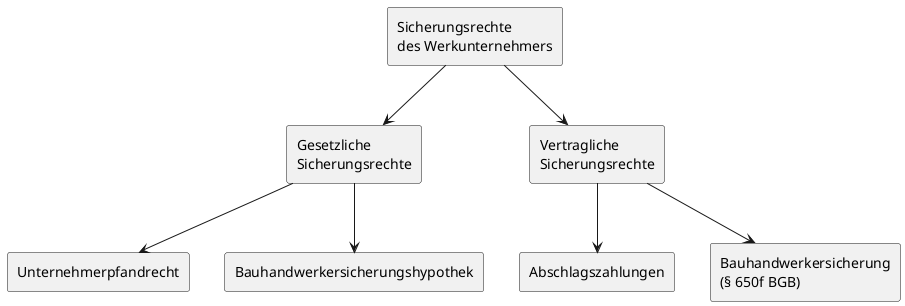

# Recht

## 1. Sicherungsmöglichkeiten Werklohn

### 1.1 Überblick und Bedeutung

Der Handwerksbetrieb tritt bei der Auftragsausführung regelmäßig in Vorleistung – er beschafft Material, setzt Personal ein und erbringt die Werkleistung, bevor er bezahlt wird. Um die Werklohnforderung abzusichern, stellt der Gesetzgeber mehrere Sicherungsrechte bereit. Diese lassen sich grundsätzlich in **gesetzliche** und **vertragliche** Sicherungsrechte unterteilen.

### 1.2 Unternehmerpfandrecht (gesetzliches Pfandrecht)

Das **Unternehmerpfandrecht** ist ein gesetzliches Pfandrecht des Werkunternehmers an den beweglichen Sachen des Bestellers, die im Rahmen der Werkleistung in seinen Besitz gelangt sind. Es sichert die Vergütungsforderung sowie Auslagen.

**Wirkungsweise:** Zahlt der Kunde nicht und nimmt er die fertige Sache trotz Fristsetzung nicht ab, kann der Handwerker den Gegenstand nach erfolgloser Mahnung und Fristsetzung gerichtlich versteigern lassen. Aus dem Erlös deckt er seinen Werklohnanspruch.

**Beispiel:** Ein Betrieb hat einen Geldschrank in seiner Werkstatt repariert, die Rechnung gestellt und erfolglos eine Abnahmefrist gesetzt. Der Kunde zahlt nicht. Der Handwerker kann den Gegenstand nach Ablauf der Frist gerichtlich versteigern lassen.

---

> [!IMPORTANT]
> **Merke:** Das Unternehmerpfandrecht entsteht kraft Gesetzes – es bedarf keiner vertraglichen Vereinbarung. Es besteht nur, solange der Handwerker den Besitz an der Sache hat.

---

### 1.3 Bauhandwerkersicherungshypothek

Für Handwerker, die ein **Bauwerk** errichten oder wesentlich verändern, gibt das Gesetz einen Anspruch auf Eintragung einer **Sicherungshypothek** im Grundbuch des Baugrundstücks. Dieser Anspruch besteht bereits vor Fertigstellung des Werkes.

- Die Hypothek sichert die künftige Werklohnforderung am Grundstück des Bauherrn ab.
- Die Eintragung erfordert eine notarielle Beurkundung und die Eintragung im Grundbuch.
- Der Bauherr bleibt Eigentümer, das Grundstück wird jedoch mit der Hypothek belastet.

### 1.4 Bauhandwerkersicherung (§ 650f BGB)

Bei Bauverträgen mit **Gewerbekunden** kann der Unternehmer vom Besteller eine Sicherheitsleistung in Höhe von bis zu **110 % der Gesamtvergütung** verlangen. Diese Sicherheit kann durch Bürgschaft, Hinterlegung oder andere geeignete Mittel erbracht werden.

**Beispiel aus den Unterlagen:** Der Betrieb verlangt vom Gewerbekunden nach schriftlicher Auftragserteilung vom 18.07.2025 – Beginn der Installationsarbeiten laut Vertrag am 07.08.2025 – am 21.07.2025 unter Fristsetzung bis 04.08.2025 Sicherheit in Höhe von 110 % der Gesamtvergütung. Läuft die Frist erfolglos ab, kann er kündigen oder seine Leistung verweigern.

### 1.5 Abschlagszahlungen

Unabhängig von den genannten Sicherungsrechten hat der Unternehmer das Recht, **Abschlagszahlungen** für bereits erbrachte und vertragsgemäße Leistungen zu verlangen. Dies verbessert die Liquidität und reduziert das Ausfallrisiko.

---

> [!TIP]
> **Prüfungstipp:** Im Examen wird häufig gefragt, welche Sicherungsmöglichkeiten dem Handwerker zur Verfügung stehen. Die drei Kernbegriffe sind: **Unternehmerpfandrecht**, **Bauhandwerkersicherungshypothek** und **Bauhandwerkersicherung**. Abschlagszahlungen nicht vergessen!

---

### 1.6 Vergleichstabelle: Sicherungsrechte des Werkunternehmers

| Sicherungsrecht                     | Art                    | Voraussetzung                         | Wirkung                                             |
| ----------------------------------- | ---------------------- | ------------------------------------- | --------------------------------------------------- |
| Unternehmerpfandrecht               | Gesetzlich             | Besitz an der Sache des Bestellers    | Verwertung durch Versteigerung                      |
| Bauhandwerkersicherungshypothek     | Gesetzlich             | Errichtung/Veränderung eines Bauwerks | Eintragung im Grundbuch; Verwertung des Grundstücks |
| Bauhandwerkersicherung (§ 650f BGB) | Vertraglich/gesetzlich | Bauvertrag mit Gewerbekunde           | Sicherheitsleistung bis 110 % der Vergütung         |
| Abschlagszahlungen                  | Vertraglich/gesetzlich | Erbrachte Teilleistungen              | Laufende Zahlungen vor Abnahme                      |

---

## 2. Nichtigkeitsgründe bei Rechtsgeschäften

### 2.1 Begriff der Nichtigkeit

Ein **nichtiges Rechtsgeschäft** entwickelt von Anfang an keine Rechtswirksamkeit – es ist _ex tunc_ (von Anfang an) unwirksam. Es bedarf keiner Anfechtung; die Nichtigkeit tritt automatisch ein.

### 2.2 Die wichtigsten Nichtigkeitsgründe

Das BGB kennt mehrere Tatbestände, die zur Nichtigkeit eines Rechtsgeschäfts führen:

1. **Geschäftsunfähigkeit** – Ein Rechtsgeschäft, das mit einem Geschäftsunfähigen (z. B. Kind unter 7 Jahren, dauerhaft geistig Erkrankter) abgeschlossen wird, ist nichtig.
2. **Beschränkt Geschäftsfähiger ohne Zustimmung** – Rechtsgeschäfte eines Minderjährigen (7–17 Jahre) ohne Einwilligung oder nachträgliche Genehmigung des gesetzlichen Vertreters sind schwebend unwirksam und werden bei Verweigerung der Zustimmung nichtig.
3. **Schein- und Scherzgeschäfte** – Willenserklärungen, die erkennbar nicht ernst gemeint sind oder nur zum Schein abgegeben werden, sind nichtig.
4. **Verstoß gegen gesetzliche Formvorschriften** – Fehlt eine gesetzlich vorgeschriebene Form (z. B. notarielle Beurkundung beim Grundstückskauf), ist das Rechtsgeschäft nichtig.
5. **Verstoß gegen ein gesetzliches Verbot** – Rechtsgeschäfte, die gegen ein gesetzliches Verbot verstoßen, sind nichtig.
6. **Verstoß gegen die guten Sitten (Sittenwidrigkeit)** – Rechtsgeschäfte, die gegen das Anstandsgefühl aller billig und gerecht Denkenden verstoßen, sind nichtig.

---

> [!IMPORTANT]
> **Merke:** Nichtigkeit tritt **automatisch** ein – ohne dass eine Partei die Nichtigkeit geltend machen muss. Ein nichtiges Rechtsgeschäft kann grundsätzlich nicht geheilt werden.

---

### 2.3 Abgrenzung: Nichtig vs. anfechtbar

| Merkmal                    | Nichtiges Rechtsgeschäft                            | Anfechtbares Rechtsgeschäft           |
| -------------------------- | --------------------------------------------------- | ------------------------------------- |
| Wirksamkeit                | Von Anfang an unwirksam                             | Zunächst wirksam                      |
| Auslöser der Unwirksamkeit | Kraft Gesetzes, automatisch                         | Erst durch Anfechtungserklärung       |
| Heilung möglich?           | Grundsätzlich nein                                  | Entfällt nach Fristablauf             |
| Typische Gründe            | Geschäftsunfähigkeit, Sittenwidrigkeit, Formverstoß | Irrtum, arglistige Täuschung, Drohung |

---

## 3. Anfechtung von Rechtsgeschäften

### 3.1 Begriff und Wirkung

Ein **anfechtbares Rechtsgeschäft** ist zunächst wirksam. Es wird erst durch die **Erklärung der Anfechtung** rückwirkend nichtig (_ex tunc_). Die Anfechtung muss innerhalb bestimmter Fristen erklärt werden.

### 3.2 Anfechtungsgründe

Das BGB unterscheidet folgende Anfechtungsgründe:

- **Erklärungsirrtum** – Der Erklärende hat sich verschrieben, versprochen oder vertippt (z. B. Bestellung von 100 statt 10 Modulen). Anfechtung muss **unverzüglich** (ohne schuldhaftes Zögern) erfolgen.
- **Inhaltsirrtum (Sachirrtum)** – Der Erklärende irrt über die Bedeutung seiner Erklärung oder über eine verkehrswesentliche Eigenschaft der Sache oder Person.
- **Personenirrtum** – Der Erklärende irrt über eine wesentliche Eigenschaft des Vertragspartners (z. B. Zahlungsfähigkeit). Anfechtung ebenfalls **unverzüglich**.
- **Arglistige Täuschung** – Eine Partei wurde durch bewusste Täuschung zur Abgabe der Willenserklärung veranlasst. Anfechtungsfrist: **innerhalb eines Jahres** nach Entdeckung der Täuschung.
- **Widerrechtliche Drohung** – Eine Partei wurde durch rechtswidrige Drohung zur Abgabe der Willenserklärung gezwungen. Anfechtungsfrist: **innerhalb eines Jahres** nach Wegfall der Zwangslage.

---

> [!IMPORTANT]
> **Merke:** Der sogenannte **Motivirrtum** – also der Irrtum über den persönlichen Beweggrund (z. B. Kauf eines Lastenrads, weil man glaubt, es sei gesünder) – berechtigt **nicht** zur Anfechtung.

---

### 3.3 Anfechtungsfristen im Überblick

| Anfechtungsgrund                             | Frist                                                      |
| -------------------------------------------- | ---------------------------------------------------------- |
| Erklärungsirrtum, Sachirrtum, Personenirrtum | Unverzüglich nach Entdeckung                               |
| Arglistige Täuschung                         | Innerhalb eines Jahres nach Entdeckung, längstens 10 Jahre |
| Widerrechtliche Drohung                      | Innerhalb eines Jahres nach Wegfall der Zwangslage         |

---

> [!TIP]
> **Prüfungstipp:** Eine häufige Prüfungsfrage lautet: „Aus welchen Gründen kann ein Vertrag angefochten werden?" Die korrekte Antwort umfasst Erklärungsirrtum, Sachirrtum, Personenirrtum sowie arglistige Täuschung und widerrechtliche Drohung – **nicht** Motivirrtum oder finanzielle Schwierigkeiten.

---

## 4. Mietvertrag und Pachtvertrag

### 4.1 Grundsätze zum Mietvertrag

Durch den **Mietvertrag** wird dem Mieter der Gebrauch einer Sache gegen Zahlung des Mietzinses überlassen. Der Mieter darf die Sache nutzen, zieht aber keine wirtschaftlichen Früchte daraus (z. B. Einnahmen aus dem Betrieb).

**Parteien:** Vermieter und Mieter.

**Gesetzliches Pfandrecht des Vermieters:** Der Vermieter hat ein gesetzliches Pfandrecht an den vom Mieter in die Mieträume eingebrachten pfändbaren beweglichen Sachen. Er kann diese bei Mietrückständen öffentlich versteigern lassen.

### 4.2 Beendigung des Mietvertrags

Mietverhältnisse können beendet werden durch:

- **Zeitablauf** (bei befristeten Mietverträgen)
- **Ordentliche Kündigung** unter Einhaltung der gesetzlichen oder vereinbarten Fristen
- **Außerordentliche (fristlose) Kündigung** aus wichtigem Grund
- **Einvernehmliche Auflösung**

Vertragliche Kündigungsvereinbarungen haben in der **Gewerbemiete** grundsätzlich Vorrang vor gesetzlichen Kündigungsfristen.

**Gesetzliche Kündigungsfristen (ordentliche Kündigung):**

| Mietobjekt                    | Gesetzliche Kündigungsfrist                                                                        |
| ----------------------------- | -------------------------------------------------------------------------------------------------- |
| Geschäftsräume (Gewerberäume) | Spätestens am 3. Werktag eines Kalendervierteljahres zum Ablauf des nächsten Kalendervierteljahres |
| Wohnungen (durch Mieter)      | Spätestens am 3. Werktag eines Kalendermonats zum Ablauf des übernächsten Monats                   |

### 4.3 Grundsätze zum Pachtvertrag

Durch den **Pachtvertrag** wird dem Pächter nicht nur der Gebrauch, sondern auch die **Nutzung und der Fruchtgenuss** des gepachteten Gegenstands überlassen. Unter „Fruchtgenuss" versteht man z. B. die Einnahmen aus dem Betrieb einer Werkstatt.

**Parteien:** Verpächter und Pächter.

**Form:** Grundsätzlich formfrei; Pachtverträge über Grundstücke mit einer Laufzeit von mehr als einem Jahr sind schriftlich abzuschließen.

**Gesetzliche Kündigungsfrist beim Pachtvertrag:** Die Kündigung ist, wenn nichts anderes vereinbart ist, nur für den **Schluss eines Pachtjahres** zulässig. Die Kündigung muss spätestens am **dritten Werktag des Halbjahres** erklärt werden, mit dessen Ablauf die Pacht endet.

### 4.4 Unterschied Miet- und Pachtvertrag

| Merkmal                            | Mietvertrag                                 | Pachtvertrag                        |
| ---------------------------------- | ------------------------------------------- | ----------------------------------- |
| Gebrauch der Sache                 | Ja                                          | Ja                                  |
| Nutzung / Fruchtgenuss             | Nein                                        | Ja (z. B. Betriebseinnahmen)        |
| Typisches Objekt                   | Wohnung, Büro, Lager                        | Betrieb, Gaststätte, Landwirtschaft |
| Parteien                           | Vermieter / Mieter                          | Verpächter / Pächter                |
| Gesetzl. Kündigungsfrist (Gewerbe) | Zum Ende des nächsten Kalendervierteljahres | Zum Ende eines Pachtjahres          |
| Inventarpflege                     | Mieter: keine Erhaltungspflicht             | Pächter: muss Pachtstücke erhalten  |

---

> [!IMPORTANT]
> **Merke:** Der entscheidende Unterschied: Beim Pachtvertrag darf der Pächter auch **wirtschaftliche Früchte** ziehen (z. B. Einnahmen aus dem Betrieb). Beim Mietvertrag ist nur der Gebrauch erlaubt.

---

## 5. Bindung von Angeboten

### 5.1 Zustandekommen eines Vertrages

Ein Vertrag kommt durch zwei übereinstimmende Willenserklärungen zustande: **Angebot (Antrag)** und **Annahme**. Werbung ist kein rechtliches Angebot, sondern lediglich eine Aufforderung, ein Angebot zu unterbreiten.

### 5.2 Bindungswirkung des Angebots

Ist das Angebot **zeitlich befristet**, kann die Annahme nur innerhalb dieser Frist erfolgen. Danach erlischt das Angebot automatisch.

Ist das Angebot **nicht befristet**, richtet sich die Bindungsdauer nach dem Adressaten:

- Gegenüber einem **Anwesenden**: Das Angebot kann nur sofort angenommen werden.
- Gegenüber einem **Abwesenden**: Die Annahme muss innerhalb der Zeit erfolgen, in der der Antragende unter regelmäßigen Umständen mit einer Antwort rechnen kann.

### 5.3 Erlöschen des Angebots

Ein Angebot erlischt in folgenden Fällen:

- Rechtzeitiger Widerruf durch den Anbietenden
- Ablehnung durch den Empfänger
- Ablauf der Annahmefrist
- Nicht rechtzeitige Annahme
- Annahme unter Änderungen (gilt als neues Angebot)

---

> [!IMPORTANT]
> **Merke:** Erfolgt die Annahme unter Änderungen oder Einschränkungen, gilt das ursprüngliche Angebot als **abgelehnt** – verbunden mit einem neuen Angebot des Empfängers.

---

### 5.4 Kaufmännisches Bestätigungsschreiben

Schweigen auf ein Angebot ist grundsätzlich keine Annahme. Eine wichtige Ausnahme gilt beim **kaufmännischen Bestätigungsschreiben**: Bestätigt ein Kaufmann einen mündlich geschlossenen Vertrag schriftlich und weicht der Inhalt geringfügig vom Vereinbarten ab, gilt der Inhalt des Bestätigungsschreibens als vereinbart, wenn der Empfänger nicht **unverzüglich** widerspricht.

---

## 6. Werkvertrag und Kaufvertrag

### 6.1 Kaufvertrag

Der **Kaufvertrag** dient der Übertragung eines Gegenstands (bewegliche oder unbewegliche Sachen, Rechte) gegen Geld.

**Parteien:** Verkäufer und Käufer.

**Pflichten:**

- **Verkäufer:** Mangelfreie Übergabe und Übereignung des Gegenstands.
- **Käufer:** Abnahme und Zahlung des Kaufpreises (Zug um Zug gegen Übergabe).

**Eigentumsübergang:** Der Käufer wird Eigentümer erst mit **Übergabe und Einigung** über den Eigentumsübergang. Mit der Übergabe geht auch die Gefahr des zufälligen Untergangs auf den Käufer über.

### 6.2 Werkvertrag

Der **Werkvertrag** verpflichtet den Unternehmer zur Herstellung eines bestimmten **Werkerfolgs** (nicht nur zur Tätigkeit). Der Besteller schuldet die vereinbarte Vergütung.

**Typische Anwendungsfälle im Handwerk:**

- Errichtung und Sanierung von Bauwerken (Bauvertrag als Sonderform)
- Reparatur und Wartung beweglicher und unbeweglicher Sachen
- Erbringung von Bauleistungen

**Pflichten des Unternehmers:** Er ist vorleistungspflichtig und kann erst nach vollständiger und vertragsgemäßer Leistung sowie Abnahme die Vergütung verlangen. Er kann jedoch Abschlagszahlungen für erbrachte Teilleistungen fordern.

**Kündigung durch den Besteller:** Der Besteller kann den Werkvertrag jederzeit kündigen. Er muss dann aber grundsätzlich die vereinbarte oder übliche Vergütung zahlen, abzüglich ersparter Aufwendungen und anderweitig erzielter Einnahmen. Es wird vermutet, dass dem Unternehmer für nicht erbrachte Leistungen **5 % der darauf entfallenden Vergütung** zustehen.

### 6.3 Abgrenzung Werkvertrag – Kaufvertrag

| Merkmal            | Kaufvertrag                                                        | Werkvertrag                       |
| ------------------ | ------------------------------------------------------------------ | --------------------------------- |
| Ziel               | Übertragung einer (vorhandenen) Sache                              | Herstellung eines Werkerfolgs     |
| Typisches Beispiel | Kauf einer Maschine                                                | Reparatur, Hausbau, Montage       |
| Mängelrecht        | Kaufrechtliche Gewährleistung                                      | Werkvertragliche Gewährleistung   |
| Sonderform         | Werklieferungsvertrag (Herstellung beweglicher Sachen → Kaufrecht) | Bauvertrag, Verbraucherbauvertrag |

---

> [!IMPORTANT]
> **Merke:** Der **Werklieferungsvertrag** – Herstellung und Lieferung beweglicher Sachen – unterliegt dem **Kaufrecht**, nicht dem Werkvertragsrecht.

---

## 7. Vertrieb per Onlineshop (Pflichten)

### 7.1 Fernabsatzverträge und außerhalb von Geschäftsräumen geschlossene Verträge

Betreibt ein Handwerksbetrieb einen **Onlineshop** oder schließt Verträge über Fernkommunikationsmittel (Telefon, E-Mail, Chat), handelt es sich um **Fernabsatzverträge**. Beauftragt ein Verbraucher den Betrieb in seiner Wohnung, liegt ein außerhalb von Geschäftsräumen geschlossener Vertrag vor.

Diese Vertragstypen gelten nur gegenüber **Verbrauchern** (nicht gegenüber Gewerbekunden).

### 7.2 Besondere Pflichten beim Onlinevertrieb

Der Betrieb hat gegenüber Verbrauchern erweiterte **Informationspflichten** zu erfüllen, u. a. über:

- Name und Anschrift des Unternehmers
- Wesentliche Eigenschaften der Ware oder Leistung
- Gesamtpreis einschließlich aller Steuern und Kosten
- Zahlungs- und Lieferbedingungen
- Bestehen eines **Widerrufsrechts** und dessen Bedingungen

### 7.3 Widerrufsrecht

Verbraucher haben bei Fernabsatzverträgen grundsätzlich ein **14-tägiges Widerrufsrecht**. Die Widerrufsfrist beginnt erst, wenn der Unternehmer die gesetzlich geforderten Informationen in ordnungsgemäßer Form übermittelt hat.

Wird das Widerrufsrecht nicht ordnungsgemäß belehrt, verlängert sich die Frist auf **12 Monate und 14 Tage**.

Bei Widerruf kann der Verbraucher ohne Wert- und Nutzungsersatz vom Vertrag zurücktreten. Versand- und Lieferkosten sind zurückzuerstatten.

---

> [!TIP]
> **Prüfungstipp:** Zur Vermeidung des Vergütungsverlusts bei sofortigem Arbeitsbeginn sollte der Betrieb sich vom Verbraucher den **Verzicht auf das Widerrufsrecht** und den **Wunsch auf sofortigen Beginn** schriftlich bestätigen lassen. Ausnahmen vom Widerrufsrecht bestehen bei dringenden Reparatur- und Instandhaltungsarbeiten.

---

### 7.4 Risiken bei Pflichtverletzung

- Schadensersatzansprüche des Kunden
- Widerruf bis zu 12 Monate und 14 Tage nach Vertragsschluss
- **Abmahnrisiko** durch Wettbewerber oder Verbraucherschutzverbände

---

## 8. Besitz, Eigentum, Eigentumsvorbehalt

### 8.1 Besitz und Eigentum

Im allgemeinen Sprachgebrauch werden Besitz und Eigentum oft gleichgesetzt. Rechtlich handelt es sich um grundlegend verschiedene Begriffe.

- **Besitz** ist die **tatsächliche Herrschaft** einer Person über eine Sache. Auch ein Dieb kann Besitzer sein.
- **Eigentum** ist das **umfassende Recht** einer Person an einer Sache. Eigentum kann ein Dieb grundsätzlich nicht erlangen.

**Beispiel:** Der Pächter einer Werkstatt ist **Besitzer** des Grundstücks, der Verpächter ist **Eigentümer**.

---

> [!IMPORTANT]
> **Merke:** Dem Eigentümer **gehört** die Sache rechtlich. Der Besitzer hat nur die tatsächliche Gewalt über die Sache – ohne zwingend Eigentümer zu sein.

---

### 8.2 Übertragung von Eigentum

| Sachkategorie                     | Übertragungsvoraussetzung                               |
| --------------------------------- | ------------------------------------------------------- |
| Bewegliche Sachen                 | Einigung über Eigentumsübergang + tatsächliche Übergabe |
| Unbewegliche Sachen (Grundstücke) | Notarielle Auflassung + Eintragung im Grundbuch         |

### 8.3 Eigentumsvorbehalt

Beim **Eigentumsvorbehalt** übergibt der Verkäufer die Sache an den Käufer, behält aber das Eigentum daran, bis der Kaufpreis vollständig bezahlt ist. Der Käufer ist bis zur vollständigen Zahlung nur **Besitzer**, nicht Eigentümer.

**Voraussetzung für Wirksamkeit:** Der Eigentumsvorbehalt muss **vor oder bei** Übergabe der Sache vereinbart werden. Eine nachträgliche Vereinbarung ist unwirksam.

**Beispiel:** Ein Verkäufer vereinbart mit dem Kunden einen Eigentumsvorbehalt. Der Kunde überweist 15.000 EUR vorab und darf die restlichen 10.000 EUR innerhalb von 3 Monaten zahlen. Erst mit vollständiger Bezahlung wird er Eigentümer.

**Praxisrelevanz im Handwerk:** Liefert ein Tischlermeister Türen und Fensterstöcke unter Eigentumsvorbehalt, gehen diese erst dann in das Eigentum des Bauherrn über, wenn die Rechnung vollständig bezahlt ist.

### 8.4 Sicherungsübereignung

Bei der **Sicherungsübereignung** überträgt der Schuldner das **Eigentum** an einer beweglichen Sache auf den Gläubiger zur Sicherung einer Forderung. Der Schuldner behält jedoch den **Besitz** und kann die Sache weiter nutzen.

- **Zweck:** Kreditsicherung, ohne die Sache physisch übergeben zu müssen.
- **Form:** Keine gesetzliche Formvorschrift; Textform wird empfohlen.
- **Wirkung:** Zahlt der Schuldner nicht, kann der Gläubiger als Eigentümer die Sache herausverlangen. In der Insolvenz des Schuldners hat der Gläubiger ein Absonderungsrecht.
- **Grenze:** Der Gläubiger darf das Eigentum nicht an Dritte weiterübertragen, da er es nur zur Sicherheit hält.

---

> [!TIP]
> **Prüfungstipp:** Der wichtigste Unterschied zwischen **vertraglichem Pfandrecht** und **Sicherungsübereignung**: Beim Pfandrecht muss der Schuldner dem Gläubiger den **Besitz** übergeben (Faustpfand) – das ist im Handwerk oft nicht möglich, weil Maschinen im Betrieb benötigt werden. Bei der Sicherungsübereignung verbleibt der Besitz beim Schuldner, das Eigentum geht auf den Gläubiger über.

---

## 9. Anfechtung des Einkommensteuerbescheids

### 9.1 Grundlagen

Nach Abgabe der Einkommensteuererklärung erlässt das Finanzamt einen **Einkommensteuerbescheid** (Veranlagungsbescheid). Ist der Steuerpflichtige mit dem Bescheid nicht einverstanden, stehen ihm Rechtsmittel zur Verfügung.

### 9.2 Rechtsbehelf: Einspruch

Das wichtigste Rechtsmittel gegen einen Steuerbescheid ist der **Einspruch**. Er muss innerhalb von **einem Monat** nach Bekanntgabe des Bescheids beim zuständigen Finanzamt eingelegt werden.

- Der Einspruch hat aufschiebende Wirkung, sofern das Finanzamt keine Vollziehung anordnet.
- Das Finanzamt prüft den Bescheid erneut und erlässt eine Einspruchsentscheidung.
- Wird dem Einspruch nicht stattgegeben, kann der Steuerpflichtige **Klage** beim Finanzgericht erheben.

---

> [!IMPORTANT]
> **Merke:** Die Einspruchsfrist beträgt **einen Monat** ab Bekanntgabe des Bescheids. Ein verspäteter Einspruch ist grundsätzlich unzulässig.

---

## 10. Gewinnverteilung und Besteuerungsverfahren GmbH

### 10.1 Gewinnverteilung in der GmbH

Die **GmbH** ist eine Kapitalgesellschaft. Gewinne werden durch **Gesellschafterbeschluss** ausgeschüttet. Die Gewinnverteilung erfolgt grundsätzlich im Verhältnis der Geschäftsanteile, sofern der Gesellschaftsvertrag nichts anderes regelt.

Nicht ausgeschüttete Gewinne verbleiben in der GmbH und erhöhen das Eigenkapital.

### 10.2 Besteuerungsverfahren der GmbH

Die GmbH unterliegt als juristische Person einer eigenständigen Besteuerung:

| Steuerart                                 | Träger         | Bemerkung                                                |
| ----------------------------------------- | -------------- | -------------------------------------------------------- |
| **Körperschaftsteuer**                    | GmbH           | 15 % auf den zu versteuernden Gewinn der GmbH            |
| **Solidaritätszuschlag**                  | GmbH           | Auf die Körperschaftsteuer                               |
| **Gewerbesteuer**                         | GmbH           | Abhängig vom Gewerbeertrag und dem Hebesatz der Gemeinde |
| **Kapitalertragsteuer (Abgeltungsteuer)** | Gesellschafter | 25 % auf ausgeschüttete Dividenden (zzgl. Soli)          |

**Besonderheit:** Die GmbH versteuert ihren Gewinn selbst (Körperschaftsteuer). Erst wenn Gewinne an die Gesellschafter **ausgeschüttet** werden, fällt auf Ebene der Gesellschafter Kapitalertragsteuer an. Es liegt also eine **zweistufige Besteuerung** vor.

---

> [!IMPORTANT]
> **Merke:** Der Geschäftsführer einer GmbH ist Arbeitnehmer der GmbH. Sein Gehalt ist Betriebsausgabe der GmbH und mindert deren steuerpflichtigen Gewinn. Er versteuert sein Gehalt als Einkünfte aus nichtselbstständiger Arbeit.

---

## 11. Inhalt einer Umsatzsteuerrechnung

### 11.1 Pflichtangaben auf einer ordnungsgemäßen Rechnung

Jede Rechnung, die zum Vorsteuerabzug berechtigen soll, muss folgende **Pflichtangaben** enthalten:

- Vollständiger Name und vollständige Anschrift des **leistenden Unternehmers**
- Vollständiger Name und vollständige Anschrift des **Leistungsempfängers**
- **Steuernummer** oder **Umsatzsteuer-Identifikationsnummer** (USt-IdNr.)
- **Ausstellungsdatum** der Rechnung
- **Fortlaufende Rechnungsnummer**
- **Menge und handelsübliche Bezeichnung** der gelieferten Gegenstände bzw. Art und Umfang der sonstigen Leistung
- **Zeitpunkt** der Lieferung oder sonstigen Leistung (oder des Zeitraums)
- **Entgelt** (Nettobetrag), aufgeschlüsselt nach Steuersätzen
- **Anzuwendender Steuersatz** sowie der auf das Entgelt entfallende **Steuerbetrag** (oder Hinweis auf Steuerbefreiung)

---

> [!TIP]
> **Prüfungstipp:** Für **Kleinbetragsrechnungen** (Bruttobetrag bis 250,00 EUR, z. B. Tankquittung) sind die Pflichtangaben reduziert: Name und Anschrift des leistenden Unternehmens, Ausstellungsdatum, Menge und Bezeichnung der Leistung, Bruttorechnungsgesamtbetrag sowie Steuersatz genügen. Ein gesonderter Steuerausweis ist nicht erforderlich.

---

### 11.2 Elektronische Rechnung

Seit 2025 sind zwischen Unternehmern (B2B) strukturierte elektronische Rechnungen (E-Rechnungen) verpflichtend einzuführen. Papierrechnungen und PDF-Dokumente dürfen gegenüber Privatkunden weiterhin verwendet werden; gegenüber Unternehmern nur noch während einer Übergangsfrist und mit Zustimmung des Empfängers.

---

## 12. Abzug der Vorsteuer

### 12.1 Voraussetzungen für den Vorsteuerabzug

Der Unternehmer ist berechtigt, die ihm von Lieferanten **in Rechnung gestellte Umsatzsteuer** (Vorsteuer) von seiner eigenen Umsatzsteuerschuld abzuziehen. Voraussetzungen:

- Der Leistungsempfänger ist **Unternehmer** und bezieht die Leistung für sein Unternehmen.
- Es liegt eine **ordnungsgemäße Rechnung** vor, die alle gesetzlichen Pflichtangaben enthält.
- Die Leistung ist **steuerpflichtig** (nicht steuerbefreit).

---

> [!IMPORTANT]
> **Merke:** Der Vorsteuerabzug ist **nur** bei Besitz einer den Vorschriften entsprechenden, richtigen und vollständigen Rechnung möglich. Ist die Rechnung inhaltlich fehlerhaft, können diese Fehler durch eine berichtigte Rechnung geheilt werden.

---

### 12.2 Welche Beträge können als Vorsteuer abgezogen werden?

- Die in **Eingangsrechnungen** von Lieferanten ausgewiesene Umsatzsteuer.
- Bei **Kleinbetragsrechnungen** (bis 250,00 EUR brutto): Der Unternehmer kann die Vorsteuer selbst aus dem Bruttobetrag herausrechnen, sofern der Steuersatz auf dem Beleg vermerkt ist.
- Der Umrechnungsmultiplikator beträgt bei 19 % Umsatzsteuer **15,97 %** und bei 7 % Umsatzsteuer **6,54 %** des Bruttobetrags.

**Beispiel:** Eine Tankquittung über 119,00 EUR brutto (19 % USt) enthält eine Vorsteuer von 119,00 × 15,97 % = **19,00 EUR**.

### 12.3 Kein Vorsteuerabzug möglich bei

- Steuerbefreiten Umsätzen (z. B. Arztleistungen, innergemeinschaftliche Lieferungen ohne Nachweis)
- Rechnungen ohne gesetzlich vorgeschriebene Pflichtangaben
- Kleinunternehmern (diese dürfen weder Vorsteuer geltend machen noch Umsatzsteuer ausweisen)

---

## 13. Steuersätze der Umsatzsteuer

### 13.1 Übersicht der Umsatzsteuersätze

| Steuersatz                      | Anwendungsbereich (Beispiele)                                                                                                    |
| ------------------------------- | -------------------------------------------------------------------------------------------------------------------------------- |
| **19 % (Regelsteuersatz)**      | Die meisten Lieferungen und Leistungen im Handwerk; Dienstleistungen allgemein                                                   |
| **7 % (ermäßigter Steuersatz)** | Bestimmte Grundnahrungsmittel (Fleisch, Gemüse, Fisch, Backwaren); Bücher und Zeitungen (auch online); Leistungen für Behinderte |
| **0 % (Nullsteuersatz)**        | Lieferung und Installation von **Photovoltaikanlagen**                                                                           |

### 13.2 Steuerbefreiungen

Bestimmte Umsätze sind von der Umsatzsteuer **befreit**, z. B.:

- Ehrenamtliche Tätigkeit für juristische Personen des öffentlichen Rechts (z. B. Handwerkskammer)
- Innergemeinschaftliche Lieferungen (unter bestimmten Voraussetzungen)
- Mitgliedsbeiträge an Handwerkskammer oder Innung (kein Leistungsaustausch)

---

> [!IMPORTANT]
> **Merke:** Ist ein Umsatz von der Umsatzsteuer **befreit**, entfällt auch der Vorsteuerabzug für die zugrundeliegende Eingangsleistung (anteilig).

---

## 14. Prinzip der Umsatzsteuer

### 14.1 Mehrwertsteuersystem mit Vorsteuerabzug

Die Umsatzsteuer wird in Deutschland nach dem System der **Mehrwertbesteuerung mit Vorsteuerabzug** erhoben. Das Prinzip lautet:

Jeder Unternehmer in der Leistungskette erhebt auf seine Ausgangsleistungen Umsatzsteuer und führt diese ans Finanzamt ab. Gleichzeitig darf er die ihm von Vorlieferanten in Rechnung gestellte Umsatzsteuer (**Vorsteuer**) abziehen. Damit wird nur der **Mehrwert** jeder Stufe besteuert.

$$\text{Umsatzsteuerzahllast} = \text{Umsatzsteuer auf Ausgangsleistungen} - \text{Vorsteuer aus Eingangsleistungen}$$

**Ergebnis:** Die Umsatzsteuer ist für den Unternehmer weder Aufwand noch Kosten, sondern ein **durchlaufender Posten**. Wirtschaftlich belastet wird letztlich nur der **private Endverbraucher**, der keine Vorsteuer geltend machen kann. Die Umsatzsteuer ist damit eine **wettbewerbsneutrale Steuer**.

### 14.2 Soll- und Ist-Besteuerung

| Besteuerungsart      | Entstehung der Steuerschuld                                  | Voraussetzung                                                  |
| -------------------- | ------------------------------------------------------------ | -------------------------------------------------------------- |
| **Soll-Besteuerung** | Mit Ausführung der Leistung (unabhängig vom Zahlungseingang) | Regelfall                                                      |
| **Ist-Besteuerung**  | Erst bei Vereinnahmung des Entgelts                          | Antrag; Vorjahresumsatz bis bestimmte Grenze oder Freiberufler |

### 14.3 Kleinunternehmerregelung

Unternehmer mit einem **Vorjahresumsatz bis 25.000 EUR** (ohne Umsatzsteuer) können die Kleinunternehmerregelung in Anspruch nehmen:

- Sie weisen **keine Umsatzsteuer** aus und führen keine ab.
- Sie dürfen auch **keine Vorsteuer** geltend machen.
- Im laufenden Jahr darf der Umsatz **100.000 EUR** nicht überschreiten.
- Die Option für die reguläre Besteuerung ist für **5 Jahre** bindend.

### 14.4 Voranmeldung und Zahlungsmodus

Die Umsatzsteuer ist eine **Kalenderjahressteuer**. Während des Jahres sind Voranmeldungen und Vorauszahlungen zu leisten:

| Vorjahresumsatzsteuerschuld | Voranmeldungsrhythmus |
| --------------------------- | --------------------- |
| Mehr als 9.000 EUR          | Monatlich             |
| Bis 9.000 EUR               | Vierteljährlich       |
| Bis 2.000 EUR               | Befreiung möglich     |

Voranmeldungen und Vorauszahlungen sind jeweils bis zum **10. des Folgemonats** per Datenfernübertragung einzureichen.

---

> [!TIP]
> **Prüfungstipp:** Eine klassische Prüfungsaufgabe ist die Berechnung der Umsatzsteuerzahllast. Merken: Umsatzsteuer auf Ausgangsrechnungen **minus** Vorsteuer aus Eingangsrechnungen = **Zahllast** ans Finanzamt. Ist die Vorsteuer höher, entsteht ein **Erstattungsanspruch**.

---

## 15. Schnellübersicht – Wichtige Begriffe und Regelungen auf einen Blick

| Begriff / Thema                 | Kernaussage                                                                                    |
| ------------------------------- | ---------------------------------------------------------------------------------------------- |
| Unternehmerpfandrecht           | Gesetzliches Pfandrecht; Verwertung durch Versteigerung; Besitz erforderlich                   |
| Bauhandwerkersicherungshypothek | Eintragung im Grundbuch; sichert Werklohn bei Bauwerken                                        |
| Bauhandwerkersicherung          | Bis 110 % der Vergütung; bei Gewerbekunden; Kündigung bei Fristablauf möglich                  |
| Nichtigkeit                     | Von Anfang an unwirksam; automatisch; keine Anfechtung nötig                                   |
| Anfechtung                      | Zunächst wirksam; wird durch Erklärung rückwirkend nichtig; Fristen beachten                   |
| Anfechtungsgründe               | Erklärungsirrtum, Sachirrtum, Personenirrtum (unverzüglich); Täuschung/Drohung (1 Jahr)        |
| Motivirrtum                     | Kein Anfechtungsgrund                                                                          |
| Mietvertrag                     | Nur Gebrauch; gesetzl. Kündigung Gewerbe: zum Ende des nächsten Kalendervierteljahres          |
| Pachtvertrag                    | Gebrauch + Fruchtgenuss; gesetzl. Kündigung: zum Ende eines Pachtjahres                        |
| Bindung Angebot                 | Befristet: nur innerhalb Frist; Annahme mit Änderung = neues Angebot                           |
| Kaufvertrag                     | Übertragung Sache gegen Geld; Eigentumsübergang mit Übergabe + Einigung                        |
| Werkvertrag                     | Herstellung Werkerfolg; Besteller kann jederzeit kündigen (5 %-Pauschale)                      |
| Eigentumsvorbehalt              | Käufer wird Eigentümer erst bei vollständiger Zahlung                                          |
| Sicherungsübereignung           | Eigentum geht auf Gläubiger über; Besitz bleibt beim Schuldner                                 |
| Onlineshop-Pflichten            | Informationspflichten; 14-tägiges Widerrufsrecht; Abmahnrisiko                                 |
| Umsatzsteuer Regelsteuersatz    | 19 %                                                                                           |
| Umsatzsteuer ermäßigt           | 7 % (Lebensmittel, Bücher); 0 % (Photovoltaik)                                                 |
| Vorsteuerabzug                  | Nur mit ordnungsgemäßer Rechnung; nur für Unternehmer                                          |
| Kleinbetragsrechnung            | Bis 250 EUR brutto; reduzierte Pflichtangaben; Vorsteuer herausrechenbar                       |
| Umsatzsteuerzahllast            | Ausgangs-USt minus Vorsteuer = Zahllast ans Finanzamt                                          |
| Kleinunternehmer                | Vorjahresumsatz bis 25.000 EUR; keine USt-Ausweis; kein Vorsteuerabzug                         |
| GmbH-Besteuerung                | Körperschaftsteuer (15 %) + Gewerbesteuer auf GmbH-Ebene; Kapitalertragsteuer bei Ausschüttung |
| Einspruch Steuerbescheid        | Frist: 1 Monat ab Bekanntgabe; beim Finanzamt einzulegen                                       |
