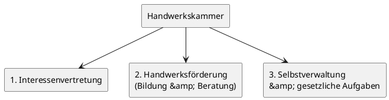
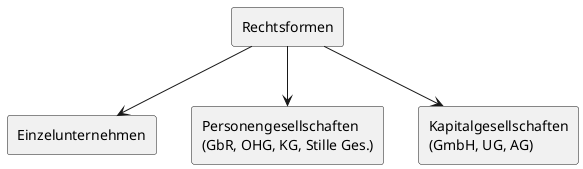

# Unternehmensgründung / Unternehmensübernahme

## 1. Anforderungen an den Unternehmer

### 1.1 Persönliche Anforderungen

Wer einen Betrieb gründen oder übernehmen möchte, muss zunächst prüfen, ob er die wesentlichen Eigenschaften mitbringt, die von einem Unternehmer erwartet werden. Berufliche Selbstständigkeit bringt nicht nur Chancen, sondern auch Risiken und Belastungen mit sich. Diese Vor- und Nachteile sind sorgfältig abzuwägen, bevor der Schritt in die Existenzgründung gewagt wird.

Zu den persönlichen Anforderungen zählen insbesondere:

- Risikobereitschaft
- Entscheidungsfreude
- Verantwortungsbewusstsein
- Kommunikationsfähigkeit und Kontaktfreude
- körperliche und emotionale Stabilität und Belastbarkeit
- Wissensdurst und Lernbereitschaft

---

> [!TIP]
> **Prüfungstipp:** Die Frage „Risikobereitschaft gehört zu welcher Kategorie der Anforderungen?" wird im Examen gestellt. Die Antwort lautet: **persönliche** Anforderungen – nicht familiäre oder fachliche.

---

### 1.2 Familiäre Anforderungen

Für den Erfolg eines Unternehmers ist es unerlässlich, dass die Familie oder der Partner die Gründung oder Übernahme eines Betriebes bejaht und unterstützt. Unternehmer zu sein ist keine Eigenschaft, die man beim Verlassen des Hauses ablegen kann. Gerade in der Startphase sind persönliche und zeitliche Einschränkungen die Regel. Bei Handwerksbetrieben ist es zudem häufig üblich, dass der (Ehe-)Partner im Betrieb mitarbeitet.

### 1.3 Fachliche Anforderungen

Wer über die notwendigen fachlichen Voraussetzungen verfügt, erleichtert sich nicht nur den eigenen Start, sondern findet auch leichter die Akzeptanz bei Geschäftspartnern, Kunden und Banken. Die fachlichen Anforderungen gliedern sich in drei Bereiche:

| Bereich                           | Inhalt                                                                                     |
| --------------------------------- | ------------------------------------------------------------------------------------------ |
| **Fachwissen und -kenntnisse**    | Fachtheoretische und fachpraktische Kenntnisse zur Ausübung des Berufs als Selbstständiger |
| **Branchenerfahrung**             | Überblick über Markt, Wettbewerb, Lieferanten und branchenübliche Gepflogenheiten          |
| **Kaufmännische Grundkenntnisse** | Buchführung, Kalkulation, Finanzplanung, Personalführung                                   |

---

> [!IMPORTANT]
> **Merke:** Handwerkskammern und Fachverbände bieten Checklisten und Tests an, mit denen Existenzgründer ihre persönliche Eignung selbst einschätzen können.

---

## 2. Markt- und Standortanalyse

### 2.1 Marktanalyse

Eine gründliche Marktanalyse sowie eine genaue Prüfung aller Fakten für die Beurteilung der Absatzgebiete und Absatzmöglichkeiten sind wichtige Voraussetzungen für eine erfolgreiche Gründung. Die Marktanalyse ist eine **Zeitpunktbetrachtung** und bildet die Basis für eine fortgesetzte **Marktbeobachtung** (Zeitraumbetrachtung). Dadurch kann der Betrieb auf Chancen und Risiken rechtzeitig reagieren.

Die Marktanalyse bezieht sich insbesondere auf:

- mögliche Zielgruppen bzw. Kunden
- die Wettbewerbssituation hinsichtlich Produkten, Dienstleistungen und deren Anbietern
- die Zukunftsperspektiven am Markt
- die bestimmenden Vertriebswege

#### Kriterien der Absatzmarktbeurteilung

| Kriterium                  | Inhalt                                              |
| -------------------------- | --------------------------------------------------- |
| Allgemeine Marktsituation  | Volkswirtschaftliche Einflussgrößen, Inflationsrate |
| Spezielle Absatzpotenziale | Verbrauchergewohnheiten in einer Region             |
| Kaufkraftentwicklung       | Einkommensstruktur im Absatzgebiet                  |
| Marktvolumen               | Veränderung der Einwohnerzahl, Umsatz pro Kopf      |
| Konkurrenzsituation        | Dichte, Stärken und Schwächen der Konkurrenz        |

#### Marktbesetzungsfaktor

Der **Marktbesetzungsfaktor** zeigt, wie hoch der Anteil an Kunden einer Region, gemessen an der Gesamtbevölkerung, ist. Er dient als Instrument zur Ermittlung versteckter Potenziale im Einzugsgebiet.

$$\text{Marktbesetzungsfaktor (\%)} = \frac{\text{Anzahl Kunden}}{\text{Anzahl Einwohner}} \times 100$$

**Rechenbeispiel:** Ein Handwerksbetrieb hat 500 Kunden in einem Einzugsgebiet mit 50.000 Einwohnern.

$$\text{Marktbesetzungsfaktor} = \frac{500}{50.000} \times 100 = 1\%$$

→ Der Betrieb erreicht 1 % der Bevölkerung seines Einzugsgebietes. Hier besteht erhebliches Wachstumspotenzial.

#### Informationsbeschaffung

Für die Marktanalyse stehen zwei Methoden zur Verfügung:

| Methode               | Beschreibung                                                                                       |
| --------------------- | -------------------------------------------------------------------------------------------------- |
| **Primärforschung**   | Direkte Kundenbefragungen, Beobachtungen – eigene Erhebung                                         |
| **Sekundärforschung** | Auswertung bereits vorhandener interner und externer Daten (z. B. Betriebsvergleiche, Statistiken) |

### 2.2 Standortanalyse

Von der richtigen Standortwahl und der voraussichtlichen Standortentwicklung hängt in den meisten Handwerkszweigen der langfristige wirtschaftliche Erfolg eines Betriebes ab. Die Wahl des günstigsten Standorts bezeichnet man als **optimalen Standort**.

#### Standortfaktoren

Die Standortfaktoren gliedern sich in drei Hauptbereiche:

| Bereich                           | Beispiele                                                                                                                  |
| --------------------------------- | -------------------------------------------------------------------------------------------------------------------------- |
| **Beschaffungsbezogene Faktoren** | Grundstücke, Gewerbeflächenangebot, Arbeitskräfte, Material- und Rohstoffbeschaffung, Energieversorgung, Breitbandinternet |
| **Produktionsbezogene Faktoren**  | Soziale und politische Rahmenbedingungen, geologische und ökologische Bedingungen, technologische Bedingungen              |
| **Absatzorientierte Faktoren**    | Kundennähe, Kaufkraft, Kundenpotenzial, Wettbewerbssituation, Verkehrsverbindungen, Parkmöglichkeiten                      |

Hinzu kommen sogenannte **„weiche" Standortfaktoren** wie persönliche, freizeitbezogene und kulturelle Angebote an einem Ort.

---

> [!IMPORTANT]
> **Merke:** Für die abschließende Beurteilung des Standortes müssen die Standortfaktoren verglichen und je nach Handwerkszweig entsprechend **gewichtet** werden. Gesetzliche Beschränkungen (z. B. Bauvorschriften, Raumordnung) können die Standortwahl begrenzen.

---

## 3. Businessplan (Inhalt und Anforderungen)

### 3.1 Bedeutung und Zweck

Am Anfang der Existenzgründung steht die Geschäftsidee. Dieses Konzept wird grundsätzlich in Form eines **Businessplans** (Unternehmenskonzept oder Geschäftsplan) dargestellt. Seine Erstellung ist die zentrale Aufgabe in der Vorbereitung einer Betriebsgründung. Von der Aussagefähigkeit und Überzeugungskraft des Businessplans hängt ab, ob potenzielle Geldgeber das erforderliche Kapital zur Verfügung stellen.

### 3.2 Inhalt des Businessplans

Ein Businessplan sollte insbesondere folgende Themen beinhalten:

- Angaben zur beruflichen Qualifikation und bisherigen Tätigkeit des Betriebsgründers
- Unternehmensidee, Leitbild, Unternehmensgrundsätze
- Beschreibung und Begründung des Vorhabens
- Standort, Betriebsräume
- Betriebsgröße
- Rechtsform
- Produkt- und Leistungsprogramm
- Kundenzielgruppe, Kundenstruktur
- Absatzmarktbeurteilung für das Produkt- und Leistungsprogramm
- Preisgestaltung
- Vertriebsstrategie
- Marketingmaßnahmen
- Personalbedarf und Personalstruktur
- Investitionsplan
- Gesamtkapitalbedarfsrechnung
- Finanzierungsplan
- Liquiditätsplan
- Umsatz-, Kosten- und Gewinnplan, Rentabilitätsvorschau

#### Gliederungsschema eines Businessplans (Kurzübersicht)

| Nr. | Kapitel                                                                                         |
| --- | ----------------------------------------------------------------------------------------------- |
| 1   | Kurzzusammenfassung                                                                             |
| 2   | Gründerperson (Qualifikation, Motive, Eignung)                                                  |
| 3   | Geschäftsidee (Zweck, Leitbild, Firmenname)                                                     |
| 4   | Produkt- und Dienstleistungsplanung                                                             |
| 5   | Marktübersicht (Kundensegmente, Marktvolumen, Konkurrenzanalyse)                                |
| 6   | Marketing/Vertrieb (Preis-, Vertriebs-, Werbestrategie)                                         |
| 7   | Standort (Standortfaktoren, Räumlichkeiten)                                                     |
| 8   | Unternehmensorganisation/Personal (Rechtsform, Aufbauorganisation)                              |
| 9   | Finanzierung (Investitionsplan, Kapitalbedarfsrechnung, Liquiditätsplan, Rentabilitätsvorschau) |
| 10  | Chancen und Risiken                                                                             |
| 11  | Lebenslauf und Unterlagen                                                                       |

### 3.3 Formale Anforderungen

Folgende allgemeine Anforderungen sollte der Businessplan erfüllen:

- Darstellung der Umsetzung der Geschäftsidee in der Praxis
- Berücksichtigung aller maßgeblichen Faktoren
- klare und sinnvolle Gliederung
- verständlicher und fehlerfreier Schreibstil
- prägnante Darstellung, ggf. angereichert mit Tabellen und Grafiken
- übersichtlicher Umfang
- nachvollziehbare Aussagen und inhaltliche Stimmigkeit
- ansprechendes äußeres Erscheinungsbild

---

> [!TIP]
> **Prüfungstipp:** Die Frage „Was sollte Ausgangspunkt der Existenzgründung sein?" wird im Examen gestellt. Die Antwort lautet: **die Geschäftsidee** – nicht der Businessplan, nicht das Bankgespräch.

---

## 4. Anbieter von Finanzierungsleistungen

### 4.1 Übersicht der Finanzierungsanbieter

Bei der Existenzgründung stehen verschiedene Anbieter von Finanzierungsleistungen zur Verfügung. Der Existenzgründer sollte sich frühzeitig informieren, welche Fördermöglichkeiten in Anspruch genommen werden können.

| Anbieter                                 | Leistung                                                                                                                                                  |
| ---------------------------------------- | --------------------------------------------------------------------------------------------------------------------------------------------------------- |
| **Hausbank**                             | Hauptansprechpartner; vermittelt Anträge an Förderinstitute; gewährt Betriebsmittel- und Investitionskredite                                              |
| **KfW (Kreditanstalt für Wiederaufbau)** | Zinsgünstige Gründerkredite des Bundes                                                                                                                    |
| **Landesförderinstitute**                | Zinsgünstige Kredite und Zuschüsse der Bundesländer                                                                                                       |
| **Bürgschaftsbanken**                    | Übernahme von Bürgschaften, wenn Sicherheiten fehlen; Antrag läuft in der Regel über die Hausbank; gutachterliche Stellungnahme durch die Handwerkskammer |
| **Beteiligungsgesellschaften**           | Ermöglichen Kapitalbeschaffung auf Basis der Beteiligung am Unternehmen                                                                                   |
| **Bund und Länder**                      | Öffentliche Finanzhilfen, Meistergründungsprämie, Förderprogramme                                                                                         |

---

> [!IMPORTANT]
> **Merke:** Der Antrag auf Übernahme einer Bürgschaft durch die Bürgschaftsbank wird in der Regel über die **Hausbank** gestellt. Die **Handwerkskammer** nimmt dabei gutachterlich Stellung.

---

## 5. Hauptaufgabenbereiche der Handwerkskammer

### 5.1 Rechtsstellung und Aufbau

Die Handwerkskammer ist die **gesetzliche Berufsvertretung des Gesamthandwerks** im Kammerbezirk. Sie hat die Rechtsform einer **Körperschaft des öffentlichen Rechts**. Alle Inhaber von Handwerksbetrieben sind Pflichtmitglieder. Oberstes Organ ist die **Vollversammlung**.

### 5.2 Die drei Hauptaufgabenbereiche

#### Bereich 1: Interessenvertretung

Die Handwerkskammer vertritt die wirtschaftlichen Interessen des Gesamthandwerks im Kammerbezirk gegenüber Politik, Behörden und der Öffentlichkeit.

#### Bereich 2: Handwerksförderung durch Bildung und Beratung

Dieser Bereich nimmt den breitesten Raum ein. Die wichtigsten Beratungsgebiete sind:

- Unternehmensführung
- Existenzgründung (Rechtsform, Standortwahl, Finanzierung, Planung)
- Betriebsübernahme, Nachfolgeregelung, Betriebsbörse
- Organisation des Rechnungswesens (Buchführung, Kostenrechnung, Controlling)
- Investitionen und Finanzierung, Handwerksförderungsprogramme
- Marktanalysen, Marketing/Vertrieb
- Kooperationsmöglichkeiten
- Personalwesen
- Betriebsanalysen, Rentabilitätsberechnungen, Schwachstellenanalysen
- Technische Betriebsberatung (Digitalisierung, Qualitätsmanagement, Umweltschutz)
- Rechtsberatung (Zivilrecht, Arbeitsrecht, Sozialversicherungsrecht, Steuerrecht)

#### Bereich 3: Gesetzliche Aufgaben (Selbstverwaltung)

- Führung der **Handwerksrolle** und des Verzeichnisses der zulassungsfreien Handwerke
- Regelung und Überwachung der **Berufsausbildung** (Führung der Lehrlingsrolle)
- Erlass von Prüfungsordnungen
- Organisatorische Durchführung der **Meisterprüfungen**
- Abnahme von Gesellen- bzw. Abschlussprüfungen
- Bestellung und Veröffentlichung von **Sachverständigen**
- Errichtung von Vermittlungsstellen zur Beilegung von Streitigkeiten
- Ausstellung von Ursprungszeugnissen und Bescheinigungen

---

> [!IMPORTANT]
> **Merke:** Die Festsetzung von Preisen für handwerkliche Waren gehört **nicht** zu den gesetzlichen Aufgaben der Handwerkskammer. Die wichtigste Finanzierungsquelle der Handwerkskammer sind die **Pflichtbeiträge** aller Inhaber von Handwerks- und handwerksähnlichen Betrieben.

---

## 6. Formen der Selbstständigkeit

### 6.1 Überblick

Der Handwerksunternehmer hat zur Teilnahme am Geschäftsleben mehrere Möglichkeiten:

- Er kann als **Einzelunternehmer** mit oder ohne Mitarbeiter tätig werden.
- Er kann eine **Kapitalgesellschaft** gründen, deren Geschäftsführer und Gesellschafter er ist.
- Er kann sich mit einem oder mehreren Handwerkskollegen als **Personengesellschaft** oder zur Gründung einer Kapitalgesellschaft zusammenschließen.

Am häufigsten im Handwerk anzutreffen ist der **Einzelunternehmer**.

## 7. Merkmale Einzelunternehmen, Personengesellschaften und Kapitalgesellschaften

### 7.1 Einzelunternehmen

Das Einzelunternehmen ist die häufigste Rechtsform im Handwerk. Der Hauptvorteil liegt in der Unabhängigkeit und einem hohen Maß an Entscheidungsfreiheit. Der Inhaber trägt jedoch das Risiko allein und haftet für alle finanziellen Verpflichtungen des Betriebs **auch mit seinem Privatvermögen** – eine Trennung von Privat- und Betriebsvermögen findet haftungsrechtlich nicht statt.

### 7.2 Personengesellschaften

Personengesellschaften sind den einzelnen Gesellschaftern zugeschrieben. Mindestens zwei Gesellschafter sind erforderlich.

| Rechtsform              | Wesentliche Merkmale                                                                                                                                  | Haftung                                                                                               |
| ----------------------- | ----------------------------------------------------------------------------------------------------------------------------------------------------- | ----------------------------------------------------------------------------------------------------- |
| **GbR / eGbR**          | Grundform aller Personengesellschaften; eGbR ist ins Gesellschaftsregister eingetragen und firmenführungsberechtigt                                   | Gesellschafter haften persönlich und gesamtschuldnerisch                                              |
| **OHG**                 | Handelsgesellschaft; Formkaufmann; muss ins Handelsregister eingetragen werden; firmenführungsberechtigt; Firma kann bei Nachfolge fortgeführt werden | Alle Gesellschafter haften persönlich, unbeschränkt und gesamtschuldnerisch                           |
| **KG**                  | Handelsgesellschaft; zwei Gesellschaftertypen; muss ins Handelsregister eingetragen werden                                                            | **Komplementär:** haftet persönlich und unbeschränkt; **Kommanditist:** haftet nur mit seiner Einlage |
| **Stille Gesellschaft** | Stiller Gesellschafter tritt nach außen nicht in Erscheinung                                                                                          | Stiller Gesellschafter haftet **nicht** gegenüber Kunden                                              |
| **GmbH &amp; Co. KG**   | KG mit GmbH als Komplementär; verhindert persönliche Haftung natürlicher Personen; steuerlich als Personengesellschaft behandelt                      | Komplementär-GmbH haftet mit ihrem Vermögen; Kommanditisten mit Einlage                               |

### 7.3 Kapitalgesellschaften

Kapitalgesellschaften sind auf die Kapitalbeteiligung zugeschnitten. Das Ausscheiden eines Gesellschafters wirkt sich grundsätzlich nicht auf den Bestand der Gesellschaft aus. Sie sind voll rechtsfähig und haben eigene Rechtspersönlichkeit.

| Rechtsform                  | Wesentliche Merkmale                                                                                                                                | Haftung                                                                        |
| --------------------------- | --------------------------------------------------------------------------------------------------------------------------------------------------- | ------------------------------------------------------------------------------ |
| **GmbH**                    | Mindestkapital 25.000 EUR; Gesellschafter können Geschäftsführer sein und Gehalt beziehen; Entnahmen außerhalb des Gehalts grundsätzlich unzulässig | Nur das **GmbH-Vermögen** haftet; keine persönliche Haftung der Gesellschafter |
| **UG (haftungsbeschränkt)** | „Mini-GmbH"; Sonderform der GmbH; kann ohne Mindeststammkapital gegründet werden; muss Rücklagen bilden                                             | Nur das UG-Vermögen haftet                                                     |
| **AG**                      | Für Handwerksbetriebe selten relevant                                                                                                               | Nur das AG-Vermögen haftet                                                     |

---

> [!IMPORTANT]
> **Merke:** Bei der GmbH haftet grundsätzlich nur das **GmbH-Vermögen**. Der Geschäftsführer haftet persönlich nur in Ausnahmefällen (z. B. bei vorsätzlicher Pflichtverletzung). Eingetragene Personenhandelsgesellschaften (OHG, KG, GmbH &amp; Co. KG, eGbR) können sich auf Antrag zur **Körperschaftsteuer** optieren und werden dann wie eine Kapitalgesellschaft besteuert.

---

## 8. Entscheidung zur Rechtsform (Fragen)

### 8.1 Zentrale Fragen bei der Rechtsformwahl

Die Wahl der Rechtsform ist eine wichtige Entscheidung, bei der sich der Unternehmensgründer umfassend informieren und beraten lassen sollte. Folgende zentrale Fragen sind zu stellen:

- In welcher Form sind die **handwerksrechtlichen Voraussetzungen** gegeben?
- Ist eine Eintragung ins **Handelsregister** oder andere Register erforderlich oder möglich?
- Welche **Formvorschriften** sind zu beachten?
- Welche **Kosten** fallen an?
- Wie soll die **Eigen- und Fremdfinanzierung** erfolgen?
- Gründe ich das Unternehmen **alleine oder mit weiteren Personen**?
- Wie soll die **Haftung** geregelt werden?
- Wie soll eine **Risikobegrenzung oder Risikoverteilung** erfolgen?
- Wie soll die **Geschäftsführung bzw. Vertretung** geregelt werden?
- Welche **Gewinn- und Verlustverteilung** wird für zweckmäßig angesehen?
- Welche **Firmierung** wird angestrebt?
- Welche **steuerlichen Gesichtspunkte** sind interessant?
- Soll bereits eine mögliche **Nachfolgeregelung** berücksichtigt werden?

---

> [!TIP]
> **Prüfungstipp:** Im Examen wird häufig gefragt, welche Fragen bei der Rechtsformwahl zu stellen sind. Die obige Liste ist prüfungsrelevant. Besonders wichtig ist der Unterschied zwischen GmbH und GmbH &amp; Co. KG hinsichtlich des Geldflusses zwischen Privat- und Betriebsvermögen.

---

## 9. Betriebsübernahme

### 9.1 Grundformen der Betriebsübernahme

Als Alternative zur Neugründung kann ein bestehender Betrieb übernommen werden. Die Grundformen der Betriebsübernahme sind:

- **Kauf** des Betriebes (Erwerb von Substanz und/oder Kundenstamm)
- **Pacht** des Betriebes (vertragliche Nutzungsüberlassung)
- **Erbschaft oder Schenkung** (familieninterne Nachfolge)
- **Beteiligung** an einem bestehenden Betrieb

### 9.2 Prüfung vor der Übernahme

Vor der Übernahme sind folgende Bereiche zu analysieren:

- **Standort und Standortsicherung:** Ist der Standort langfristig optimal und sicherbar? Stimmen Infrastruktur, Verkehrsanbindung und Parkmöglichkeiten?
- **Stellung des Betriebes am Markt:** Wettbewerbsfähigkeit und regionale Marktstellung
- **Kundenstruktur:** Zusammensetzung des Kundenstamms nach Region, Kaufkraft, Alter; Ausfallgefährdung der Kundendatei
- **Leistungsprogramm:** Marktgerechtigkeit und Wettbewerbsfähigkeit
- **Analyse wirtschaftlicher Verhältnisse:** Bilanzen und Jahresabschlüsse der letzten beiden Jahre, Umsatz- und Leistungsentwicklung, Kostenstruktur, Rentabilität, Liquidität, Eigenkapitalquote

### 9.3 Kaufpreisermittlung

Für die Kaufpreisermittlung sind folgende Wertansätze relevant:

| Wertansatz                | Beschreibung                                                                                                             |
| ------------------------- | ------------------------------------------------------------------------------------------------------------------------ |
| **Substanzwert**          | Wert aller materiellen und immateriellen Vermögensgegenstände des Betriebes                                              |
| **Ertragswert**           | Basiert auf dem nachhaltig erzielbaren Gewinn; wird mit einem Kapitalisierungszinssatz berechnet                         |
| **Firmenwert (Goodwill)** | Ergibt sich aus der Differenz zwischen Kauf-/Ertragswert und Substanzwert; repräsentiert Kundenstamm, Ruf, Marktstellung |

---

> [!IMPORTANT]
> **Merke:** Betriebsübernahmen werden in erster Linie durch **Bund und Länder** mit finanziellen Zuwendungen und zinsgünstigen Krediten gefördert.

---

## 10. Fragen bei betrieblicher Partnerschaft

### 10.1 Einzelunternehmer vs. Partnerschaft

Bei der Entscheidung, ob die berufliche Selbstständigkeit allein oder in Partnerschaft angestrebt wird, sind Vor- und Nachteile abzuwägen.

| Kriterium             | Einzelunternehmer           | Partnerschaft               |
| --------------------- | --------------------------- | --------------------------- |
| Entscheidungsfreiheit | Vollständig                 | Eingeschränkt durch Partner |
| Risiko                | Allein zu tragen            | Verteilt auf mehrere        |
| Kapital               | Nur eigenes                 | Gemeinsame Finanzierung     |
| Führung               | Allein zuständig            | Arbeitsteilung möglich      |
| Abhängigkeit          | Keine                       | Abhängigkeit vom Partner    |
| Gewinn                | Steht allein dem Inhaber zu | Aufzuteilen                 |

### 10.2 Wichtige Fragen bei der Partnerauswahl

Von der sorgfältigen Prüfung und Auswahl des Partners hängt es entscheidend ab, ob der gemeinsame Betrieb erfolgreich sein wird. Folgende Fragen sind zu stellen:

- Ergänzen sich die **fachlichen Kenntnisse** der Partner?
- Stimmen die **persönlichen Eigenschaften** und die Arbeitsweise überein?
- Wie ist die **finanzielle Situation** des Partners?
- Wie soll die **Aufgabenverteilung** (z. B. technisch/kaufmännisch, Innen-/Außendienst) geregelt werden?
- Wie wird die **Gewinn- und Verlustverteilung** geregelt?
- Wie soll bei **Ausscheiden** eines Partners verfahren werden?
- Welche **Rechtsform** soll die Partnerschaft haben?

## 11. Beratungsmöglichkeiten und -gebiete bei Existenzgründung

### 11.1 Beratungsanbieter

Bei der Existenzgründung stehen verschiedene Beratungsanbieter zur Verfügung:

- **Handwerkskammer:** Überfachliche betriebswirtschaftliche, technische und rechtliche Beratung; erste Anlaufstelle für Handwerksbetriebe
- **Innungen und Landesinnungsverbände:** Fachliche Betriebsberatung
- **Steuerberater:** Steuerliche Gestaltung, Buchführung, Jahresabschluss
- **Freiberufliche Unternehmensberater:** Individuelle Beratung zu betriebswirtschaftlichen Fragen
- **Banken und Förderinstitute:** Finanzierungsberatung, Businessplan-Anforderungen

### 11.2 Beratungsgebiete

Die wichtigsten Beratungsgebiete bei der Existenzgründung umfassen:

- Unternehmensführung
- Existenzgründung: Rechtsform, Standortwahl, Finanzierung, Planung
- Betriebsübernahme, Nachfolgeregelung, Betriebsbörse
- Organisation des Rechnungswesens
- Investitionen und Finanzierung, Handwerksförderungsprogramme
- Marktanalysen, Marketing/Vertrieb
- Kooperationsmöglichkeiten
- Personalwesen
- Betriebsanalysen und Rentabilitätsberechnungen

---

> [!TIP]
> **Prüfungstipp:** Der Existenzgründer erhält von der Handwerkskammer eine **Handwerkskarte oder Gewerbekarte**. Die Handwerkskammer ist die erste Anlaufstelle – insbesondere wenn die Abgrenzung zum Gewerbe der Industrie- und Handelskammer unklar ist.

---

## 12. Chancen und Risiken im Handwerk

### 12.1 Chancen der Selbstständigkeit im Handwerk

- Persönliche Unabhängigkeit und Entscheidungsfreiheit
- Möglichkeit, Einkommen und Vermögen selbst zu gestalten
- Direkte Einflussnahme auf Betriebsentwicklung und Kundenpflege
- Nutzung von Wachstumsmärkten (z. B. Energieeffizienz, Digitalisierung, Barrierefreiheit)
- Regionale Verwurzelung und Kundennähe als Wettbewerbsvorteil
- Meistergründungsprämie und öffentliche Förderprogramme

### 12.2 Risiken der Selbstständigkeit im Handwerk

- Persönliche Haftung (insbesondere beim Einzelunternehmen)
- Ausfall von Einnahmen bei Krankheit oder Unfall
- Konjunkturelle Schwankungen und Abhängigkeit von wenigen Großkunden
- Fachkräftemangel und steigende Personalkosten
- Wettbewerbsdruck durch größere Betriebe und Billiganbieter
- Bürokratische Belastungen und gesetzliche Anforderungen

---

> [!NOTE]
> Berufliche Selbstständigkeit bringt nicht nur Chancen, sondern auch Risiken und Belastungen. Diese Vor- und Nachteile muss jeder Existenzgründer sorgfältig für sich abwägen, bevor er den Schritt wagt.

---

## 13. Minderung von Risiken und Kosten im Bereich Personal

### 13.1 Flexible Beschäftigungsformen

Um Personalrisiken und -kosten zu minimieren, stehen dem Handwerksbetrieb verschiedene Beschäftigungsformen zur Verfügung:

| Beschäftigungsform                       | Merkmal                                                                                                                     | Kostenvorteil                                      |
| ---------------------------------------- | --------------------------------------------------------------------------------------------------------------------------- | -------------------------------------------------- |
| **Minijob (geringfügige Beschäftigung)** | Entgelt bis 556,00 EUR/Monat (2025); grundsätzlich rentenversicherungspflichtig; Arbeitgeber zahlt Pauschalabgaben von 30 % | Keine vollen Sozialversicherungsbeiträge           |
| **Teilzeitbeschäftigung**                | Flexible Anpassung der Arbeitszeit an den Bedarf                                                                            | Kostensenkung bei geringem Auftragsvolumen         |
| **Leiharbeit / Zeitarbeit**              | Kurzfristiger Einsatz von Arbeitskräften über Zeitarbeitsfirmen                                                             | Kein dauerhaftes Beschäftigungsverhältnis          |
| **Freie Mitarbeiter / Subunternehmer**   | Beauftragung auf Werkvertragsbasis                                                                                          | Keine Sozialversicherungspflicht des Auftraggebers |

### 13.2 Weitere Maßnahmen zur Risikominderung

- Sorgfältige **Personalplanung** und bedarfsgerechter Personaleinsatz
- Nutzung von **Kurzarbeit** in Auftragsflauten
- Investition in **Aus- und Weiterbildung** zur Senkung der Fluktuation
- **Leistungsorientierte Vergütung** zur Motivation ohne feste Kostensteigerung

---

> [!IMPORTANT]
> **Merke:** Bei geringfügiger Beschäftigung in Privathaushalten zahlt der Arbeitgeber nur Pauschalabgaben zur Kranken- und Rentenversicherung in Höhe von 5 %. Werden mehrere Minijobs ausgeübt und übersteigen diese zusammen 556,00 EUR/Monat, tritt Versicherungspflicht ein.

---

## 14. Begriff Marketing, Ziele Marketing

### 14.1 Begriff Marketing

Marketing ist nicht nur eine Sache des Absatzes, sondern betrifft nahezu alle betrieblichen Funktionsbereiche. Im Mittelpunkt stehen die **Bedürfnisse und Wünsche der Kunden**. Hauptziel der Marktanalyse und Marktforschung ist es, Handlungsalternativen zu schaffen, die dazu beitragen, die Unternehmensziele zu erreichen.

### 14.2 Marketingziele

Marketingziele befassen sich mit der Frage: **„Was möchte ich erreichen?"**

#### Zeitliche Dimension

- **Kurzfristige** Marketingziele
- **Mittelfristige** Marketingziele
- **Langfristige** Marketingziele

#### Inhaltliche Dimension

Vom Inhalt her können sich Marketingziele auf folgende Größen beziehen:

| Zielgröße        | Beispiel                             |
| ---------------- | ------------------------------------ |
| Absatz           | Steigerung der verkauften Einheiten  |
| Umsatz           | Erhöhung des Jahresumsatzes um 10 %  |
| Gewinn           | Verbesserung der Umsatzrendite       |
| Rentabilität     | Steigerung des Return on Investment  |
| Bekanntheitsgrad | Aufbau regionaler Markenbekanntheit  |
| Image            | Positionierung als Qualitätsanbieter |
| Kundenbindung    | Erhöhung der Wiederkaufrate          |

---

> [!IMPORTANT]
> **Merke:** Marketingziele müssen so formuliert werden, dass sie **kontrollierbar** sind. Die **Marketingstrategie** beantwortet die Folgefrage: „Wie kann ich meine Marketingziele erreichen?"

---

## 15. Versicherungsschutz für Selbstständige

### 15.1 Ausgangssituation

Mit der Selbstständigkeit im Vollerwerb verlässt der Existenzgründer das soziale Netz als Arbeitnehmer. Er muss nun selbst durch Abschluss geeigneter Versicherungen für seinen Schutz sorgen. Wichtig ist zu bedenken, dass Selbstständige ihre Beiträge **selbst voll aufbringen** müssen – bei Arbeitnehmern trägt der Arbeitgeber in der Regel die Hälfte.

### 15.2 Sozialversicherung für Selbstständige

Das System der Sozialversicherung gliedert sich in folgende Versicherungszweige:

| Zweig                        | Regelung für Selbstständige                                                                                                                                                                   |
| ---------------------------- | --------------------------------------------------------------------------------------------------------------------------------------------------------------------------------------------- |
| **Krankenversicherung**      | Pflicht zur Mitgliedschaft in gesetzlicher oder privater KV; Existenzgründer können sich freiwillig in der GKV versichern (Voraussetzung: mind. 24 Monate in den letzten 5 Jahren versichert) |
| **Pflegeversicherung**       | Wer privat krankenversichert ist, ist pflichtversichert in der privaten Pflegeversicherung                                                                                                    |
| **Rentenversicherung**       | Selbstständige Handwerker in zulassungspflichtigen Handwerken (Anlage A) sind **rentenversicherungspflichtig**; Beginn der Pflicht mit Eintragung in die Handwerksrolle                       |
| **Unfallversicherung**       | Pflichtversicherung je nach Satzung der Berufsgenossenschaft; freiwillige Versicherung möglich                                                                                                |
| **Arbeitslosenversicherung** | Grundsätzlich keine Pflicht; freiwillige Versicherung auf Antrag möglich                                                                                                                      |

### 15.3 Private Personenversicherungen

| Versicherungsart                       | Zweck                                                                                                         |
| -------------------------------------- | ------------------------------------------------------------------------------------------------------------- |
| **Lebens- / Risikolebensversicherung** | Absicherung der Familie im Todesfall                                                                          |
| **Private Krankenversicherung**        | Materielle Sicherheit bei Krankheit                                                                           |
| **Private Unfallversicherung**         | Absicherung bei Unfallfolgen                                                                                  |
| **Berufsunfähigkeitsversicherung**     | Zahlt Rente, wenn der Versicherte aufgrund von Unfall oder Krankheit nicht mehr in seinem Beruf arbeiten kann |
| **Erwerbsunfähigkeitsversicherung**    | Absicherung, wenn weniger als 3 Stunden täglich gearbeitet werden kann (nicht berufsgebunden)                 |
| **Grundfähigkeitsversicherung**        | Absicherung bei Verlust festgelegter Grundfähigkeiten (z. B. Sehen, Hören, Treppensteigen)                    |

### 15.4 Sachversicherungen (betrieblich und privat)

| Versicherungsart                       | Zweck                                                                         |
| -------------------------------------- | ----------------------------------------------------------------------------- |
| **Betriebshaftpflichtversicherung**    | Deckt Schäden ab, die der Handwerker in Ausübung seines Berufs Dritten zufügt |
| **Betriebsunterbrechungsversicherung** | Sichert Einnahmen bei betrieblichem Stillstand                                |
| **Einbruchdiebstahlversicherung**      | Schutz vor Diebstahlschäden                                                   |
| **Gebäude- / Feuerversicherung**       | Schutz der Betriebsimmobilie                                                  |
| **Kfz-Versicherung**                   | Pflichtversicherung für Betriebsfahrzeuge                                     |

---

> [!IMPORTANT]
> **Merke:** Schäden, die der selbstständige Handwerker in Ausübung seines Berufs Dritten zufügt, werden durch die **Haftpflichtversicherung** gedeckt – nicht durch die Unfall- oder Sachversicherung.

---

> [!TIP]
> **Prüfungstipp:** Im Examen wird gefragt, ob der selbstständige Unternehmer für seine eigene Person unfallversicherungspflichtig bei der Berufsgenossenschaft ist. Die Antwort: Dies hängt davon ab, ob die **Satzung der Berufsgenossenschaft** die Unternehmerpflichtversicherung vorschreibt.

---

## Schnellübersicht – Wichtige Begriffe und Formeln auf einen Blick

| Begriff / Formel               | Inhalt                                                                                                      |
| ------------------------------ | ----------------------------------------------------------------------------------------------------------- |
| **Marktbesetzungsfaktor**      | Anzahl Kunden ÷ Anzahl Einwohner × 100                                                                      |
| **Optimaler Standort**         | Standort mit der günstigsten Kombination aller Standortfaktoren                                             |
| **Businessplan**               | Zentrales Dokument der Existenzgründung; Grundlage für Finanzierungsgespräche                               |
| **Einzelunternehmer**          | Häufigste Rechtsform im Handwerk; haftet mit Privat- und Betriebsvermögen                                   |
| **GmbH**                       | Kapitalgesellschaft; Mindestkapital 25.000 EUR; nur GmbH-Vermögen haftet                                    |
| **UG (haftungsbeschränkt)**    | Sonderform der GmbH; kein Mindeststammkapital; muss Rücklagen bilden                                        |
| **Komplementär (KG)**          | Haftet persönlich und unbeschränkt                                                                          |
| **Kommanditist (KG)**          | Haftet nur mit seiner Einlage                                                                               |
| **Bürgschaftsbank**            | Antrag über Hausbank; HWK nimmt gutachterlich Stellung                                                      |
| **Handwerkskammer**            | Körperschaft des öffentlichen Rechts; drei Hauptaufgaben: Interessenvertretung, Förderung, Selbstverwaltung |
| **Rentenversicherungspflicht** | Gilt für selbstständige Handwerker in zulassungspflichtigen Handwerken (Anlage A HwO)                       |
| **Haftpflichtversicherung**    | Deckt Schäden ab, die der Handwerker Dritten in Ausübung seines Berufs zufügt                               |
| **Marketingziele**             | Müssen zeitlich, inhaltlich und kontrollierbar formuliert sein                                              |
