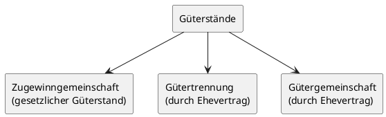

# Arbeits- und Sozialversicherungsrecht

## 1. Arten des Arbeitsvertrags

### 1.1 Grundlagen und Form

Ein Arbeitsvertrag kommt zustande, wenn Arbeitgeber und Arbeitnehmer die Aufnahme eines Arbeitsverhältnisses vereinbaren. Der unbefristete Arbeitsvertrag kann grundsätzlich mündlich oder schriftlich abgeschlossen werden — es besteht kein Formzwang. Aus Gründen der Beweissicherung und Rechtssicherheit empfiehlt sich jedoch stets die Schriftform. Die Befristung eines Arbeitsvertrages hingegen **bedarf zwingend der Schriftform**.

Liegt kein schriftlicher Vertrag vor, hat der Arbeitnehmer nach dem **Nachweisgesetz (NachwG)** einen Anspruch auf schriftliche Niederlegung der wesentlichen Vertragsbedingungen.

### 1.2 Unbefristeter Arbeitsvertrag

Der **Arbeitsvertrag auf unbestimmte Zeit** ist die häufigste Vertragsform. Er besteht so lange fort, bis er durch Kündigung eines der beiden Vertragspartner, durch einvernehmliche Aufhebung oder durch den Tod des Arbeitnehmers endet.

### 1.3 Befristeter Arbeitsvertrag

- Der **Arbeitsvertrag auf bestimmte Zeit** endet automatisch — ohne dass es einer Kündigung bedarf — entweder:

- mit Ablauf der vereinbarten Befristung (**kalendermäßig befristeter Vertrag**), oder
- mit Erreichen des vereinbarten Zwecks der Arbeitsleistung (**zweckbefristeter Vertrag**).

Bei zweckbefristeten Verträgen muss der Arbeitgeber den Arbeitnehmer mindestens zwei Wochen vorher schriftlich über den Zeitpunkt der Zweckerreichung unterrichten.

Befristete Arbeitsverträge sind zulässig, wenn **sachliche Gründe** vorliegen, z. B.:

- Aushilfsbeschäftigung
- Vertretung vorübergehend abwesender Arbeitnehmer
- Saisonbeschäftigung

**Befristung ohne sachlichen Grund** ist möglich:

- Bei Neueinstellungen: bis zu **2 Jahren** (maximal dreimalige Verlängerung innerhalb dieser Gesamtdauer). Ausgeschlossen, wenn zuvor bereits ein Arbeitsvertrag mit demselben Arbeitnehmer bestand.
- Bei Arbeitnehmern ab dem vollendeten **52. Lebensjahr**, die unmittelbar davor mindestens 4 Monate arbeitslos waren: bis zu **5 Jahren**.
- Bei **Existenzgründern** in den ersten 4 Jahren nach Unternehmensgründung: bis zu **4 Jahren**.

### 1.4 Probearbeitsverhältnis

Die Probezeit darf in der Regel nicht länger als **6 Monate** dauern. Sie kann als befristetes Arbeitsverhältnis (endet automatisch) oder als unbefristetes Arbeitsverhältnis mit Probezeitklausel vereinbart werden. Während der Probezeit gilt eine Kündigungsfrist von **2 Wochen**.

### 1.5 Weitere Vertragsarten

| Vertragsart                    | Wesentliches Merkmal                                                                                                                   |
| ------------------------------ | -------------------------------------------------------------------------------------------------------------------------------------- |
| **Teilzeitarbeitsvertrag**     | Regelmäßige Wochenarbeitszeit kürzer als die vergleichbarer Vollzeitbeschäftigter; alle Arbeitsschutzgrundsätze gelten gleichermaßen   |
| **Leiharbeitsvertrag**         | Arbeitnehmer wird mit seiner Zustimmung von einem Arbeitgeber an einen anderen überlassen; Equal-Pay-Grundsatz gilt ab dem 10. Monat   |
| **Geringfügige Beschäftigung** | Entgelt bis zu 556,00 EUR/Monat (2025); grundsätzlich rentenversicherungspflichtig, Arbeitnehmer kann Versicherungsfreiheit beantragen |

---

> [!TIP]
> **Prüfungstipp:** Häufig wird gefragt, ob ein Arbeitsvertrag der Schriftform bedarf. Merke: Nur die **Befristung** erfordert zwingend Schriftform. Der unbefristete Vertrag kann auch mündlich geschlossen werden.

---

## 2. Kündigungsfristen

### 2.1 Ordentliche Kündigung und Grundfrist

Das Arbeitsverhältnis wird am häufigsten durch die **ordentliche Kündigung** unter Einhaltung der Kündigungsfrist beendet. Die Kündigungserklärung muss klar und zweifelsfrei sein und wird erst mit Zugang beim anderen Vertragspartner wirksam.

Die **gesetzliche Grundkündigungsfrist** für den Arbeitnehmer beträgt **4 Wochen zum 15. oder zum Ende eines Kalendermonats**.

### 2.2 Verlängerte Kündigungsfristen für den Arbeitgeber

Je länger die Betriebszugehörigkeit, desto länger die Frist, die der Arbeitgeber bei einer Kündigung einhalten muss:

| Betriebszugehörigkeit     | Kündigungsfrist (Arbeitgeber) |
| ------------------------- | ----------------------------- |
| Probezeit (max. 6 Monate) | 2 Wochen                      |
| nach 2 Jahren             | 1 Monat zum Monatsende        |
| nach 5 Jahren             | 2 Monate zum Monatsende       |
| nach 8 Jahren             | 3 Monate zum Monatsende       |
| nach 10 Jahren            | 4 Monate zum Monatsende       |
| nach 12 Jahren            | 5 Monate zum Monatsende       |
| nach 15 Jahren            | 6 Monate zum Monatsende       |
| nach 20 Jahren            | 7 Monate zum Monatsende       |

---

> [!IMPORTANT]
> **Merke:** Die verlängerten Kündigungsfristen gelten **nur für die Kündigung durch den Arbeitgeber**, nicht für die Kündigung durch den Arbeitnehmer. Für die Kündigung durch den Arbeitnehmer darf einzelvertraglich keine längere Frist vereinbart werden als für die Kündigung durch den Arbeitgeber.

---

### 2.3 Besondere Regelungen

- **Kleinbetriebe** (bis zu 20 Arbeitnehmer, ohne Auszubildende): Einzelvertraglich kann die Grundfrist von 4 Wochen ohne Endtermin vereinbart werden. Teilzeitbeschäftigte werden dabei mit 0,5 (bis 20 Std.) bzw. 0,75 (bis 30 Std.) berücksichtigt.
- **Aushilfsbeschäftigung** bis 3 Monate: Auch einzelvertraglich kann die gesetzliche Frist verkürzt werden.
- **Schwerbehinderte Menschen**: Die Kündigungsfrist beträgt mindestens 4 Wochen; außerdem bedarf die Kündigung durch den Arbeitgeber der **vorherigen Zustimmung des Integrationsamtes** (Ausnahme: innerhalb der ersten 6 Monate des Arbeitsverhältnisses).

### 2.4 Außerordentliche (fristlose) Kündigung

Jeder Vertragspartner kann das Arbeitsverhältnis **aus wichtigem Grund ohne Einhaltung einer Kündigungsfrist** kündigen, wenn die Fortsetzung des Arbeitsverhältnisses bis zum Ablauf der Kündigungsfrist unzumutbar ist. Die fristlose Kündigung muss **innerhalb von 2 Wochen** ab Kenntnis des Kündigungsgrundes ausgesprochen werden. Besteht ein Betriebsrat, ist dieser **vor** der fristlosen Kündigung zu unterrichten; andernfalls ist die Kündigung unwirksam.

---

> [!TIP]
> **Prüfungstipp:** Bei der fristlosen Kündigung gilt die 2-Wochen-Frist ab Kenntnis des Kündigungsgrundes — nicht ab dem Ereignis selbst. Der Betriebsrat hat bei fristloser Kündigung nur **3 Tage** Zeit, Bedenken schriftlich mitzuteilen.

---

## 3. Möglichkeiten, den Arbeitsvertrag zu beenden

### 3.1 Überblick der Beendigungstatbestände

Ein Arbeitsverhältnis kann auf verschiedene Weisen enden. Die wichtigsten Möglichkeiten sind:

1. Ordentliche Kündigung (mit Frist)
2. Außerordentliche Kündigung (fristlos, aus wichtigem Grund)
3. Änderungskündigung (Kündigung verbunden mit Angebot geänderter Bedingungen)
4. Einvernehmliche Aufhebung (Aufhebungsvertrag)
5. Zeitablauf (bei befristetem Vertrag)
6. Zweckerreichung (bei zweckbefristetem Vertrag)
7. Tod des Arbeitnehmers
8. Anfechtung des Arbeitsvertrages

### 3.2 Ordentliche Kündigung

Die ordentliche Kündigung ist die häufigste Form der Beendigung. Sie erfordert die Einhaltung der gesetzlichen oder tarifvertraglichen Kündigungsfristen. Besteht ein Betriebsrat, muss der Arbeitgeber diesen **vor** Ausspruch der Kündigung unterrichten und die Gründe mitteilen. Erhebt der Betriebsrat Bedenken, muss er diese **innerhalb einer Woche** schriftlich mitteilen.

### 3.3 Änderungskündigung

Bei der **Änderungskündigung** spricht der Arbeitgeber eine Kündigung aus und bietet gleichzeitig an, das Arbeitsverhältnis zu geänderten Bedingungen fortzusetzen. Nimmt der Arbeitnehmer das Angebot nicht an, endet das Arbeitsverhältnis mit Ablauf der Kündigungsfrist. Eine Änderungskündigung ist stets vor einer Beendigungskündigung zu prüfen (Grundsatz der Verhältnismäßigkeit).

### 3.4 Aufhebungsvertrag

Arbeitgeber und Arbeitnehmer können das Arbeitsverhältnis jederzeit **einvernehmlich durch einen Aufhebungsvertrag** beenden. Dieser bedarf der Schriftform. Der Arbeitnehmer riskiert dabei eine **Sperrzeit beim Arbeitslosengeld**.

### 3.5 Rechtswidrige Beendigung

Wird das Arbeitsverhältnis von einem Vertragspartner unberechtigt ohne Einhaltung der Kündigungsfrist beendet, ist er dem anderen zum **Ersatz des entstehenden Schadens** verpflichtet. Grund und Höhe des Schadens müssen nachgewiesen werden.

---

> [!IMPORTANT]
> **Merke:** Gegen eine Kündigung kann der Arbeitnehmer innerhalb von **3 Wochen** nach Zugang der schriftlichen Kündigung **Klage beim Arbeitsgericht** erheben (Kündigungsschutzklage). Im Verfahren muss der Arbeitgeber die Kündigungsgründe beweisen. In der Praxis endet das Verfahren häufig mit einem Vergleich gegen Zahlung einer **Abfindung**.

---

## 4. Besonderer Kündigungsschutz

### 4.1 Allgemeiner Kündigungsschutz (KSchG)

Der allgemeine Kündigungsschutz nach dem **Kündigungsschutzgesetz (KSchG)** gilt für Arbeitnehmer, die:

- **länger als 6 Monate** im Betrieb beschäftigt sind, **und**
- in einem Betrieb mit **mehr als 10 Arbeitnehmern** (in der Regel) tätig sind.

Eine Kündigung ist dann rechtlich unwirksam, wenn sie **sozial ungerechtfertigt** ist. Sozial gerechtfertigt ist eine Kündigung nur, wenn einer der folgenden Gründe vorliegt:

- **Personenbedingte Gründe** (z. B. lang andauernde Krankheit mit negativer Gesundheitsprognose)
- **Verhaltensbedingte Gründe** (z. B. Pflichtverletzungen, in der Regel nach vorheriger Abmahnung)
- **Betriebsbedingte Gründe** (z. B. Auftragsmangel, Rationalisierung)

Bei betriebsbedingten Kündigungen ist eine **Sozialauswahl** vorzunehmen: Betriebszugehörigkeit, Lebensalter, Unterhaltspflichten und Schwerbehinderung sind zu berücksichtigen.

### 4.2 Besonderer Kündigungsschutz für bestimmte Personengruppen

Bestimmte Personengruppen genießen einen weitergehenden Schutz:

| Personengruppe                          | Schutzumfang                                                                                                                                         |
| --------------------------------------- | ---------------------------------------------------------------------------------------------------------------------------------------------------- |
| **Werdende Mütter**                     | Kündigung unzulässig vom Beginn der Schwangerschaft bis 4 Monate nach der Entbindung; Ausnahme nur mit behördlicher Genehmigung                      |
| **Elternzeitberechtigte**               | Kündigung unzulässig ab Beantragung der Elternzeit (frühestens 8 Wochen vor Beginn) und während der Elternzeit                                       |
| **Pflegezeitberechtigte**               | Kündigung unzulässig während der Ankündigung und der Pflegezeit (bis zu 10 Arbeitstage Kurzzeit-Pflege bzw. bis zu 6 Monate unbezahlte Freistellung) |
| **Familienpflegezeitberechtigte**       | Kündigung unzulässig während der Familienpflegezeit (bis zu 2 Jahre, Reduzierung auf min. 15 Std./Woche)                                             |
| **Betriebsratsmitglieder**              | Ordentliche Kündigung unzulässig während der Amtszeit und 1 Jahr danach                                                                              |
| **Jugend- und Auszubildendenvertreter** | Wie Betriebsratsmitglieder                                                                                                                           |
| **Wahlvorstand / Bewerber**             | Ordentliche Kündigung unzulässig bis 6 Monate nach Beendigung des Wahlergebnisses                                                                    |
| **Schwerbehinderte**                    | Kündigung nur mit vorheriger Zustimmung des Integrationsamtes; Mindestkündigungsfrist 4 Wochen                                                       |

---

> [!IMPORTANT]
> **Merke:** Die Arbeitnehmerin selbst kann während der Schwangerschaft und der Schutzfrist nach der Entbindung (in der Regel 8 Wochen) **ohne Frist zum Ende der Schutzfrist** kündigen. Der besondere Kündigungsschutz schützt nur vor der Kündigung durch den **Arbeitgeber**.

---

## 5. Pflichten des Arbeitgebers im Arbeitsschutz

### 5.1 Grundlagen des betrieblichen Arbeitsschutzes

Der **Arbeitsschutz** dient der Sicherheit und Gesundheit der Beschäftigten bei der Arbeit. Die Arbeitsschutzvorschriften sind zwingend und müssen von Arbeitgebern und Arbeitnehmern beachtet werden. Verstöße sind mit **Bußgeld und Strafandrohungen** bedroht.

Man unterscheidet:

- **Sozialer Arbeitsschutz**: Regelung der Arbeitsbedingungen (Arbeitszeit, Mutterschutz, Jugendarbeitsschutz)
- **Technischer Arbeitsschutz**: Gefahrenschutz im Umgang mit Anlagen, Arbeitsmitteln und Arbeitsstoffen

### 5.2 Pflichten aus dem Arbeitsschutzgesetz (ArbSchG)

Das **Arbeitsschutzgesetz** verpflichtet den Arbeitgeber insbesondere zu:

- Durchführung einer **Gefährdungsbeurteilung** für alle Arbeitsplätze
- Ergreifung geeigneter **Schutzmaßnahmen** zur Verhütung von Unfällen und Berufskrankheiten
- **Unterweisung** der Arbeitnehmer über Sicherheit und Gesundheitsschutz
- Dokumentation der Maßnahmen

### 5.3 Weitere wichtige Arbeitsschutzvorschriften

Neben dem Arbeitsschutzgesetz gibt es spezielle Regelungen:

| Vorschrift                               | Regelungsinhalt                                                                                                                                                    |
| ---------------------------------------- | ------------------------------------------------------------------------------------------------------------------------------------------------------------------ |
| **Arbeitsstättenverordnung**             | Anforderungen an Arbeitsräume: Beleuchtung, Lüftung, Raumtemperatur, Verkehrswege, Flucht- und Rettungswege, Sozialräume, Sanitätsräume, Erste-Hilfe-Einrichtungen |
| **Arbeitszeitgesetz (ArbZG)**            | Gesetzlicher Rahmen für Arbeitszeiten von Arbeitnehmern und Auszubildenden über 18 Jahren; Sonn- und Feiertagsarbeitsverbot mit Ausnahmen                          |
| **Mutterschutzgesetz (MuSchG)**          | Beschäftigungsverbote für werdende und stillende Mütter; Mutterschutzlohn; Anzeigepflicht des Arbeitgebers gegenüber der Arbeitsschutzbehörde                      |
| **Jugendarbeitsschutzgesetz (JArbSchG)** | Besondere Schutzvorschriften für Beschäftigte unter 18 Jahren                                                                                                      |
| **Baustellenverordnung**                 | Sicherheit auf Baustellen                                                                                                                                          |
| **Gefahrstoffverordnung**                | Umgang mit gefährlichen Stoffen                                                                                                                                    |
| **Bildschirmarbeitsverordnung**          | Anforderungen an Bildschirmarbeitsplätze                                                                                                                           |

### 5.4 Fachkräfte für Arbeitssicherheit und Betriebsärzte

Das **Arbeitssicherheitsgesetz** verpflichtet Betriebe, **Fachkräfte für Arbeitssicherheit** sowie **Betriebsärzte** zu bestellen. Für Kleinbetriebe (bis maximal 50 Beschäftigte) besteht die Möglichkeit, die sicherheitstechnische und betriebsärztliche Betreuung im Rahmen des **Unternehmermodells** selbst zu übernehmen.

In Betrieben mit **mehr als 20 Beschäftigten** muss ein **Sicherheitsbeauftragter** bestellt werden, der den Unternehmer bei der Durchführung des Unfallschutzes unterstützt.

Die Überwachung des Arbeitsschutzes erfolgt durch die **zuständige Arbeitsschutzbehörde** in Zusammenarbeit mit den **Berufsgenossenschaften**.

---

> [!NOTE]
> Arbeitnehmer haben im Bereich Arbeitsschutz folgende Rechte: Vorschlagsrecht für Schutzmaßnahmen, Entfernungsrecht vom Arbeitsplatz bei unmittelbarer erheblicher Gefahr sowie Beschwerderecht bei den Aufsichtsbehörden.

---

## 6. Ehegattenarbeitsvertrag

### 6.1 Grundsatz und steuerliche Bedeutung

Es ist zulässig, den Ehegatten im Betrieb des anderen Ehegatten zu beschäftigen und dabei alle steuerlichen Vorteile in Anspruch zu nehmen. Das **Ehegatten-Arbeitsverhältnis** ermöglicht es, das Gehalt des mitarbeitenden Ehegatten als **Betriebsausgabe** abzuziehen und damit den steuerpflichtigen Gewinn zu mindern. Gleichzeitig erzielt der mitarbeitende Ehegatte Einkünfte aus nichtselbstständiger Arbeit, die ggf. in einer günstigeren Steuerklasse versteuert werden.

### 6.2 Voraussetzungen für die steuerliche Anerkennung

Damit das Finanzamt den Ehegattenarbeitsvertrag steuerlich anerkennt, müssen folgende Kriterien erfüllt sein (**Fremdvergleichsgrundsatz**):

- Der Vertrag muss **tatsächlich durchgeführt** werden (der Ehegatte muss die vereinbarte Arbeit wirklich leisten).
- Die **Vergütung muss angemessen** sein und dem entsprechen, was ein fremder Dritter für die gleiche Tätigkeit erhalten würde.
- Die Vergütung muss tatsächlich **ausgezahlt** werden (Überweisung auf ein eigenes Konto des Ehegatten).
- Es müssen die üblichen **Sozialversicherungsbeiträge** abgeführt werden.
- Der Vertrag kann mündlich, schriftlich oder in Textform abgeschlossen werden; aus Nachweisgründen ist die **Schriftform empfehlenswert**.

In gleicher Weise sind auch Arbeitsverhältnisse mit eingetragenen Lebenspartnern sowie anderen Angehörigen (Kinder, Eltern, Enkel) möglich.

---

> [!IMPORTANT]
> **Merke:** Der Güterstand spielt für die steuerliche Wirksamkeit des Ehegattenarbeitsvertrags **keine Rolle** — er ist bei Zugewinngemeinschaft, Gütertrennung und Gütergemeinschaft (sofern der Betrieb nicht zum Gesamtgut gehört) gleichermaßen möglich.

---

## 7. Aufgabe der Sozialversicherung

### 7.1 Grundprinzip und Aufgabe

Die **Sozialversicherung** hat die Aufgabe, Arbeitnehmer gegen die vielfältigen Risiken des Lebens auf der Grundlage einer **Pflichtversicherung** abzusichern. Zu den abgesicherten Risiken zählen: Alter, Invalidität, Krankheit, Unfall, Arbeitslosigkeit und Pflegebedürftigkeit.

Die Durchführung obliegt den **Versicherungsträgern** als Körperschaften des öffentlichen Rechts mit dem Recht der Selbstverwaltung. Die Organe sind paritätisch mit Arbeitnehmern und Arbeitgebern besetzt.

### 7.2 Die fünf Versicherungszweige im Überblick

| Versicherungszweig           | Träger                                                  | Beitragstragung            | Wichtige Leistungen                                                                                        |
| ---------------------------- | ------------------------------------------------------- | -------------------------- | ---------------------------------------------------------------------------------------------------------- |
| **Krankenversicherung**      | Gesetzliche Krankenkassen (AOK, BKK, IKK, Ersatzkassen) | je zur Hälfte AG und AN    | Krankenbehandlung, Krankengeld, Mutterschaftsgeld, Vorsorgeuntersuchungen                                  |
| **Pflegeversicherung**       | Pflegekassen (bei den Krankenkassen)                    | je zur Hälfte AG und AN    | Pflegesachleistungen, Pflegegeld, stationäre Pflege                                                        |
| **Rentenversicherung**       | Deutsche Rentenversicherung                             | je zur Hälfte AG und AN    | Altersrente, Erwerbsminderungsrente, Witwen-/Witwerrente, Rehabilitation                                   |
| **Arbeitslosenversicherung** | Bundesagentur für Arbeit                                | je zur Hälfte AG und AN    | Arbeitslosengeld (60 % / 67 % des pauschalierten Nettoentgelts), Kurzarbeitergeld, Eingliederungszuschüsse |
| **Unfallversicherung**       | Berufsgenossenschaften                                  | **allein der Arbeitgeber** | Heilbehandlung, Rehabilitation, Verletztengeld, Verletztenrente, Sterbegeld                                |

### 7.3 Beitragseinzug und Meldepflichten

**Einzugsstelle** für den Gesamtsozialversicherungsbeitrag (Kranken-, Renten-, Arbeitslosen- und Pflegeversicherung) ist die **Krankenkasse**, bei der der Arbeitnehmer krankenversichert ist. Der Arbeitgeber haftet für die richtige und rechtzeitige Abführung der Gesamtsozialversicherungsbeiträge.

Wichtige Meldungen durch den Betrieb:

- **Anmeldung**: mit der ersten Lohn-/Gehaltsabrechnung, spätestens innerhalb von 6 Wochen nach Beschäftigungsbeginn
- **Abmeldung**: mit der nächsten Lohn-/Gehaltsabrechnung, spätestens innerhalb von 6 Wochen nach Beschäftigungsende
- **Jahresmeldung**: bis zum 15.02. des Folgejahres für alle am 31.12. Beschäftigten

### 7.4 Geringfügige Beschäftigung (Minijob)

Für geringfügig entlohnte Beschäftigte (bis 556,00 EUR/Monat in 2025) zahlt der Arbeitgeber **Pauschalabgaben** von insgesamt 30 % (15 % Rentenversicherung, 13 % Krankenversicherung, 2 % Pauschalsteuer). Der Arbeitnehmer ist grundsätzlich rentenversicherungspflichtig, kann aber Versicherungsfreiheit beantragen.

---

> [!TIP]
> **Prüfungstipp:** Die Beiträge zur **Unfallversicherung** trägt ausschließlich der Arbeitgeber — dies ist eine häufige Prüfungsfrage. Bei allen anderen Versicherungszweigen tragen Arbeitgeber und Arbeitnehmer die Beiträge grundsätzlich je zur Hälfte.

---

## 8. Güterstände in der Ehe

### 8.1 Überblick

Das **eheliche Güterrecht** regelt die vermögensrechtlichen Beziehungen zwischen Ehegatten. Es gibt drei mögliche Güterstände:

### 8.2 Zugewinngemeinschaft (gesetzlicher Güterstand)

Die **Zugewinngemeinschaft** entsteht automatisch durch Heirat, wenn kein notarieller Ehevertrag vereinbart wird. Sie ist der gesetzliche Regelfall.

**Wesentliche Merkmale:**

- Während der Ehe bleibt das Vermögen jedes Ehegatten **getrennt** — es gibt kein gemeinsames Vermögen.
- Jeder Ehegatte verwaltet sein Vermögen selbst.
- Bei **Scheidung** wird der beiderseitige Zugewinn berechnet und ausgeglichen.

**Berechnung des Zugewinnausgleichs:**

$$\text{Zugewinn} = \text{Endvermögen} - \text{Anfangsvermögen}$$

Wer während der Ehe mehr Zugewinn erzielt hat, muss dem anderen Ehegatten die **Hälfte des Überschusses** auszahlen. Maßgeblicher Zeitpunkt ist die Zustellung des Scheidungsantrags.

**Besonderheiten bei der Vermögensberechnung:**

- Negatives Anfangsvermögen wird berücksichtigt.
- Während der Ehe erhaltene **Schenkungen und Erbschaften** werden dem Anfangsvermögen zugerechnet (wirken sich also nicht auf den Zugewinnausgleich aus).
- Kann ein Ehegatte sein Anfangsvermögen nicht beweisen, wird es mit **null** angesetzt.

### 8.3 Gütertrennung (durch Ehevertrag)

Die **Gütertrennung** erfordert einen notariell beurkundeten Ehevertrag bei gleichzeitiger Anwesenheit beider Ehegatten.

**Wesentliche Merkmale:**

- Absolute Trennung der Vermögensmassen — jeder Ehegatte hat sein eigenes Vermögen.
- Jeder verwaltet sein Vermögen allein, ohne Verfügungsbeschränkungen.
- Jeder haftet für seine Schulden allein.
- Bei Beendigung (z. B. Scheidung) findet **kein Vermögensausgleich** statt.

### 8.4 Gütergemeinschaft (durch Ehevertrag)

Die **Gütergemeinschaft** erfordert ebenfalls einen notariell beurkundeten Ehevertrag.

**Wesentliche Merkmale:**

- Die Vermögen der Ehegatten werden vereinigt → es entsteht ein **Gesamtgut**.
- Das Gesamtgut verwalten beide Ehegatten zusammen oder ein Ehegatte nach Vereinbarung allein.
- Schulden des Gesamtguts betreffen beide Ehepartner.
- Bei Beendigung (z. B. Scheidung) erhält jeder Ehegatte die **Hälfte des Gesamtguts**.

### 8.5 Vergleich der Güterstände

| Merkmal                      | Zugewinngemeinschaft                                                              | Gütertrennung                            | Gütergemeinschaft              |
| ---------------------------- | --------------------------------------------------------------------------------- | ---------------------------------------- | ------------------------------ |
| **Entstehung**               | Kraft Gesetzes (Heirat)                                                           | Notarieller Ehevertrag                   | Notarieller Ehevertrag         |
| **Vermögen während der Ehe** | Getrennt                                                                          | Getrennt                                 | Gemeinsames Gesamtgut          |
| **Verwaltung**               | Jeder allein                                                                      | Jeder allein                             | Gemeinsam oder einer allein    |
| **Haftung**                  | Jeder für sich                                                                    | Jeder für sich                           | Beide für Gesamtgutsschulden   |
| **Bei Scheidung**            | Zugewinnausgleich (Hälfte des Überschusses)                                       | Kein Ausgleich                           | Halbteilung des Gesamtguts     |
| **Relevanz für Handwerk**    | Häufigste Form; Betrieb kann aus Zugewinn herausgenommen werden (modifizierte ZG) | Schützt Betrieb vor Ausgleichsansprüchen | Selten; Betrieb wird Gesamtgut |

---

> [!TIP]
> **Prüfungstipp:** In der Praxis wählen Handwerksunternehmer häufig die **modifizierte Zugewinngemeinschaft**: Der Betrieb als Existenzgrundlage wird aus der Zugewinngemeinschaft herausgenommen, während das übrige Vermögen (z. B. Wohnhaus) in der Zugewinngemeinschaft verbleibt. Dies schützt den Betrieb im Scheidungsfall.

---

> [!IMPORTANT]
> **Merke:** Jeder Ehegatte ist berechtigt, alle Rechtsgeschäfte zur **angemessenen Deckung des Lebensbedarfs der Familie** auch mit Wirkung für und gegen den anderen Ehegatten abzuschließen — und zwar **unabhängig vom Güterstand**, also auch bei Gütertrennung. Kauft ein Ehegatte hingegen eine Maschine für sein Unternehmen, wird der andere nicht verpflichtet.

---

## Schnellübersicht – Wichtige Fristen und Begriffe auf einen Blick

| Begriff / Frist                                    | Inhalt                                                                  |
| -------------------------------------------------- | ----------------------------------------------------------------------- |
| **Probezeit**                                      | Max. 6 Monate; Kündigungsfrist 2 Wochen                                 |
| **Befristung ohne Sachgrund (Neueinstellung)**     | Max. 2 Jahre, max. 3-malige Verlängerung                                |
| **Gesetzliche Grundkündigungsfrist AN**            | 4 Wochen zum 15. oder Monatsende                                        |
| **Verlängerte Kündigungsfrist AG (max.)**          | 7 Monate nach 20 Jahren Betriebszugehörigkeit                           |
| **Frist fristlose Kündigung**                      | Innerhalb 2 Wochen ab Kenntnis des Grundes                              |
| **Betriebsrat bei fristloser Kündigung**           | Bedenken innerhalb 3 Tagen schriftlich                                  |
| **Kündigungsschutzklage**                          | Innerhalb 3 Wochen nach Zugang der Kündigung                            |
| **KSchG-Schwellenwert**                            | Mehr als 10 Arbeitnehmer + mehr als 6 Monate Beschäftigung              |
| **Mutterschutz**                                   | Beginn Schwangerschaft bis 4 Monate nach Entbindung                     |
| **Sicherheitsbeauftragter**                        | Pflicht ab mehr als 20 Beschäftigten                                    |
| **Unternehmermodell (Arbeitsschutz)**              | Möglich bis max. 50 Beschäftigte                                        |
| **Sozialversicherungsbeiträge Unfallversicherung** | Trägt allein der Arbeitgeber                                            |
| **Minijob-Grenze (2025)**                          | 556,00 EUR/Monat                                                        |
| **Meldepflicht Anmeldung SV**                      | Spätestens 6 Wochen nach Beschäftigungsbeginn                           |
| **Zugewinnausgleich**                              | Hälfte des Zugewinn-Überschusses; Stichtag: Zustellung Scheidungsantrag |
| **Gütertrennung**                                  | Notarieller Ehevertrag; kein Ausgleich bei Scheidung                    |
| **Gütergemeinschaft**                              | Notarieller Ehevertrag; Halbteilung des Gesamtguts bei Scheidung        |
