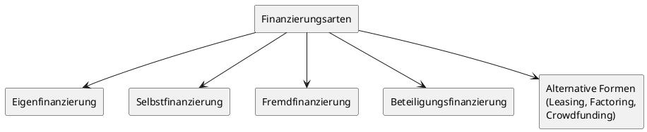
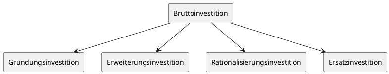

# Investitionsrechnung / Finanzierung

## 1. Finanzierungsarten und Kreditarten

### Leitfrage: „Wie kann ein Handwerksbetrieb seinen Kapitalbedarf decken?"

Die Finanzierung eines Handwerksbetriebes lässt sich nach zwei Kriterien systematisieren: nach der **Kapitalherkunft** (Außen- vs. Innenfinanzierung) und nach der **Kapitalbildungsform** (Art der Finanzierung). Beide Perspektiven ergänzen sich und bilden zusammen das vollständige Bild der Finanzierungsmöglichkeiten.

### 1.1 Systematik der Finanzierungsarten

Nach der Kapitalherkunft wird unterschieden:

- **Außenfinanzierung** — Zuführung von Finanzmitteln von außen, z. B. durch Einlagen, Beteiligungen oder Kredite.
- **Innenfinanzierung** — Zuführung von Finanzmitteln von innen, z. B. durch Einbehaltung von Gewinnen oder Vermögensumschichtung.

Nach der Kapitalbildungsform ergeben sich folgende Hauptarten:



### 1.2 Eigenfinanzierung

Unter **Eigenfinanzierung** versteht man den Einsatz von Mitteln des Privatvermögens für betriebliche Zwecke. Die Ansammlung des Kapitals kann durch Sparen, Erbschaft, Schenkung oder ähnliche Wege erfolgen.

---

> [!IMPORTANT]
> **Merke:** Eigenfinanzierung bedeutet den Einsatz von Privatvermögen oder Eigenleistungen für betriebliche Zwecke — nicht die Finanzierung durch einbehaltene Gewinne (das ist Selbstfinanzierung).

---

Im Allgemeinen wird ein Eigenkapitalanteil von mindestens **20 %** an der Gesamtfinanzierung empfohlen. Eigenkapital verbessert die Bonität gegenüber der Bank und signalisiert die Risikobereitschaft des Inhabers.

### 1.3 Selbstfinanzierung

Die **Selbstfinanzierung** ist die Kapitalbildung durch im Betrieb erzielte und nicht entnommene Gewinne. Sie ist für jeden Handwerksbetrieb ein erstrebenswertes finanzpolitisches Ziel, da keine periodischen Zins- und Tilgungsleistungen anfallen und die Liquiditätslage positiv beeinflusst wird.

Die zur Selbstfinanzierung verfügbaren Mittel errechnen sich wie folgt:

```
Gewinn
+ Abschreibungen
- Privatentnahmen
- Gewinnausschüttungen
= Selbstfinanzierungsmittel
```

### 1.4 Beteiligungsfinanzierung

Die **Beteiligungsfinanzierung** ist eine besondere Art der Eigenfinanzierung durch Kapitaleinlagen von vorhandenen oder neu hinzukommenden Gesellschaftern.

Es wird unterschieden zwischen:

- **Offene Beteiligung** — Aufnahme eines Gesellschafters, der Gesellschaftsrechte, Gewinn- und Verlustbeteiligung erhält und je nach Gesellschaftsform haftet.
- **Stille Beteiligung** — Der stille Gesellschafter tritt nach außen nicht in Erscheinung und hat keine Mitbestimmungsrechte.

| Vorteile stiller Beteiligung                     | Nachteile stiller Beteiligung                                                   |
| ------------------------------------------------ | ------------------------------------------------------------------------------- |
| Langfristige Finanzmittel                        | Einräumung von Informationsrechten                                              |
| Stärkung der Eigenkapitalbasis                   | Liquiditätsbelastung durch Beteiligungsentgelte und Rückzahlung am Laufzeitende |
| Keine Bindung von Sicherheiten                   | —                                                                               |
| Betriebsinhaber bleibt alleiniger Gesellschafter | —                                                                               |

### 1.5 Fremdfinanzierung und Kreditarten

Unter **Fremdfinanzierung** versteht man die Geld- und Kapitalbeschaffung in Form von Krediten. Das Fremdkapital verursacht Zahlungsverpflichtungen für Verzinsung und Tilgung. Die gezahlten Zinsen mindern als steuerlich abzugsfähige Betriebsausgaben den Gewinn. Für Fremdkapital müssen in der Regel Sicherheiten gestellt werden.

#### Einteilung nach Laufzeit

| Kreditart              | Laufzeit         | Typische Verwendung              |
| ---------------------- | ---------------- | -------------------------------- |
| Kurzfristige Kredite   | bis zu 1 Jahr    | Umlaufvermögen, Warenbeschaffung |
| Mittelfristige Kredite | bis zu 5 Jahren  | Maschinen, Fahrzeuge             |
| Langfristige Kredite   | mehr als 5 Jahre | Gebäude, Grundstücke             |

#### Kontokorrentkredit

Der **Kontokorrentkredit** ist ein Kredit in laufender Rechnung. Er ist kurzfristig und dient dem Betrieb als Liquiditätsstütze zur Aufrechterhaltung der betrieblichen Zahlungsbereitschaft sowie zur Finanzierung wesentlicher Teile des Umlaufvermögens (z. B. Waren- und Materialbestand, Forderungen). Je nach Bedarf kann er bis zur vereinbarten Höchstgrenze in Anspruch genommen werden; der jeweils in Anspruch genommene Betrag wird verzinst.

#### Lieferantenkredit

Der **Lieferantenkredit** ist ein kurzfristiger Kredit. Er besteht darin, dass man die von Lieferanten eingeräumten Zahlungsziele bei der Beschaffung von Waren und Materialien nutzt. Der Lieferantenkredit verursacht Kosten, weil bei Zahlung innerhalb einer Skontofrist ein Skontoabzug gewährt wird — der Verzicht auf Skonto entspricht einem Zinsaufwand.

**Rechenbeispiel — Skonto vs. Kontokorrentkredit:**

Handwerksmeister Klaus Bauer kauft Material für 10.000,00 EUR, zahlbar innerhalb von 10 Tagen mit 3 % Skonto oder nach 30 Tagen ohne Abzug.

$$\text{Skontoabzug: }10.000{,}00\text{ €}\times3\%=300{,}00\text{ €}$$
$$\text{Überweisungsbetrag bei Skontierung: }9.700{,}00\text{ €}$$
$$\text{Zinsaufwand Kontokorrentkredit }(12\%\text{ p. a., 20 Tage})$$
$$=\frac{9.700{,}00\text{ €}\times12\%\times20}{360\text{ Tage}}=64{,}67\text{ €}$$
$$\text{Einsparung durch Skontierung: }300{,}00\text{ €}-64{,}67\text{ €}=\mathbf{235{,}33\text{ €}}$$

**Ergebnis:** Es ist vorteilhaft, den Kontokorrentkredit zur Skontoausnutzung einzusetzen.

---

> [!TIP]
> **Prüfungstipp:** Die Berechnung des Skontovorteils gegenüber dem Kontokorrentkredit ist eine klassische Prüfungsaufgabe. Formel merken: Zinsaufwand = Überweisungsbetrag × Zinssatz × Tage / 360 Tage.

---

#### Kundenanzahlungskredit

Der **Kundenanzahlungskredit** (Vorkasse) besteht darin, dass der Kunde bezahlt, bevor der Unternehmer die Leistung vollständig erbracht hat. In verschiedenen Handwerksbranchen ist es üblich, dass Kunden vor oder während der Auftragsdurchführung Anzahlungen leisten.

#### Darlehen

Das **Darlehen** ist ein mittel- oder langfristiger Kredit mit festgelegten Zins- und Tilgungsraten. Es werden folgende Formen unterschieden:

| Darlehensform                             | Merkmale                                                                                     |
| ----------------------------------------- | -------------------------------------------------------------------------------------------- |
| **Endfälliges Darlehen** (Festdarlehen)   | Rückzahlung am Ende der Laufzeit; während der Laufzeit nur Zinszahlungen                     |
| **Tilgungsdarlehen** (Abzahlungsdarlehen) | Gleichbleibende Tilgungsraten; Zinsen sinken laufend, da sie nur auf die Restschuld anfallen |
| **Annuitätendarlehen**                    | Gleichbleibender Kapitaldienst (Rate); Tilgungsanteil steigt, Zinsanteil sinkt               |

Als Finanzierungskosten können je nach Konditionen anfallen: Disagio (Abgeld), Provisionen und sonstige Gebühren. Die Zinshöhe richtet sich nach dem Zinsniveau am Kapitalmarkt und der Bonität des Kreditnehmers. Die **Zinsbindung** bezeichnet den Zeitraum, in dem der Zinssatz unverändert bleibt.

---

> [!IMPORTANT]
> **Merke:** Außerplanmäßige Tilgungen sind nur möglich, wenn dies im Darlehensvertrag vereinbart wurde. Andernfalls fällt eine **Vorfälligkeitsentschädigung** an.

---

### 1.6 Alternative Finanzierungsformen

#### Leasing

Beim **Leasing** werden Wirtschaftsgüter (Maschinen, Fahrzeuge, IT-Systeme usw.) von einer Leasinggesellschaft oder direkt vom Produzenten gegen Zahlung von Leasingraten zur Nutzung überlassen. Leasingverträge können Kauf- oder Mietoptionen einschließen.

Grundformen der Amortisation:

- **Vollamortisation** — Die Anschaffungskosten werden während der Vertragslaufzeit vollständig über die Leasingraten abgetragen.
- **Teilamortisation** — Die Kosten werden nur teilweise abgetragen; es verbleibt ein Restwert.

| Vorteile Leasing                            | Nachteile Leasing               |
| ------------------------------------------- | ------------------------------- |
| Schonung der Liquidität                     | Gesamtkosten oft höher als Kauf |
| Keine Bindung von Sicherheiten              | Keine Eigentumsübertragung      |
| Steuerliche Absetzbarkeit der Raten         | Bindung an Vertragslaufzeit     |
| Ständige Systemerneuerung möglich (bes. IT) | —                               |

#### Factoring

**Factoring** bedeutet den Verkauf von Außenständen (Kundenforderungen aus Lieferungen und Leistungen) an ein spezialisiertes Finanzierungsinstitut (Factor). Das Factoringinstitut übernimmt das Mahnwesen und den Einzug der Forderung, in manchen Fällen auch die Debitorenbuchhaltung. Es zahlt die verkauften Forderungen zunächst als Vorschuss nach Abzug einer Vergütung für Gebühren, Risiko und Zinsen sofort aus.

| Vorteile Factoring                                    | Nachteile Factoring                      |
| ----------------------------------------------------- | ---------------------------------------- |
| Verbesserung der Liquidität                           | Mögliche Belastung der Kundenbeziehungen |
| Möglichkeit der Skontierung von Lieferantenrechnungen | Teurer als Bankkredit                    |
| Erweiterung des Kreditrahmens                         | —                                        |
| Vereinfachung des Mahnwesens                          | —                                        |
| Steuervorteile                                        | —                                        |

#### Crowdfunding

Unter **Crowdfunding** (auch „Schwarmfinanzierung") versteht man die Finanzierung durch die Gewinnung mehrerer Kleininvestoren für den Handwerksbetrieb. Das Kapital kommt von Geldgebern, die über das Internet gewonnen werden.

#### Mezzaninkapital

**Mezzaninfinanzierung** ist eine Zwischenform von Eigenkapital und Fremdkapital. Dazu gehören u. a. nachrangige Darlehen und stille (typische und atypische) Beteiligungen. Mezzaninkapital wird vor allem als zusätzlicher Finanzierungsbaustein für Investitionen und Wachstum eingesetzt.

### 1.7 Kreditsicherheiten

**Kreditsicherheiten** haben den Zweck, den Kreditgeber im Falle einer Insolvenz des Betriebes oder einer Abwicklung aus sonstigen Gründen zu befriedigen.

| Sicherheit                                    | Beschreibung                                                                                                         |
| --------------------------------------------- | -------------------------------------------------------------------------------------------------------------------- |
| **Grundpfandrechte** (Hypothek, Grundschuld)  | Belastung eines Grundstücks zugunsten des Kreditgebers; Eintragung im Grundbuch                                      |
| **Sicherungsübereignung**                     | Eigentumsübertragung von Maschinen/Einrichtungen an den Kreditgeber; Besitz und Nutzung verbleiben beim Kreditnehmer |
| **Abtretung von Forderungen** (Globalzession) | Sämtliche gegenwärtigen und zukünftigen Forderungen werden an den Gläubiger (z. B. Bank) abgetreten                  |
| **Verpfändung beweglicher Sachen**            | Übergabe einer beweglichen Sache (Faustpfand) an den Gläubiger                                                       |
| **Lebensversicherungen**                      | Risikolebens- oder Kapitallebensversicherung als Sicherheit; Sicherheit = Rückkaufswert bzw. Ablaufleistung          |
| **Bürgschaft**                                | Bürge verpflichtet sich, für die Verbindlichkeit des Schuldners einzustehen                                          |

#### Bürgschaftsarten

- **Bürgschaft mit Einrede der Vorausklage** — Der Gläubiger muss zuerst den Schuldner verklagen und die Zwangsvollstreckung versuchen, bevor er den Bürgen in Anspruch nehmen kann.
- **Selbstschuldnerische Bürgschaft** — Der Bürge verzichtet vertraglich auf die Einrede der Vorausklage und haftet wie der Schuldner selbst. In der Praxis ist dies die übliche Form.

---

> [!TIP]
> **Prüfungstipp:** Die Unterscheidung zwischen Hypothek und Grundschuld sowie zwischen den Bürgschaftsarten (Einrede der Vorausklage vs. selbstschuldnerisch) ist prüfungsrelevant. Merken: Bei der **Hypothek** ist die Sicherheit an eine konkrete Forderung gebunden; bei der **Grundschuld** ist sie forderungsunabhängig.

---

#### Bürgschaftsbanken

Da Handwerksbetriebe bei Gründung oder Betriebserweiterung häufig keine banküblichen Sicherheiten leisten können, wurden **Bürgschaftsbanken** in allen Bundesländern eingerichtet. Sie gewähren selbst keine Kredite, sondern übernehmen Ausfallbürgschaften für mittelständische Kredite. Die Bürgschaft wird bis maximal **80 %** des Kreditbetrages übernommen. Der Antrag ist in der Regel über die Hausbank zu stellen; die Handwerkskammer nimmt gutachterlich Stellung.

---

## 2. Inhalt des Investitionsplans und Investitionsplanung

### Leitfrage: „Was muss ein Investitionsplan enthalten und wie wird er erstellt?"

Die **Investitionsplanung** ist ein wichtiger Bestandteil der strategischen Unternehmensplanung. Allen Investitionsentscheidungen geht eine entsprechende Investitionsplanung voraus. Sie bewertet die Vorteilhaftigkeit einer Investition oder mehrerer Alternativen auf Basis der betrieblichen Erfordernisse und der Ergebnisse der Investitionsrechnung.

### 2.1 Investitionsarten

Geht man vom Investitionsvolumen einer Periode aus, ergibt sich folgende Gliederung:



| Investitionsart                  | Zweck                                       |
| -------------------------------- | ------------------------------------------- |
| **Gründungsinvestition**         | Erstausstattung bei Betriebsgründung        |
| **Erweiterungsinvestition**      | Kapazitätsausbau, Erschließung neuer Märkte |
| **Rationalisierungsinvestition** | Kostensenkung, Effizienzsteigerung          |
| **Ersatzinvestition**            | Erneuerung abgenutzter Anlagegüter          |

### 2.2 Inhalt des Investitionsplans

Der **Investitionsplan** beinhaltet die kurz-, mittel- und langfristigen Investitionen für einen bestimmten Zeitraum. Bevor die Investitionsentscheidung getroffen wird, sind die exakten Kosten für alle infrage kommenden Anschaffungen zu ermitteln und zusammenzustellen.

Folgendes Schema wird verwendet:

| Investitionen                                             | Euro |
| --------------------------------------------------------- | ---- |
| Firmenwert / Kaufpreis bei Übernahme                      |      |
| + Grundstück mit Erschließung                             |      |
| + Gebäude / Umbau- und Renovierungsmaßnahmen              |      |
| + Außenanlagen (auch Werbeschilder u. Ä.)                 |      |
| + Werkstatteinrichtung (Maschinen, Geräte, Werkzeuge)     |      |
| + Ladeneinrichtung                                        |      |
| + Büroausstattung (Möbel, Technik, EDV/IT, Kommunikation) |      |
| + Lagereinrichtung                                        |      |
| + Firmenfahrzeuge / Fuhrpark                              |      |
| + Grundbedarf Material- und Warenbestand                  |      |
| + Sonstiges (inkl. Reserve für unvorhergesehene Ausgaben) |      |
| **= Summe Investitionskosten**                            |      |

Die wichtigsten Positionen eines Investitionsplans sind je nach Investitionsanlass:

- Beschaffung eines Grundstücks
- Bauliche Investitionen: Neubauten, Umbauten, Erweiterungen, Renovierungen, Einbauten, Installationen
- Maschinen und Werkzeuge
- Betriebs- und Geschäftsausstattung
- Ladeneinrichtung
- Büromöbel, Büromaschinen, Büromaterial
- Hard- und Software
- Telekommunikationsmittel
- Kraftfahrzeuge
- Mietvorauszahlung, Mietkaution

---

> [!IMPORTANT]
> **Merke:** Die ermittelten Beträge des Investitionsplans fließen nach getroffener Investitionsentscheidung in die **Gesamt-Kapitalbedarfsrechnung** (auch Kapitalbedarfsplan genannt) ein.

---

### 2.3 Vom Investitionsplan zur Kapitalbedarfsrechnung

Der Investitionsplan liefert den **langfristigen Kapitalbedarf** (Investitionsbedarf). Zusammen mit dem **kurzfristigen Kapitalbedarf** (Betriebsmittelbedarf) ergibt sich der Gesamtkapitalbedarf:

```
Investitionsbedarf (langfristiger Kapitalbedarf)
+ Betriebsmittelbedarf (kurzfristiger Kapitalbedarf)
= Gesamtkapitalbedarf
```

Der Betriebsmittelbedarf umfasst u. a.: Waren- und Materialeinkauf, Personalkosten, Miete/Pacht, Energiekosten, Leasing, betriebliche Steuern, Versicherungen, Reparaturen, Beratungskosten, Beiträge, Zinsen, sonstige betriebliche Ausgaben.

### 2.4 Finanzierungsplan

Auf Basis des Gesamtkapitalbedarfs wird der **Finanzierungsplan** erstellt, der zeigt, wie der Kapitalbedarf gedeckt wird:

| Finanzierungsquelle                                     | Euro |
| ------------------------------------------------------- | ---- |
| **1. Eigenfinanzierung**                                |      |
| Bargeld / Bankguthaben                                  |      |
| + Sacheinlagen (Maschinen, Pkw u. Ä. zum Zeitwert)      |      |
| + Beteiligungskapital                                   |      |
| + Sonstiges                                             |      |
| **= Eigenmittel insgesamt**                             |      |
| **2. Langfristige Fremdfinanzierung**                   |      |
| Öffentliche Fördermittel                                |      |
| + (Haus-)Bankdarlehen                                   |      |
| + Sonstige Fremdfinanzierung (z. B. Verwandtendarlehen) |      |
| **= Langfristige Fremdmittel gesamt**                   |      |
| **3. Kurzfristige Fremdfinanzierung**                   |      |
| Kontokorrentkredit der (Haus-)Bank                      |      |
| + Lieferantenkredite                                    |      |
| + Sonstiges                                             |      |
| **= Kurzfristige Fremdmittel gesamt**                   |      |
| **Finanzierungsmittel gesamt (1. + 2. + 3.)**           |      |

### 2.5 Finanzierungsregeln

In der Praxis gelten folgende allgemeine **Finanzierungsregeln** als Orientierung:

- Kurzfristige Investitionen sind mit kurzfristigen Mitteln zu finanzieren (z. B. Warenbeschaffung mit Kontokorrentkredit).
- Langfristige Investitionen sind mit langfristigen Mitteln zu finanzieren (z. B. Neubau mit langfristigen Darlehen).
- Die Laufzeit des Fremdkapitals sollte der Nutzungsdauer der angeschafften Gegenstände entsprechen.
- Das Anlagevermögen sollte durch Eigenkapital und langfristiges Fremdkapital finanziert werden (**Goldene Bilanzregel**).

---

> [!TIP]
> **Prüfungstipp:** Die **Goldene Bilanzregel** ist ein häufiges Prüfungsthema. Sie besagt: Anlagevermögen = Eigenkapital + langfristiges Fremdkapital. In der Kennzahlenrechnung entspricht dies der Anlagendeckung I (nur Eigenkapital) und Anlagendeckung II (Eigenkapital + langfristiges Fremdkapital).

---

---

## Schnellübersicht – Wichtige Begriffe und Formeln auf einen Blick

| Begriff / Formel                    | Inhalt                                                                            |
| ----------------------------------- | --------------------------------------------------------------------------------- |
| **Eigenfinanzierung**               | Einsatz von Privatvermögen für betriebliche Zwecke                                |
| **Selbstfinanzierung**              | Gewinn + AfA − Privatentnahmen − Ausschüttungen = Selbstfinanzierungsmittel       |
| **Kontokorrentkredit**              | Kurzfristiger Kredit in laufender Rechnung; Liquiditätsstütze                     |
| **Lieferantenkredit**               | Nutzung von Zahlungszielen; Kosten = entgangener Skonto                           |
| **Annuitätendarlehen**              | Gleichbleibender Kapitaldienst; Tilgungsanteil steigt, Zinsanteil sinkt           |
| **Festdarlehen**                    | Rückzahlung am Laufzeitende; während der Laufzeit nur Zinsen                      |
| **Tilgungsdarlehen**                | Gleichbleibende Tilgungsraten; sinkende Zinslast                                  |
| **Factoring**                       | Verkauf von Kundenforderungen an Factor; verbessert Liquidität                    |
| **Leasing**                         | Nutzungsüberlassung gegen Ratenzahlung; kein Eigentumserwerb                      |
| **Mezzaninkapital**                 | Zwischenform EK/FK; z. B. nachrangige Darlehen, stille Beteiligungen              |
| **Goldene Bilanzregel**             | Anlagevermögen = Eigenkapital + langfristiges Fremdkapital                        |
| **Investitionsplan**                | Aufstellung aller geplanten Anschaffungskosten → fließt in Kapitalbedarfsrechnung |
| **Kapitalbedarfsrechnung**          | Investitionsbedarf + Betriebsmittelbedarf = Gesamtkapitalbedarf                   |
| **Selbstschuldnerische Bürgschaft** | Bürge haftet wie Schuldner; Einrede der Vorausklage ausgeschlossen                |
| **Globalzession**                   | Abtretung aller gegenwärtigen und zukünftigen Forderungen an die Bank             |
| **Skontoformel**                    | Zinsaufwand = Überweisungsbetrag × Zinssatz × Tage / 360 Tage                     |
