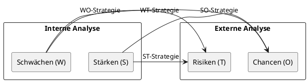
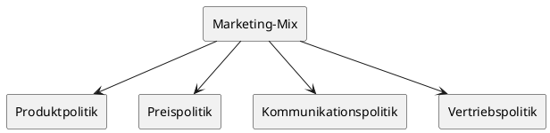

# Marketing II / Controlling

## 1. Befragungsmöglichkeiten

### Leitfrage: „Welche Befragungsarten gibt es, und was sind ihre Vor- und Nachteile?"

Die **Befragung** ist die wichtigste Methode der Informationsbeschaffung im Marketing. Unter einer Befragung versteht man eine systematische Erhebung, bei der Personen durch gezielte Fragen zu konkreten, für den Handwerksbetrieb verwertbaren Aussagen veranlasst werden sollen. Vor der Durchführung muss die Zielgruppe festgelegt werden – sie sollte möglichst mit der Zielgruppe des Betriebes übereinstimmen.

Es werden vier gebräuchliche Befragungswege unterschieden:

### 1.1 Schriftliche Befragung

Bei der schriftlichen Befragung erhalten die Teilnehmer einen Fragebogen per Post oder E-Mail, den sie eigenständig ausfüllen.

| Vorteile                                                        | Nachteile                      |
| --------------------------------------------------------------- | ------------------------------ |
| Gute Repräsentativität                                          | Teurere und aufwendige Methode |
| Möglichkeit, komplexere Fragen zu stellen                       | Geringe Rücklaufquote          |
| Angebot von Auswahlmöglichkeiten durch vorformulierte Antworten | —                              |

### 1.2 Passantenbefragung (persönlich/mündlich)

Hierbei werden Personen direkt vor Ort – z. B. auf der Straße oder im Ladengeschäft – angesprochen und befragt.

| Vorteile                       | Nachteile                                   |
| ------------------------------ | ------------------------------------------- |
| Relativ kostengünstige Methode | Geringe Repräsentativität                   |
| Möglichkeit genauer Nachfragen | Anwendung von Antwortalternativen schwierig |

### 1.3 Telefonische Befragung

Der Befragte wird telefonisch kontaktiert und die Fragen werden mündlich gestellt.

| Vorteile                     | Nachteile                                   |
| ---------------------------- | ------------------------------------------- |
| Relativ geringer Zeitaufwand | Telefoninterviews werden häufig abgebrochen |
| Hohe Repräsentativität       | Anwendung von Antwortalternativen schwierig |

### 1.4 Onlinebefragung

Die Befragung erfolgt über das Internet, z. B. per E-Mail-Link oder auf einer Website.

| Vorteile                                 | Nachteile                            |
| ---------------------------------------- | ------------------------------------ |
| Schnelle Umsetzung                       | Geringe Repräsentativität            |
| Geringe Kosten                           | Abbruch leicht möglich               |
| Daten und Auswertungen zeitnah verfügbar | Technische Voraussetzungen notwendig |

---

> [!TIP]
> **Prüfungstipp:** In der Prüfung werden häufig alle vier Befragungsarten mit je einem Vor- und Nachteil abgefragt. Eine Rücklaufquote von 5 % bis 20 % gilt bei Onlinebefragungen bereits als Erfolg. In der Praxis hat sich die **telefonisch unterstützte Onlinebefragung** im Handwerk als besonders geeignet erwiesen.

---

### 1.5 Maßnahmen zur Erhöhung der Rücklaufquote

Um möglichst viele Teilnehmer zur Mitwirkung zu bewegen, können folgende Techniken eingesetzt werden:

- Zusage eines Gutscheins oder kleinen Geschenks bei Teilnahme
- Zusicherung von Anonymität und Vertraulichkeit
- Formulierung einfacher und klar strukturierter Fragen
- Übersichtliche, nicht zu umfangreiche Gestaltung der Fragen
- Individuelle Gestaltung des E-Mail-Anschreibens
- Angebot einfacher Antwortalternativen
- Telefonische Nachfassaktion

---

> [!NOTE]
> Eine Kundenbefragung hat zwei positive Aspekte: Der Betriebsinhaber erfährt die Wünsche seiner Kunden, und der Kunde erkennt, dass es dem Betrieb ernst damit ist, seine Anregungen aufzunehmen und umzusetzen.

---

## 2. Stärkung der Kundenorientierung

### Leitfrage: „Wie stärkt ein Handwerksbetrieb systematisch seine Kundenorientierung?"

Die Ausrichtung aller marktrelevanten Maßnahmen eines Betriebes an den Wünschen, Bedürfnissen und Problemen des Kunden – die sogenannte **Kundenorientierung** – ist eine zentrale Aufgabe der Betriebsführung im Handwerk. Ein wichtiger Erfolgsfaktor ist dabei die persönliche Beziehung der Mitarbeiter zum Kunden.

### 2.1 Einflussfaktoren auf die Kundenzufriedenheit

Kundenzufriedenheit entsteht, wenn die tatsächlich erbrachte Leistung die Erwartungen des Kunden erfüllt oder übertrifft. Wesentliche Einflussfaktoren sind:

- Qualität der Produkte und Dienstleistungen
- Freundlichkeit und Kompetenz der Mitarbeiter
- Termintreue und Zuverlässigkeit
- Transparenz bei Preisen und Kostenvoranschlägen
- Erreichbarkeit des Betriebes (Telefon, E-Mail, Mobilfunk)
- Beschwerdemanagement und Kulanz

### 2.2 Konkrete Maßnahmen zur Stärkung der Kundenorientierung

Folgende Maßnahmen stärken die Kundenbindung im Handwerksbetrieb nachhaltig:

- Sicherstellung der ständigen Erreichbarkeit (Anrufbeantworter, Mobilfunk, E-Mail)
- Annahme und schnelle Ausführung auch von Kleinaufträgen
- Jeder Reklamation nachgehen und fehlerhafte Arbeit ohne Wenn und Aber ausbessern
- Anlegen einer Kundendatei bzw. Datenbank für Kundenpflege (Geburtstage, Sonderangebote, Sortimentsänderungen)
- Offensive Öffentlichkeitsarbeit (Tage der offenen Tür, Pressemeldungen, Kundenseminare)
- Kostenvoranschläge sorgfältig fertigen und bei Abweichungen verständlich begründen
- Dem Kunden Angebote, Stundenverrechnungssatz und Rechnungen auf Verlangen erläutern

### 2.3 Kundenorientiertes Personalmanagement

Voraussetzung für die Umsetzung der Kundenorientierung ist ein **kundenorientiertes Personalmanagement**. Nur wenn alle Mitarbeiter das Programm mittragen und im Alltag praktizieren, stellt sich der gewünschte Erfolg ein. Wichtige Leitsätze sind:

- Mit Kompetenz überzeugen
- Mit Information, Beratung und Leistung Kunden binden
- Mit Kulanz Kunden behalten
- Mit Geschick verlorene Kunden zurückgewinnen

---

> [!IMPORTANT]
> **Merke:** Kundenzufriedenheit führt zu Kundentreue. Der Betrieb sollte in einem permanenten Prozess Kundenzufriedenheitsanalysen durchführen und in periodischen Abständen das Instrument der Kundenbefragung einsetzen. Daraus entsteht ein gezieltes **Beschwerdemanagement**, das Zufriedenheitsdefizite aufdeckt und Strategien zu deren Abbau entwickelt.

---

## 3. Stärken-/Schwächen-Analyse und SWOT-Analyse

### Leitfrage: „Wie analysiert ein Handwerksbetrieb seine Stärken und Schwächen, und wie wird daraus eine SWOT-Analyse?"

Am Beginn jedes Planungsprozesses steht die gründliche Analyse der Ausgangssituation. Dabei müssen einerseits die eigenen Stärken und Schwächen (Unternehmensanalyse) und andererseits die Chancen und Risiken im Marktumfeld (Umfeldanalyse) ermittelt werden. Zusammen ergeben sie die **SWOT-Analyse**.

### 3.1 Stärken-Schwächen-Analyse (Unternehmensanalyse)

Die Stärken-Schwächen-Analyse erfasst die interne Wettbewerbsposition des Betriebes im Vergleich zur Konkurrenz. Sämtliche Unternehmensbereiche werden systematisch betrachtet:

| Bereich             | Beispielhafte Kriterien                                              |
| ------------------- | -------------------------------------------------------------------- |
| Beschaffung         | Lieferantenbeziehungen, Einkaufspreise, Lagerhaltung                 |
| Produktion          | Maschinenpark, Arbeitsorganisation, Qualitätssicherung               |
| Absatz              | Leistungsangebot, Marktstellung, Kundenkontakt, Werbung              |
| Personal            | Qualifikation, Motivation, Betriebsklima, Fachkräftesicherung        |
| Finanzen            | Eigenkapitalausstattung, Liquiditätsplanung, Zahlungsmanagement      |
| Unternehmensführung | Kaufmännische Qualifikation, Führungseigenschaften, Nachfolgeplanung |
| Strukturfaktoren    | Standort, Marktposition, Umsatz, Rentabilität                        |

**Beispiel für eine Stärken-Schwächen-Übersicht:**

| Stärken                            | Schwächen                         |
| ---------------------------------- | --------------------------------- |
| Mitarbeiterqualifikation (Meister) | Hohe Verschuldung                 |
| Moderner Maschinenpark             | Geringe Liquidität                |
| Hohe Flexibilität                  | Überlastung des Chefs             |
| Guter Kundendienst/Service         | Keine Kostenrechnung/Kalkulation  |
| Termintreue                        | Mangelhafte interne Kommunikation |

---

> [!TIP]
> **Prüfungstipp:** Die Stärken-Schwächen-Analyse sollte nicht allein vom Betriebsinhaber durchgeführt werden. Eine Arbeitsgruppe mit 7–12 Mitgliedern aus allen Unternehmensbereichen und Hierarchieebenen liefert realistischere Ergebnisse. Auch externe Berater können hinzugezogen werden.

---

### 3.2 SWOT-Analyse

Die **SWOT-Analyse** (S = Strengths/Stärken, W = Weaknesses/Schwächen, O = Opportunities/Chancen, T = Threats/Risiken) verbindet die interne Unternehmensanalyse mit der externen Umfeldanalyse. Sie gibt dem Betriebsinhaber eine Positionsbeschreibung, von der ausgehend Strategien entwickelt werden können.



### 3.3 Die vier SWOT-Strategien

Auf Basis der SWOT-Analyse werden vier Strategierichtungen abgeleitet:

| Strategie        | Beschreibung                                  | Beispiel                                                                            |
| ---------------- | --------------------------------------------- | ----------------------------------------------------------------------------------- |
| **SO-Strategie** | Stärken nutzen, um Chancen zu ergreifen       | Ausbau eines erfolgreichen Leistungsbereichs in einem wachsenden Marktsegment       |
| **ST-Strategie** | Stärken einsetzen, um Risiken abzuwehren      | Ausbau der Marktposition durch Forcierung erfolgreicher bestehender Produkte        |
| **WO-Strategie** | Schwächen abbauen, um Chancen zu nutzen       | Einführung neuer ergänzender Dienstleistungen, um den Umsatz zu steigern            |
| **WT-Strategie** | Schwächen reduzieren, um Risiken zu begrenzen | Erweiterung des Leistungsangebots, um Kunden nicht an Komplettanbieter zu verlieren |

---

> [!IMPORTANT]
> **Merke:** Stärken und Schwächen können sich im Zeitverlauf verändern. Die SWOT-Analyse ist daher kein einmaliger Vorgang, sondern muss regelmäßig wiederholt und neu bewertet werden.

---

## 4. Ziele der Werbung und Werbemittel

### Leitfrage: „Welche Ziele verfolgt Werbung, und welche Werbemittel stehen einem Handwerksbetrieb zur Verfügung?"

Unter **Werbung** versteht man den Versuch, Kunden und Verbraucher durch gezielte Maßnahmen so zu beeinflussen, dass sie von sich aus ein bestimmtes Produkt oder eine Dienstleistung des Betriebes erwerben. Für jeden Handwerksbetrieb gilt: „Wer nicht wirbt, der stirbt."

### 4.1 Ziele der Werbung

Jeder Handwerksbetrieb verfolgt mit seiner Werbung bestimmte Zielsetzungen:

- Einführung neuer Produkte und Dienstleistungen
- Erhaltung und Sicherung des Absatzes
- Erweiterung von Umsatz und Marktanteilen
- Ansprache bestimmter Zielgruppen
- Steigerung des Absatzes in verkaufsschwachen Gebieten
- Sicherung des Absatzes in verkaufsstarken Gebieten
- Weckung neuen Bedarfs
- Steigerung des Bekanntheitsgrades
- Verbesserung des Images

### 4.2 Arten der Werbung

| Unterscheidungsmerkmal | Arten                                                                                                                                    |
| ---------------------- | ---------------------------------------------------------------------------------------------------------------------------------------- |
| Nach Adressat          | **Direkte Werbung** (persönliche Ansprache des Endverbrauchers) / **Indirekte Werbung** (verkaufsfördernde Maßnahmen gegenüber Händlern) |
| Nach Träger            | **Einzelwerbung** (ein Betrieb allein) / **Gemeinschaftswerbung** (mehrere Betriebe gemeinsam)                                           |
| Nach Objekt            | **Produktwerbung** (bestimmtes Produkt im Vordergrund) / **Unternehmenswerbung** (Leistungsfähigkeit des Betriebes)                      |

### 4.3 Werbewege und Werbemittel

Die häufigsten **Werbewege** für den Handwerksbetrieb sind:

- **Printmedien** (Druckerzeugnisse)
- **Elektronische Medien** (Fernsehen, Rundfunk, Kino, Internet, E-Mail, Apps)
- **Außenwerbung** (Plakate, Firmenfahrzeuge, Leuchtschriften)

Die wichtigsten **Werbemittel** je Werbeweg:

| Werbeweg              | Werbemittel (Beispiele)                                                                                         |
| --------------------- | --------------------------------------------------------------------------------------------------------------- |
| Printwerbung          | Anzeigen, Poster, Beilagen, Prospekte, Kataloge, Handzettel, Werbebriefe                                        |
| Elektronische Werbung | TV-/Rundfunkspots, Kinowerbung, Internetwerbung, E-Mail-Werbung, Social Media, eigene Apps                      |
| Außenwerbung          | Plakate, Litfaßsäulen, Firmenfahrzeuge, Leuchtschriften, Baustellenschilder, Schaufenster, digitale Werbetafeln |

### 4.4 Systematische Werbeplanung

Werbung ist systematisch zu planen. Werbewege und Werbemittel sind auf die Werbeziele auszurichten. Die Handlungsschritte einer systematischen Werbeplanung sind:

1. Festlegung des Werbeetats
2. Zusammenstellung wichtiger Markt- und Firmeninformationen
3. Entwicklung der Werbekonzeption
4. Gestaltung der Werbemittel
5. Erstellen des Mediaplanes
6. Werbeerfolgskontrolle und Werbewirkungsanalyse

---

> [!IMPORTANT]
> **Wichtig:** Werbemaßnahmen müssen den Grundsätzen von **Wahrheit und Klarheit** genügen. Rechtliche Aspekte – insbesondere das Gesetz gegen den unlauteren Wettbewerb (UWG) und die Datenschutz-Grundverordnung (DSGVO) – sind zwingend einzuhalten. Personenbezogene Daten dürfen nur mit Einwilligung des Betroffenen für Werbezwecke genutzt werden.

---

## 5. Marketinginstrumente

### Leitfrage: „Welche vier Marketinginstrumente bilden den Marketing-Mix, und wie werden sie eingesetzt?"

Die **Marketinginstrumente** werden nicht isoliert, sondern kombiniert in einem **Marketing-Mix** eingesetzt. Ziel ist es, in möglichst vielen Bereichen Alleinstellungsmerkmale gegenüber der Konkurrenz zu erzielen.

### 5.1 Die vier Instrumente des Marketing-Mix



### 5.2 Produkt- und Sortimentspolitik (Product)

Die Aufgabe der **Produktpolitik** ist es, ein an den Bedürfnissen der Nachfrage orientiertes Angebot zu erstellen. Ziel ist es, sich durch ein bedarfsgerechtes Güter- und Dienstleistungsangebot positiv von der Konkurrenz abzuheben. Wichtige Merkmale der äußeren Produkt- und Leistungsgestaltung sind Qualität, Design, Verpackung und Kundendienstleistungen (z. B. Reparatur, Ersatzteilversorgung, Finanzierungsvermittlung, Abhol- und Auslieferungsdienst).

### 5.3 Preis- und Konditionenpolitik (Price)

Die **Preispolitik** legt fest, zu welchen Preisen und Konditionen Produkte und Dienstleistungen angeboten werden. Neben den betrieblichen Kosten aus Kostenrechnung und Kalkulation müssen auch markt- und konkurrenzorientierte Gesichtspunkte berücksichtigt werden. Instrumente sind u. a. Rabatte, Skonti, Zahlungsziele und Staffelpreise.

### 5.4 Kommunikations- und Werbepolitik (Promotion)

Die **Kommunikationspolitik** umfasst alle Maßnahmen, mit denen der Betrieb nach außen kommuniziert. Dazu gehören:

- **Werbung** (Printmedien, elektronische Medien, Außenwerbung)
- **Öffentlichkeitsarbeit/PR** (Pressemitteilungen, Tage der offenen Tür, Kundenseminare)
- **Verkaufsförderung/Sales Promotion** (Messen, Ausstellungen, Sonderangebote, Gewinnspiele, Produktvorführungen)

### 5.5 Vertriebspolitik (Place)

Die **Vertriebspolitik** regelt, wie und über welche Wege Produkte und Dienstleistungen zum Kunden gelangen:

| Vertriebsweg            | Beschreibung                         | Beispiel                                    |
| ----------------------- | ------------------------------------ | ------------------------------------------- |
| **Direktvertrieb**      | Verkauf direkt an den Endverbraucher | Bäckerei verkauft Brot direkt an Kunden     |
| **Indirekter Vertrieb** | Verkauf über Zwischenhändler         | Schreinerei verkauft Türen über Großhändler |
| **Onlinevertrieb**      | Verkauf über das Internet            | Möbelverkauf über eigenen Onlineshop        |

---

> [!TIP]
> **Prüfungstipp:** Die vier Marketinginstrumente (die „4 Ps": Product, Price, Promotion, Place) müssen sicher benannt und voneinander abgegrenzt werden können. Häufige Prüfungsfrage: „Nennen Sie die vier Marketinginstrumente und erläutern Sie je ein Beispiel aus dem Handwerk."

---

## 6. Szenariotechnik

### Leitfrage: „Was ist die Szenariotechnik, und wie wird sie im Handwerksbetrieb angewendet?"

Die **Szenariotechnik** ist eine häufig verwendete Methode, um zukünftige Entwicklungen vorherzusehen. Dabei werden betriebliche Daten und Kennzahlen mit Einschätzungen und Meinungen verknüpft. Die Szenariotechnik ist ein Instrument des strategischen Controllings.

### 6.1 Die drei Szenarien

Grundsätzlich werden drei Szenarien unterschieden:

| Szenario                         | Beschreibung                                                                     |
| -------------------------------- | -------------------------------------------------------------------------------- |
| **Positivszenario** (Best Case)  | Die positivste mögliche Entwicklung für einen bestimmten Zeitraum in der Zukunft |
| **Negativszenario** (Worst Case) | Die negativste denkbare Entwicklung                                              |
| **Trendszenario**                | Die Fortsetzung der Entwicklung auf dem derzeitigen Stand                        |

### 6.2 Vorgehensweise

Die Anwendung der Szenariotechnik erfolgt in drei Schritten:

1. **Szenarien entwickeln:** Für den betrachteten Bereich (z. B. Umsatzentwicklung) werden Positiv-, Negativ- und Trendszenario formuliert.
2. **Einflussfaktoren analysieren:** Es wird untersucht, welche Faktoren und Einflussgrößen die Szenarien in welcher Art und Weise beeinflussen.
3. **Maßnahmen ableiten:** Es werden Maßnahmen erarbeitet, die die verschiedenen Szenarien wahrscheinlich machen oder abwenden.

### 6.3 Beispiel

Ein Handwerksbetrieb prognostiziert seine Umsatzentwicklung für das nächste Jahr:

| Szenario            | Annahme                   | Mögliche Maßnahme                                    |
| ------------------- | ------------------------- | ---------------------------------------------------- |
| **Positivszenario** | Umsatzsteigerung von 20 % | Einstellung eines zusätzlichen Vertriebsmitarbeiters |
| **Trendszenario**   | Umsatz wie im Vorjahr     | Gleiche Vertriebsmannschaft beibehalten              |
| **Negativszenario** | Umsatzrückgang von 20 %   | Reduzierung des Vertriebsteams                       |

---

> [!IMPORTANT]
> **Merke:** Die Szenariotechnik ist kein Instrument zur exakten Vorhersage der Zukunft, sondern dient dazu, mögliche Entwicklungen zu durchdenken und den Betrieb auf verschiedene Situationen vorzubereiten. Sie ist ein Bestandteil des **strategischen Controllings**.

---

## 7. Aufgaben des Controllings

### Leitfrage: „Was ist Controlling, und welche Aufgaben hat es im Handwerksbetrieb?"

**Controlling** ist nicht mit Kontrolle gleichzusetzen. Controlling ist ein Prozess, der vergleichbar mit dem Führen eines Schiffes ist: Es stellt die (Kenn-)Zahlen zur Verfügung, mit deren Hilfe der Betrieb auf Kurs gehalten werden kann. Controlling unterstützt den Inhaber bei der **Zielbildung, Zielsteuerung und Zielüberwachung**.

### 7.1 Operatives und strategisches Controlling

| Merkmal      | Operatives Controlling                       | Strategisches Controlling                              |
| ------------ | -------------------------------------------- | ------------------------------------------------------ |
| Zeithorizont | Kurzfristig (bis 1 Jahr)                     | Mittel- und langfristig (über 1 Jahr)                  |
| Fokus        | Liquidität, Rentabilität, Kosten             | Marktposition, Wettbewerbsfähigkeit, Zukunftssicherung |
| Instrumente  | Soll-Ist-Vergleich, Kennzahlen, Budgetierung | SWOT-Analyse, Szenariotechnik, Balanced Scorecard      |

### 7.2 Ziel des Controllings

Das Ziel des Controllings ist es, **alle Führungsbereiche auf die Unternehmensziele auszurichten**. Controlling als Prozess bedeutet, dass Ist- und Soll-Werte stets verglichen werden müssen und bei Abweichungen gegengesteuert werden muss.

### 7.3 Instrumente des Controllings

Die wichtigsten Controlling-Instrumente im Überblick:

- **Schwachstellenanalyse** → Erkennen und Beseitigen betrieblicher Schwächen
- **Kennzahlen und Kennzahlensysteme** → Messung der Unternehmensleistung
- **Soll-Ist-Vergleich** → Abgleich von Planwerten mit tatsächlichen Ergebnissen
- **Betriebsvergleich** → Branchenvergleich und Zeitvergleich
- **Budgetierung** → Planung und Kontrolle von Kosten und Erlösen
- **Szenariotechnik** → Planung zukünftiger Entwicklungen
- **Balanced Scorecard (BSC)** → Ganzheitliche kennzahlenbasierte Steuerung aus vier Perspektiven (Kunden, Prozesse, Mitarbeiter, Finanzen)

### 7.4 Arten von Kennzahlen

Grundsätzlich lassen sich zwei Arten von Kennzahlen unterscheiden:

- **Beziehungszahlen:** Geben das Verhältnis zweier unterschiedlicher Größen an (z. B. Umsatz pro Mitarbeiter, Rohertrag pro produktive Stunde).
- **Indexzahlen:** Geben an, wie sich zwei inhaltlich vergleichbare, aber voneinander unabhängige Größen in einem Zeitraum entwickelt haben (z. B. Lohnzusatzkosten 2023 zu 2024).

### 7.5 Wichtige Kennzahlen im Überblick

| Bereich      | Kennzahl                             | Formel                                                |
| ------------ | ------------------------------------ | ----------------------------------------------------- |
| Personal     | Fluktuation                          | (Zu- und Abgänge / Gesamte Arbeitskräfte) × 100       |
| Personal     | Fehlzeitenquote                      | (Fehlarbeitstage / Mögliche Arbeitstage) × 100        |
| Fertigung    | Materialaufwand zur Betriebsleistung | (Materialaufwand / Betriebsleistung) × 100            |
| Fertigung    | Lagerumschlagshäufigkeit             | Materialaufwand / Materialbestand                     |
| Fertigung    | Lagerdauer                           | (Materialbestand × 360) / Materialaufwand             |
| Rentabilität | Eigenkapitalrentabilität             | (Gewinn / Eigenkapital) × 100                         |
| Rentabilität | Umsatzrentabilität                   | (Gewinn / Umsatzerlöse) × 100                         |
| Rentabilität | Gesamtkapitalrentabilität            | ((Gewinn + Fremdkapitalzinsen) / Gesamtkapital) × 100 |
| Verwaltung   | Angebotserfolg                       | (Erteilte Aufträge / Abgegebene Angebote) × 100       |

---

> [!TIP]
> **Prüfungstipp:** Die **Umsatzrentabilität** gilt als die wichtigste betriebswirtschaftliche Kennzahl. Kennzahlen gewinnen an Aussagekraft erst durch den **Vergleich** – entweder mit Branchenwerten (Betriebsvergleich), Vorjahreswerten (Zeitvergleich) oder Planwerten (Soll-Ist-Vergleich).

---

## 8. Schwachstellenanalyse

### Leitfrage: „Wie wird eine Schwachstellenanalyse in einem Handwerksbetrieb durchgeführt?"

In jedem Betrieb sind, unabhängig von seiner Größe, **Schwachstellen** vorhanden. Mithilfe der Schwachstellenanalyse gilt es, diese zu erkennen und zu beseitigen. Sie ist ein zentrales Instrument des operativen Controllings.

### 8.1 Die drei Schritte der Schwachstellenanalyse

Die Schwachstellenanalyse besteht aus drei aufeinanderfolgenden Phasen:

```
Schritt 1: Ist-Analyse
→ Gegenwärtigen Zustand erfassen
→ Alle betrieblichen Bereiche nach Schwächen und Fehlern durchsuchen
→ Ergebnisse schriftlich festhalten

Schritt 2: Ursachenanalyse
→ Für jede erkannte Schwachstelle die Ursache(n) ermitteln

Schritt 3: Maßnahmenentwicklung
→ Schwachstellen den Ursachen gegenüberstellen
→ Konkrete Maßnahmen zur Beseitigung der Schwächen entwickeln
```

### 8.2 Unternehmensbereiche der Schwachstellenanalyse

Die Schwachstellenanalyse kann in folgenden Unternehmensbereichen zum Einsatz kommen:

- Rechnungswesen
- Kalkulation
- Marketing / Vertrieb
- Organisation
- Finanzwesen
- Personalwesen
- Planung

### 8.3 Tabellarische Schwachstellenübersicht

Die Ergebnisse der Schwachstellenanalyse werden in einer Tabelle mit den drei Hauptspalten **Schwachstelle – Ursache – Maßnahmen** dokumentiert:

| Schwachstelle                                | Ursache                                                | Maßnahmen                                                                             |
| -------------------------------------------- | ------------------------------------------------------ | ------------------------------------------------------------------------------------- |
| Buchführung ist nicht auf dem neuesten Stand | Rechnungen werden nur einmal im Monat erfasst          | Rechnungen ab sofort wöchentlich erfassen; ggf. Bürohilfe auf Stundenbasis einstellen |
| Kunden finden die Reparaturwerkstatt nicht   | Weg zur Werkstatt ist von der Straße nicht beschildert | Aufstellen von Hinweisschildern mit Firmenlogo                                        |

---

> [!IMPORTANT]
> **Merke:** Die Schwachstellenanalyse ist kein einmaliger Vorgang. Sie sollte regelmäßig wiederholt werden, um neue Schwachstellen frühzeitig zu erkennen. Ziel ist nicht nur die Beseitigung von Fehlern, sondern die kontinuierliche Verbesserung aller betrieblichen Abläufe.

---

## Schnellübersicht – Wichtige Begriffe und Methoden auf einen Blick

| Begriff / Methode             | Kernaussage                                                                                                               |
| ----------------------------- | ------------------------------------------------------------------------------------------------------------------------- |
| **Befragungsarten**           | Schriftlich, persönlich (Passant), telefonisch, online – je mit spezifischen Vor- und Nachteilen                          |
| **Kundenorientierung**        | Ausrichtung aller Maßnahmen an Wünschen und Bedürfnissen des Kunden; Voraussetzung: kundenorientiertes Personalmanagement |
| **Stärken-Schwächen-Analyse** | Interne Analyse der eigenen Wettbewerbsposition in allen Unternehmensbereichen                                            |
| **SWOT-Analyse**              | Verbindung von interner (S/W) und externer (O/T) Analyse → Ableitung von SO-, ST-, WO-, WT-Strategien                     |
| **Werbeziele**                | Absatzsicherung, Absatzsteigerung, Produkteinführung, Imageverbesserung, Bekanntheitsgradsteigerung                       |
| **Marketing-Mix (4 Ps)**      | Produkt-, Preis-, Kommunikations- und Vertriebspolitik – stets kombiniert einsetzen                                       |
| **Szenariotechnik**           | Positiv-, Negativ- und Trendszenario → Maßnahmen für jede Entwicklung ableiten                                            |
| **Controlling**               | Prozess zur Zielbildung, Zielsteuerung und Zielüberwachung; ≠ bloße Kontrolle                                             |
| **Schwachstellenanalyse**     | 3 Schritte: Ist-Analyse → Ursachenanalyse → Maßnahmenentwicklung                                                          |
| **Soll-Ist-Vergleich**        | Planwerte werden tatsächlich erreichten Ist-Werten gegenübergestellt; Abweichungen werden analysiert                      |
| **Umsatzrentabilität**        | (Gewinn / Umsatzerlöse) × 100 – wichtigste betriebswirtschaftliche Kennzahl                                               |
| **Balanced Scorecard**        | Ganzheitliches Controlling-Instrument mit 4 Perspektiven: Kunden, Prozesse, Mitarbeiter, Finanzen                         |
