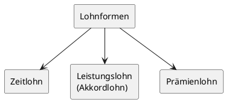

# Personal / Mitarbeiterführung

## 1. Personalbedarf

### 1.1 Grundlagen der Personalbedarfsermittlung

Die **Personalbedarfsermittlung** analysiert den Personalbedarf des Handwerksbetriebes und leitet daraus den Stellenplan ab. Sie unterscheidet zwischen quantitativen und qualitativen Kriterien.

### 1.2 Quantitative Personalbedarfsanalyse

Die quantitative Personalbedarfsanalyse beantwortet die Frage, **wie viele** Mitarbeiter zu einem bestimmten Zeitpunkt an einem bestimmten Ort benötigt werden.

Dabei fließen folgende Einflussfaktoren ein:

**Interne Faktoren:**

- Arbeitsorganisation
- Absatzplanung und Auftragslage
- erwartete Personalfluktuation
- Betriebsgröße und Betriebsausstattung
- Qualitätsanforderungen

**Externe Faktoren:**

- gesamtwirtschaftliche Entwicklung
- wirtschaftliche Entwicklung des Handwerkszweiges
- technologische Entwicklung
- strukturelle Entwicklungen
- Angebot am Arbeitsmarkt

Aus diesen Faktoren werden zwei Kenngrößen abgeleitet:

| Begriff                   | Definition                                                                                                                      |
| ------------------------- | ------------------------------------------------------------------------------------------------------------------------------- |
| **Brutto-Personalbedarf** | Anzahl der Mitarbeiter, die voraussichtlich zur Bewältigung der Aufgaben bzw. Aufträge des Handwerksbetriebes erforderlich sind |
| **Netto-Personalbedarf**  | Brutto-Personalbedarf minus Personalbestand zum Planungszeitpunkt                                                               |

---

> [!IMPORTANT]
> **Merke:** Ist der Netto-Personalbedarf positiv, besteht ein Fehlbedarf → Personalbeschaffung erforderlich. Ist er negativ, liegt eine Überbesetzung vor → Personalabbau oder Umstrukturierung.

---

### 1.3 Qualitative Personalbedarfsanalyse

Die qualitative Personalbedarfsermittlung beantwortet die Frage, **welche Qualifikation** die benötigten Arbeitskräfte aufweisen müssen. Hierzu sind die derzeitigen und zukünftigen Arbeitsanforderungen zu definieren, um daraus die erforderliche Qualifikation zu ermitteln. Typische Kategorien im Handwerk sind: Hilfskräfte, Facharbeiter, Meister und kaufmännische Mitarbeiter.

### 1.4 Stellenplan und Stellenbeschreibung

Der **Stellenplan** ist eine Zusammenstellung aller im Betrieb bestehenden und geplanten Stellen. Er ist das Ergebnis der Personalbedarfsermittlung und bildet die Grundlage für Stellenbeschreibungen.

Die **Stellenbeschreibung** fasst einzelne Teilaufgaben zu einer von einer Person bewältigbaren Aufgabe zusammen. Wichtige Inhalte sind:

- sachliche Beschreibung der Tätigkeiten und Aufgaben
- organisatorische Eingliederung der Stelle
- spezifische Leistungsanforderungen
- persönliche Anforderungen an den Stelleninhaber
- Kompetenz des Stelleninhabers
- Vertretungsregelung

---

> [!TIP]
> **Prüfungstipp:** Die Unterscheidung Brutto- vs. Netto-Personalbedarf sowie interne vs. externe Einflussfaktoren sind klassische Prüfungsfragen. Die Formel merken: Netto-Personalbedarf = Brutto-Personalbedarf − aktueller Personalbestand.

---

## 2. Stellenanzeige (Inhalt, Anforderungen)

### 2.1 Funktion der Stellenanzeige

Die **Stellenanzeige** ist das wichtigste Instrument der externen Personalbeschaffung. Ihre Gestaltung ist firmenspezifisch, folgt jedoch einem klaren inhaltlichen Rahmen. Bei der Erstellung sind die Vorgaben des **Allgemeinen Gleichbehandlungsgesetzes (AGG)** zwingend einzuhalten.

### 2.2 Pflichtinhalte einer Stellenanzeige

Eine vollständige Stellenanzeige enthält folgende Elemente:

- **Vorstellung des Unternehmens** (Branche, Umsatz, Mitarbeiterzahl, Produkt- und Leistungsspektrum)
- **Geschlechts- und altersneutrale Bezeichnung** der zu besetzenden Funktion (Aufgaben, Vollmachten, Entwicklungsmöglichkeiten)
- **Anforderungen an den Bewerber:**
  - Fachliche Merkmale (z. B. Ausbildung, Berufserfahrung, Weiterbildung)
  - Persönliche Merkmale (z. B. Belastbarkeit, Teamfähigkeit, Kommunikationsfähigkeit)
- **Kontaktdaten** (Firmenadresse, Ansprechpartner, ggf. telefonische Vorabauskunft, Homepage)

---

> [!IMPORTANT]
> **Wichtig:** Keinerlei Angaben zum gewünschten Alter oder Geschlecht des Kandidaten! Verstöße gegen das AGG können zu Schadensersatzansprüchen führen.

---

### 2.3 Grundsätze bei der Ausschreibung

- Erstellung eines klaren Anforderungsprofils mit sachlichen und persönlichen Anforderungen
- Keine übertriebenen Forderungen stellen
- Attraktive, zielgruppengerechte, werbliche Gestaltung
- Rasche Bearbeitung eingehender Bewerbungen
- Diskrete Behandlung aller Bewerbungsunterlagen
- Bei Absagen: nur die Gesamtqualifikation als Grund nennen, keine Einzelaspekte

---

> [!TIP]
> **Prüfungstipp:** Häufig wird gefragt, welche Angaben in einer Stellenanzeige fehlen dürfen bzw. verboten sind. Die AGG-konforme Formulierung (keine Alters- oder Geschlechtsangaben) ist ein typischer Prüfungsfallstrick.

---

## 3. Bewerbungsunterlagen

### 3.1 Bestandteile vollständiger Bewerbungsunterlagen

Der Handwerksbetrieb beurteilt Bewerber anhand ihrer Unterlagen. Vollständige Bewerbungsunterlagen umfassen folgende Hauptkategorien:

- **Bewerbungsschreiben** (Anschreiben mit Motivation und Bezug zur Stelle)
- **Lebenslauf** (tabellarisch, lückenlos)
- **Zeugnisse von allgemeinbildenden Schulen** (Schulabschlüsse)
- **Zeugnisse von berufsbildenden Schulen** (Berufsausbildung, Fort- und Weiterbildungsprüfungen, Umschulungsprüfungen)
- **Referenzen** (Empfehlungsschreiben früherer Arbeitgeber)
- **Beurteilungen** (Arbeitszeugnisse)

### 3.2 Grundsätze der Bewerbungsbearbeitung

- Rasche Bearbeitung und ggf. Zwischenbescheide
- Rücksendung von Originalunterlagen abgelehnter Bewerber
- Keine Abwertung von Bewerbern, die nicht angenommen wurden
- Beachtung des AGG bei der gesamten Bearbeitung

---

> [!NOTE]
> Die Bewerbungsunterlagen sind die erste Grundlage der Personalauswahl. Erst im zweiten Schritt folgen Vorstellungsgespräch und weitere Entscheidungshilfen.

---

## 4. Vorstellungsgespräch

### 4.1 Bedeutung des Vorstellungsgesprächs

Das Vorstellungsgespräch ist ein zentrales Instrument der Personalauswahl. Der Erkenntnisgewinn ist in einem **persönlichen Gespräch** immer höher als in einem virtuellen oder telefonischen Gespräch. Erstgespräche finden jedoch häufig virtuell oder telefonisch statt.

### 4.2 Strukturierter Gesprächsablauf

Ein Vorstellungsgespräch folgt idealerweise einer klaren Checkliste:

1. **Gesprächsbeginn / Gesprächseinstieg**
   - Begrüßung des Bewerbers
   - Gegenseitige Vorstellung
   - Anlass der Einladung

2. **Schulischer und beruflicher Lebensweg des Bewerbers**
   - Schulische Ausbildung
   - Berufliche Ausbildung
   - Stationen der bisherigen Berufstätigkeit
   - Fortbildungen
   - Klärung des Grundes für den beruflichen Veränderungswillen

3. **Persönlicher Lebensweg des Bewerbers**
   - Herkunft, Familie/Umfeld
   - Hobbys/Freizeit
   - ggf. ehrenamtliche Tätigkeiten

4. **Gespräch über das Handwerksunternehmen**
   - Daten über das Unternehmen (Größe, Umsatz, Mitarbeiterzahl)
   - Details zur ausgeschriebenen Stelle (Aufgabenbereich, Verantwortungsbereich)
   - Unternehmenskultur / Unternehmensleitbild
   - Darstellung der Vorteile (Marktsituation, flexible Arbeitszeiten, Lohnmodelle)

5. **Absprachen zum Arbeitsverhältnis**
   - Vergütung/Einkommen
   - Arbeitszeit und Arbeitsort
   - Fortbildung, Nebentätigkeiten

6. **Gesprächsabschluss**
   - Kurze Gesprächszusammenfassung
   - Weitere Vorgehensweise
   - Dank und Verabschiedung

---

> [!TIP]
> **Prüfungstipp:** Der strukturierte Gesprächsablauf in sechs Phasen kann als Aufzählungsaufgabe abgefragt werden. Die Reihenfolge und der Inhalt der einzelnen Phasen sind prüfungsrelevant.

---

## 5. Entscheidungshilfen für die Auswahl von Mitarbeitern

### 5.1 Überblick

Die **Personalauswahl** ist die Entscheidung über die Besetzung einer freien Stelle im Handwerksbetrieb. Neben den Bewerbungsunterlagen stehen weitere Entscheidungshilfen zur Verfügung.

### 5.2 Weitere Entscheidungshilfen

- **Persönlicher Eindruck im Vorstellungsgespräch** (virtuell oder persönlich)
- **Einsatz verschiedener Eignungstests:**
  - Fachbezogene Tests (z. B. mathematische und sprachliche Fertigkeiten, logisches Denken, allgemeines Vorstellungsvermögen)
  - Psychologische Tests
  - Tests zur Ermittlung von allgemeinen und fachbezogenen IT-Kompetenzen
- **Beratung bzw. Vermittlung** durch Personal- und Unternehmensberater
- **Assessment-Center** (z. B. Rollen- und Planspiele, Gruppendiskussion)
- **Nachfrage bei angegebenen Referenzen**

| Entscheidungshilfe   | Einsatzbereich                             |
| -------------------- | ------------------------------------------ |
| Bewerbungsunterlagen | Erste Vorauswahl                           |
| Vorstellungsgespräch | Persönlichkeit, Motivation, Auftreten      |
| Eignungstests        | Fachliche und kognitive Eignung            |
| Assessment-Center    | Soziale Kompetenz, Teamverhalten           |
| Referenzen           | Bestätigung bisheriger Leistungen          |
| Personalberater      | Externe Unterstützung bei Fachkräftemangel |

---

> [!IMPORTANT]
> **Merke:** Bei allen Auswahlverfahren sind die Vorschriften des AGG einzuhalten. Diskriminierung wegen Geschlecht, ethnischer Herkunft, Religion, Behinderung, Alter oder sexueller Identität ist verboten.

---

## 6. Arbeitszeugnisse (Inhalt und Formulierung)

### 6.1 Definition und Rechtsgrundlage

Das **Arbeitszeugnis** ist eine dem Arbeitnehmer in der Regel nach Beendigung des Arbeitsverhältnisses auszustellende Urkunde. Der Arbeitnehmer hat beim qualifizierten Zeugnis einen Anspruch auf **wohlwollende, aber den Tatsachen entsprechende** Beurteilung seiner Leistungen.

### 6.2 Arten des Arbeitszeugnisses

| Merkmal                              | Einfaches Zeugnis | Qualifiziertes Zeugnis |
| ------------------------------------ | ----------------- | ---------------------- |
| Art und Dauer der Beschäftigung      | ✓                 | ✓                      |
| Persönliche Daten                    | ✓                 | ✓                      |
| Darstellung der Arbeitsinhalte       | ✗                 | ✓                      |
| Bewertung von Verhalten und Leistung | ✗                 | ✓                      |

### 6.3 Formulierungen zur Leistungsbeurteilung

Die Zeugnissprache ist codiert. Folgende Skala gilt in der betrieblichen Praxis:

| Formulierung                                                                     | Bedeutung                          |
| -------------------------------------------------------------------------------- | ---------------------------------- |
| „erfüllte die übertragenen Aufgaben **stets zu unserer vollsten Zufriedenheit**" | **sehr gut**                       |
| „erfüllte die übertragenen Aufgaben **stets zu unserer vollen Zufriedenheit**"   | **gut**                            |
| „erfüllte die übertragenen Aufgaben **zu unserer vollen Zufriedenheit**"         | **durchschnittlich**               |
| „erfüllte die übertragenen Aufgaben **zu unserer Zufriedenheit**"                | durchschnittlich, noch ausreichend |
| „erfüllte die übertragenen Aufgaben **insgesamt zu unserer Zufriedenheit**"      | **mangelhaft**                     |
| „hat sich **bemüht**, die übertragenen Aufgaben zu erfüllen"                     | **unzureichend**                   |

### 6.4 Formulierungen zur Verhaltensbeurteilung

| Formulierung                                               | Bedeutung             |
| ---------------------------------------------------------- | --------------------- |
| „sein Verhalten … war **stets vorbildlich**"               | sehr gut              |
| „sein Verhalten … war **vorbildlich**"                     | gut                   |
| „sein Verhalten … war **gut**"                             | durchschnittlich      |
| „sein Verhalten … **gab zu Beanstandungen keinen Anlass**" | unterdurchschnittlich |

---

> [!IMPORTANT]
> **Merke:** Das Weglassen des Wortes „stets" oder das Einfügen von „insgesamt" oder „im Großen und Ganzen" verschlechtert die Beurteilung erheblich. Diese Codierungen sind prüfungsrelevant.

---

> [!TIP]
> **Prüfungstipp:** Im Examen werden häufig Zeugnisformulierungen vorgelegt mit der Frage, welche Note sie ausdrücken. Die Tabellen oben sind auswendig zu lernen.

---

## 7. Lohnformen (Vorteile / Nachteile)

### 7.1 Anforderungen an ein Lohnsystem

An ein gerechtes Lohnsystem werden folgende Anforderungen gestellt:

- Markt- und personenbezogene **Lohngerechtigkeit**
- Förderung und Erhaltung der **Leistungsbereitschaft**
- **Funktionsdifferenzierung** (Angemessenheit hinsichtlich der Besonderheiten der einzelbetrieblichen Leistung)

### 7.2 Die drei Hauptlohnformen im Vergleich

#### Zeitlohn

Der **Zeitlohn** geht von der Dauer der Arbeitszeit aus, ohne Rücksicht auf die dabei geleistete Arbeitsmenge.

| Vorteile                       | Nachteile                                         |
| ------------------------------ | ------------------------------------------------- |
| Sorgfältige Arbeitsausführung  | Geringere Produktivität                           |
| Einfachheit der Lohnabrechnung | Höhere Stückkosten                                |
| Gute Arbeitsqualität           | Fehlender Anreiz zu größerer Leistung             |
| Geringerer Leistungsdruck      | Enge Führung der Arbeitskräfte erforderlich       |
| Weniger Arbeitsunfälle         | Keine Berücksichtigung von Leistungsunterschieden |

#### Leistungslohn (Akkordlohn)

Der **Leistungslohn** bezieht sich auf die Anzahl der geleisteten Arbeitsmenge (Stückgeldakkord) oder auf eine durch Zeitstudien ermittelte Vorgabezeit (Stückzeitakkord).

| Vorteile                                    | Nachteile                                     |
| ------------------------------------------- | --------------------------------------------- |
| Höhere Produktivität                        | Oftmals weniger sorgfältige Arbeitsausführung |
| Geringere Stückkosten                       | Schwierigere Lohnabrechnung                   |
| Anreiz zu größerer Arbeitsleistung          | Höherer Leistungsdruck der Mitarbeiter        |
| Geringere Führung erforderlich              | —                                             |
| Mitarbeiter optimiert Arbeitsabläufe selbst | —                                             |

#### Prämienlohn

Der **Prämienlohn** nimmt eine Mittelstellung zwischen Zeitlohn und Leistungslohn ein. Zusätzlich zum Zeitlohn erhält der Arbeitnehmer eine Prämie für quantitative (Mengenprämie) oder qualitative (Qualitätsprämie) Mehrleistungen. Das Lohnniveau steigt über das Zeitlohnniveau, jedoch in geringerem Umfang als die zusätzliche Leistung.

Beispiele für Prämienlohnsysteme:

- Erfolgsbeteiligung (v. a. für Führungskräfte)
- Meister-/Vorarbeiterprämie
- Teamprämie

---

> [!TIP]
> **Prüfungstipp:** Typische Prüfungsfrage: „In welchen Fällen wählen Sie den Zeitlohn, in welchen den Leistungslohn?" Zeitlohn eignet sich bei Qualitätsarbeit und schwer messbarer Leistung; Leistungslohn bei standardisierten, mengenmäßig erfassbaren Tätigkeiten.

---

## 8. Betriebliche Altersversorgung

### 8.1 Grundlagen

Im Rahmen der **betrieblichen Altersversorgung (bAV)** sagt der Arbeitgeber dem Arbeitnehmer Versorgungsleistungen bei **Alter, Invalidität und/oder Tod** zu. Arbeitnehmer, die in der gesetzlichen Rentenversicherung pflichtversichert sind, haben einen **Rechtsanspruch** auf Umwandlung von Gehaltsteilen in eine betriebliche Altersversorgung (**Entgeltumwandlung**).

- Steuerfreier Höchstbetrag der Entgeltumwandlung: **8 % der Beitragsbemessungsgrenze** der Rentenversicherung (West)
- Sozialversicherungsfreier Höchstbetrag: **4 % pro Jahr**

### 8.2 Durchführungswege der betrieblichen Altersversorgung

| Durchführungsweg        | Merkmale                                                                                 |
| ----------------------- | ---------------------------------------------------------------------------------------- |
| **Direktzusage**        | Arbeitgeber sagt Versorgungsleistung direkt zu; Rückstellungen in der Bilanz             |
| **Unterstützungskasse** | Rechtlich selbstständige Versorgungseinrichtung des Betriebes                            |
| **Pensionskasse**       | Rechtlich selbstständige Versorgungseinrichtung; unterliegt Versicherungsaufsicht        |
| **Direktversicherung**  | Arbeitgeber schließt Lebensversicherung auf das Leben des Arbeitnehmers ab               |
| **Pensionsfonds**       | Kapitalmarktorientierte Versorgungseinrichtung; höhere Renditechancen, aber auch Risiken |

### 8.3 Vorteile für Arbeitnehmer und Arbeitgeber

**Für den Arbeitnehmer:**

- Einsparung von steuer- und sozialversicherungspflichtigen Arbeitsentgeltanteilen in der Ansparphase
- Ergänzung der gesetzlichen Rente
- Da Einkünfte im Alter geringer sind, profitiert der Rentner vom geringeren Steuersatz

**Für den Arbeitgeber:**

- Umgewandelte Gehaltsteile sind nicht sozialversicherungspflichtig
- Ausgaben für bAV sind steuerlich **Betriebsausgaben**
- Betriebliche Altersversorgung bewirkt **Mitarbeiterbindung und -motivation**
- Positives Betriebsklima und besseres Ansehen am Markt

### 8.4 Unverfallbarkeit und Absicherung

Scheidet ein Arbeitnehmer vor Eintritt des Versorgungsfalls aus dem Betrieb aus, verliert er den bereits erworbenen Teil seiner Versorgungsanwartschaft **nicht**, wenn er mindestens **21 Jahre alt** ist und die Versorgungszusage mindestens **3 Jahre** bestanden hat.

Zur Absicherung der Versorgungsleistungen haben Betriebe eine **Pflichtumlage an den Pensionssicherungsverein** abzuführen (ausgenommen: Lebensversicherungen und Ansprüche gegenüber Pensionskassen).

---

> [!IMPORTANT]
> **Merke:** Die betriebliche Altersversorgung ist ein wichtiges Instrument der Personalerhaltung, besonders in Zeiten des Fachkräftemangels im Handwerk.

---

## 9. Führungsstile / Führungstechniken

### 9.1 Begriff und Grundlagen

Der **Führungsstil** bezeichnet die Art des Umgangs von Vorgesetzten mit Mitarbeitern. Das Hauptkriterium für die Unterscheidung der Führungsstile ist der **Grad der Einbeziehung der Mitarbeiter in den Entscheidungsprozess**.

Die Eignung einer Führungskraft hängt von persönlichen Voraussetzungen ab:

- Selbstdisziplin, Autorität als Person
- Überzeugungskraft, Kontaktfähigkeit
- Entscheidungskraft, soziale Kompetenz
- Kommunikationsfähigkeit
- Fähigkeit zur Unterdrückung impulsiver Launen

### 9.2 Die drei Hauptführungsstile

| Merkmal          | Autoritärer Stil                   | Kooperativer Stil               | Laissez-faire-Stil           |
| ---------------- | ---------------------------------- | ------------------------------- | ---------------------------- |
| Entscheidung     | Allein durch Vorgesetzten          | Gemeinsam mit Mitarbeitern      | Weitgehend durch Mitarbeiter |
| Kontrolle        | Fremdkontrolle durch Vorgesetzten  | Selbstkontrolle der Mitarbeiter | Kaum Kontrolle               |
| Delegation       | Keine                              | Teilweise                       | Weitgehend                   |
| Mitarbeiterrolle | Ausführend                         | Mitgestaltend                   | Selbstständig                |
| Geeignet für     | Krisensituationen, Routinearbeiten | Regelfall im Handwerk           | Hochqualifizierte Experten   |

#### Autoritärer Führungsstil

- Alleinige Anweisungs- und Entscheidungskompetenz des Vorgesetzten
- Mitarbeiter können Anweisungen nur akzeptieren und ausführen
- Einsatz der legitimierten Macht des Vorgesetzten
- Kontrolle, ob Anweisungen ausgeführt wurden
- Keine Delegation

#### Kooperativer / partnerschaftlicher Führungsstil

- Beteiligung der Mitarbeiter an Entscheidungen
- Verlagerung bestimmter Entscheidungen auf die Mitarbeiter
- Selbstkontrolle statt Fremdkontrolle
- Vorgesetzter beteiligt sich an den Handlungen der Gruppe
- Zeitgerechte Autorität zur gemeinsamen Aufgabenerfüllung

#### Laissez-faire-Stil (Gewähren lassen)

- Weitgehende Freiheit der Mitarbeiter bei Entscheidungen
- Selbstständigkeit der Mitarbeiter bei der Auftragsdurchführung
- Informationen durch den Vorgesetzten nur auf Verlangen der Mitarbeiter

---

> [!IMPORTANT]
> **Merke:** Der **kooperative Führungsstil** wird als der am besten geeignete Stil bewertet, weil er Eigenverantwortung und Motivation der Mitarbeiter stärkt. Je nach Situation und Aufgabe können Elemente verschiedener Führungsstile kombiniert werden.

---

### 9.3 Führungstechniken

**Führungstechniken** sind umfassende Konzepte, die den Rahmen für Führungstätigkeiten und Verhaltensweisen bilden.

| Führungstechnik                    | Kurzbezeichnung          | Inhalt                                                                                                                     |
| ---------------------------------- | ------------------------ | -------------------------------------------------------------------------------------------------------------------------- |
| **Führung im Ausnahmefall**        | Management by Exceptions | Nahezu alle normalen Entscheidungen werden von zuständigen Stellen getroffen; Vorgesetzter entscheidet nur im Ausnahmefall |
| **Führung durch Delegation**       | Management by Delegation | Übertragung weitgehender Entscheidungsfreiheit und Verantwortung an die Mitarbeiter                                        |
| **Führung durch Zielvereinbarung** | Management by Objectives | Gemeinsame Zielvereinbarungen zwischen Vorgesetztem und Mitarbeiter; regelmäßige Überprüfung des Zielerreichungsgrads      |

### 9.4 Weisungsformen in der Praxis

In der betrieblichen Praxis werden drei Arten von Weisungen unterschieden:

| Weisungsform  | Merkmale                                                                                                                |
| ------------- | ----------------------------------------------------------------------------------------------------------------------- |
| **Kommando**  | Knappste Art der Weisung; ohne Begründung und Höflichkeitsform; mit erhobener Stimme                                    |
| **Auftrag**   | Mit Begründung und Höflichkeitsform; Mitarbeiter übernimmt Verantwortung und entwickelt Eigeninitiative; häufigste Form |
| **Anweisung** | Mittelweg zwischen Kommando und Auftrag                                                                                 |

---

> [!TIP]
> **Prüfungstipp:** Die drei Management-by-Techniken werden häufig mit ihrer deutschen Bezeichnung und ihrem Inhalt abgefragt. Eselsbrücke: Exceptions = Ausnahme, Delegation = Übertragen, Objectives = Ziele.

---

## 10. Motivationsfaktoren

### 10.1 Bedeutung der Mitarbeitermotivation

Die Motivation der Mitarbeiter bestimmt in hohem Maße den Erfolg des Handwerksbetriebes. Beim Einsatz von Motivationsfaktoren ist die **individuelle Bedürfnisstruktur** des Mitarbeiters zu berücksichtigen. Basis hierfür sind Beobachtungen im Arbeitsalltag und regelmäßige **Mitarbeitergespräche**.

### 10.2 Wichtige Motivationsfaktoren

Motivationsfaktoren lassen sich in intrinsische (innere) und extrinsische (äußere) Faktoren unterteilen:

| Bereich             | Motivationsfaktoren                                                                    |
| ------------------- | -------------------------------------------------------------------------------------- |
| **Arbeitsinhalt**   | Eindeutige Aufgabenstellungen, Gestaltungsmöglichkeiten (inhaltlich, fachlich)         |
| **Arbeitsumgebung** | Arbeitsplatzgestaltung, Arbeitszeitgestaltung, Arbeitsortgestaltung (z. B. Homeoffice) |
| **Anerkennung**     | Arbeitszufriedenheit, Verantwortungsbewusstsein für den Betrieb                        |
| **Vergütung**       | Angemessene Entlohnung, leistungs- und erfolgsorientierte Vergütungskomponenten        |
| **Entwicklung**     | Fortbildungsmöglichkeiten, Karrieremodelle                                             |
| **Soziales**        | Gutes Team- und Betriebsklima, flexible Arbeitszeiten                                  |

### 10.3 Das Mitarbeitergespräch als Führungsinstrument

Ein wichtiges Führungsinstrument zur Motivation ist das **Mitarbeitergespräch**. Es gehört zum Handwerkszeug der Führungskraft, folgende Gesprächsarten zu führen:

- **Motivationsgespräch** – Stärkung der Leistungsbereitschaft
- **Zielvereinbarungsgespräch** – Gemeinsame Festlegung messbarer Ziele
- **Kritikgespräch** – Sachliche Rückmeldung bei Fehlern (Fehler kritisieren, nicht den Menschen)
- **Konfliktgespräch** – Lösung menschlicher Schwierigkeiten, möglichst unter vier Augen

---

> [!TIP]
> **Prüfungstipp:** Motivationsfaktoren können in der Prüfung als Aufzählung oder als Fallbeispiel abgefragt werden (z. B.: „Wie binden Sie qualifizierte Mitarbeiter in Zeiten des Fachkräftemangels?"). Stets mehrere Kategorien nennen: Inhalt, Umgebung, Vergütung, Entwicklung, Soziales.

---

> [!NOTE]
> Personalführung und Motivation haben im Handwerk einen sehr hohen Stellenwert. Dies erfordert die kontinuierliche Weiterbildung des Betriebsinhabers und des Führungspersonals.

---

## Schnellübersicht – Wichtige Begriffe auf einen Blick

| Begriff                       | Kurzdefinition                                                                               |
| ----------------------------- | -------------------------------------------------------------------------------------------- |
| **Brutto-Personalbedarf**     | Gesamte benötigte Mitarbeiterzahl zur Aufgabenbewältigung                                    |
| **Netto-Personalbedarf**      | Brutto-Personalbedarf minus aktueller Personalbestand                                        |
| **Stellenbeschreibung**       | Schriftliche Festlegung von Aufgaben, Anforderungen und Kompetenzen einer Stelle             |
| **AGG**                       | Allgemeines Gleichbehandlungsgesetz; verbietet Diskriminierung bei Ausschreibung und Auswahl |
| **Einfaches Zeugnis**         | Bestätigt nur Art und Dauer der Beschäftigung                                                |
| **Qualifiziertes Zeugnis**    | Enthält zusätzlich Leistungs- und Verhaltensbeurteilung                                      |
| **Wohlwollenspflicht**        | Arbeitgeber muss Zeugnis wohlwollend, aber wahrheitsgemäß formulieren                        |
| **Zeitlohn**                  | Entlohnung nach Dauer der Arbeitszeit                                                        |
| **Leistungslohn (Akkord)**    | Entlohnung nach geleisteter Arbeitsmenge                                                     |
| **Prämienlohn**               | Zeitlohn + Prämie für Mehr- oder Qualitätsleistung                                           |
| **bAV**                       | Betriebliche Altersversorgung; 5 Durchführungswege                                           |
| **Entgeltumwandlung**         | Rechtsanspruch des AN auf Umwandlung von Gehaltsteilen in bAV                                |
| **Autoritärer Führungsstil**  | Alleinentscheidung durch Vorgesetzten, keine Delegation                                      |
| **Kooperativer Führungsstil** | Mitarbeiter werden in Entscheidungen einbezogen; empfohlener Regelstil                       |
| **Laissez-faire-Stil**        | Weitgehende Selbstständigkeit der Mitarbeiter                                                |
| **Management by Exceptions**  | Vorgesetzter entscheidet nur im Ausnahmefall                                                 |
| **Management by Delegation**  | Weitgehende Übertragung von Entscheidungsfreiheit                                            |
| **Management by Objectives**  | Führung durch gemeinsame Zielvereinbarungen                                                  |
