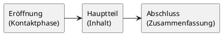

# Kommunikations- und Präsentationstechniken im Geschäftsverkehr einsetzen

## 1. Definition Kommunikation

### 1.1 Was ist Kommunikation?

**Kommunikation** bezeichnet jede beliebige Art des Austauschs von Gedanken, Eindrücken, Stimmungen, Wahrnehmungen und Sichtweisen zwischen zwei oder mehreren Personen. Der Begriff leitet sich vom lateinischen _communicare_ ab – „etwas gemeinsam tun" oder „einander mitteilen". Kommunikation findet überall statt: beim Reden, Schreiben, Telefonieren, aber auch durch Blicke, Gestik und Mimik. Selbst Streiten ist eine Form der Kommunikation.

---

> [!IMPORTANT]
> **Merke:** „Man kann nicht nicht kommunizieren." (Paul Watzlawick) – Jedes Verhalten, auch Schweigen oder Wegschauen, ist eine Form der Kommunikation.

---

### 1.2 Die fünf Axiome nach Watzlawick

Paul Watzlawick formulierte fünf kommunikationspsychologische Grundannahmen (Axiome), die für jeden Kommunikationsprozess Gültigkeit besitzen:

1. **Man kann nicht nicht kommunizieren.** Jedes Verhalten – auch nonverbales – ist Kommunikation.
2. **Jede Kommunikation hat einen Inhalts- und einen Beziehungsaspekt.** Der Beziehungsaspekt bestimmt, wie der Inhalt beim Empfänger ankommt. Beispiel: Ein Kunde lässt Argumente des Beraters nicht gelten, weil er ihn unsympathisch findet.
3. **Jeder Kommunikationsprozess ist von der Interpunktion der Beteiligten abhängig.** Jeder Gesprächspartner empfindet subjektiv, wo ein Austausch „beginnt" und wer „schuld" an einem Missverständnis ist.
4. **Menschliche Kommunikation bedient sich digitaler und analoger Modalitäten.** Digital = Worte/Sprache; analog = Körpersprache, Tonfall, Mimik.
5. **Kommunikationsprozesse sind entweder symmetrisch oder komplementär strukturiert.** Symmetrisch: Partner streben nach Gleichheit. Komplementär: Unterschiede (z. B. Hierarchie) bestimmen die Interaktion.

---

> [!TIP]
> **Prüfungstipp:** Das Axiom „Man kann nicht nicht kommunizieren" erscheint regelmäßig als Definitionsfrage. Die korrekte Erklärung lautet: Auch Schweigen oder Nichtreagieren ist ein kommunikativer Akt, weil es beim Gegenüber eine Reaktion auslöst.

---

## 2. Kommunikationsregeln

### 2.1 Grundregeln für effektive Kommunikation

Richtige und effektive Kommunikation setzt die Beachtung bestimmter Kommunikationsregeln voraus. Im beruflichen Alltag des Handwerks ist es unerlässlich, so zu kommunizieren, dass Vorgesetzte, Kollegen und Kunden den Gesprächspartner sofort verstehen.

Wesentliche Kommunikationsregeln sind:

- **Dem Gegenüber aufmerksam zuhören.** Nur wer zuhört, kann auf die Anliegen des anderen eingehen und ein echtes Gespräch führen.
- **Sich auf den Gesprächspartner einstellen.** Je nach Gesprächspartner (Vorgesetzte, Kollegen, Kunden) ist eine andere Kommunikation gefragt – sowohl in der Wortwahl als auch in Mimik und Gestik.
- **Den Gesprächspartner wertschätzen.** Den anderen ausreden lassen, seinen Standpunkt akzeptieren und eigene Ziele klar kommunizieren, um Missverständnisse zu vermeiden.

---

> [!IMPORTANT]
> **Merke:** Das persönliche Auftreten und die Kommunikationsfähigkeit sind neben der Fachkompetenz entscheidende Kriterien für die Außenwirkung eines Handwerksbetriebs. In jedem Kundenkontakt repräsentiert der Mitarbeiter sein Unternehmen.

---

### 2.2 Kommunikationsstrategien im Konfliktfall

Die Nichteinhaltung von Kommunikationsregeln führt zu typischen Konfliktsituationen wie Mobbing, Aggressionen oder Missverständnissen. Um konstruktive Meinungsäußerung zu gewährleisten, müssen klare Regeln und Methoden (Kommunikationsstrategien) aufgestellt werden. Ein Beispiel: Ein standardisierter Reklamationsbogen steuert die sachliche Betrachtung eines Reklamationsgrundes und verhindert emotionale, unsachliche Wiedergaben.

## 3. Grundmodelle der Kommunikation

### 3.1 Das Sender-Empfänger-Modell

Das **Sender-Empfänger-Modell** ist das Grundmodell der Kommunikation. Es definiert Kommunikation als Übertragung einer Nachricht von einem **Sender** (Person A) zu einem **Empfänger** (Person B). Der Prozess verläuft in vier Schritten:

```plantuml
Sender ----> Empfänger : Kodiert⚡Dekodiert
Sender <---- Empfänger : Dekodiert⚡Kodiert
```

1. Der Sender hat eine Nachricht und **codiert** sie in Worte, Mimik oder Gestik.
2. Die codierte Nachricht wird über einen **Kanal** (verbal oder nonverbal) übermittelt.
3. Der Empfänger **decodiert** die Nachricht – er muss denselben Code kennen, um sie zu verstehen.
4. Der Empfänger gibt eine **Rückmeldung (Feedback)**, mit der beide Seiten prüfen können, ob die Nachricht richtig verstanden wurde.

**Störungen** können bei der Codierung und Decodierung auftreten: unterschiedliche Sprache, Mehrdeutigkeit, kulturelle Unterschiede, mangelnde Aufmerksamkeit oder eingegrenzte Wahrnehmung.

---

> [!IMPORTANT]
> **Merke:** Sender und Empfänger sind zu gleichen Teilen für eine störungsfreie Kommunikation verantwortlich. Der Sender muss sich unmissverständlich ausdrücken; der Empfänger muss genau zuhören und bei Unklarheiten nachfragen.

---

### 3.2 Das Vier-Seiten-Modell (Schulz von Thun)

Der Kommunikationswissenschaftler **Friedemann Schulz von Thun** entwickelte das Modell der „Vier Seiten einer Nachricht". Jede Nachricht kann auf vier Ebenen betrachtet werden:

| Seite                       | Frage des Senders                                     | Bedeutung                                                         |
| --------------------------- | ----------------------------------------------------- | ----------------------------------------------------------------- |
| **Sachebene**               | Worüber möchte ich informieren?                       | Austausch von Sachinformationen                                   |
| **Beziehungsebene**         | Was halte ich von meinem Gesprächspartner?            | Zwischenmenschliche Empfindungen und Impulse                      |
| **Selbstoffenbarungsebene** | Was gebe ich von mir zu erkennen?                     | Unbewusste Signale über die eigene Persönlichkeit (Authentizität) |
| **Appellebene**             | Was möchte ich bei meinem Gesprächspartner erreichen? | Aufforderung zu einer Handlung oder Reaktion                      |

Je nachdem, auf welcher Seite der Empfänger „hört", entsteht eine andere Reaktion. Dieses Modell erklärt viele Missverständnisse in der Alltagskommunikation.

---

> [!TIP]
> **Prüfungstipp:** Im Handwerk-Kontext wird das Vier-Seiten-Modell häufig anhand eines konkreten Gesprächsbeispiels abgefragt. Die Aufgabe lautet dann: „Analysieren Sie die Aussage auf allen vier Ebenen." Üben Sie, eine Aussage systematisch aus Sender- und Empfängerperspektive zu betrachten.

---

## 4. Gesprächstechniken

### 4.1 Definition und Phasen des Kundengesprächs

**Gesprächstechniken** sind Vorgehensweisen und Methoden, mit deren Anwendung ein Kundengespräch positiv gesteuert werden kann. Grundsätzlich gilt es, eine Struktur aufzubauen, Gesprächsinhalte zu thematisieren und eine Beziehung zum Gesprächspartner herzustellen.

Für einen optimalen Gesprächsausgang eignet sich die Dialogform, bei der der Gesprächsanteil zugunsten des Kunden verteilt wird **(70 % Kunde : 30 % Berater)**. Dies gelingt durch gezieltes Fragen.

Ein Kundengespräch besteht in der Regel aus **fünf Phasen**:

```
Phase I   → Eröffnungs-/Begrüßungsphase
Phase II  → Bedarfsermittlungsphase
Phase III → Angebots-/Präsentationsphase
Phase IV  → Verhandlungsphase
Phase V   → Abschlussphase
```

**Phase I – Eröffnungs-/Begrüßungsphase:** Die Gesprächspartner begrüßen sich, nennen Gesprächsanlass, Thema und Ziel. Der Berater beobachtet den Kunden genau (Typ, Sprachstil, Bedürfnisse), um diese Informationen im weiteren Verlauf einzusetzen.

**Phase IV – Verhandlungsphase:** Auf Grundlage der ermittelten Bedürfnisse wird eine Lösung präsentiert. Einwände des Kunden werden aufgenommen und behandelt.

**Phase V – Abschlussphase:** Der Berater fasst alle gemeinsam erarbeiteten Details prägnant zusammen, nutzt dabei die Technik des Visualisierens und bedankt sich für die Mitarbeit des Kunden.

### 4.2 Umgang mit Einwänden des Kunden

Einwände sind Äußerungen des Kunden, die Bedenken oder Widerstände gegenüber einem Angebot signalisieren. Typische Einwände lauten:

- „Ich habe jetzt keine Zeit!"
- „Das ist aber teuer!"
- „Ich bin nicht interessiert!"

Grundsätzlich gilt: Einwände sollten nicht als Störung, sondern als Chance betrachtet werden. Sie zeigen, dass der Kunde sich mit dem Angebot auseinandersetzt. Der Berater sollte sich von Einwänden nicht aus dem Konzept bringen lassen.

---

> [!IMPORTANT]
> **Merke:** Es ist wichtig, zwischen einem echten **Einwand** (sachliche Bedenken, die ausgeräumt werden können) und einem **Vorwand** (vorgeschobener Grund, der die eigentliche Ablehnung verdeckt) zu unterscheiden.

---

### 4.3 Aktives Zuhören

**Aktives Zuhören** ist eine Grundvoraussetzung für einen verständnisvollen Dialog. In Kundengesprächen schafft es eine vertrauensvolle Atmosphäre und signalisiert dem Kunden, dass der Berater zu 100 % bei ihm ist. Verhaltensweisen aktiver Zuhörer umfassen:

- Dem Gesprächspartner zugewandt sein und Blickkontakt halten
- Nicken und kurze Bestätigungslaute als Zeichen des Verständnisses
- Inhalte des Gesagten in eigenen Worten zusammenfassen (Paraphrasieren)
- Gezielte Nachfragen bei Unklarheiten stellen

## 5. Gesprächsvorbereitung und Gesprächsnachbereitung

### 5.1 Gesprächsvorbereitung

Das Kundengespräch wird von zwei weiteren Phasen begleitet: der **Vorbereitungsphase** und der **Nachbereitungsphase**. Die Gesprächsvorbereitung umfasst:

- Sammeln von Informationen über den Kunden und das Unternehmen
- Erfassen von Kenntnissen über den Gesprächspartner
- Entwickeln einer gut durchdachten Strategie
- Vorbereitung des persönlichen Auftretens

Eine Checkliste zur Gesprächsvorbereitung enthält typischerweise folgende Punkte:

| Checkliste Gesprächsvorbereitung    |                                     |
| ----------------------------------- | ----------------------------------- |
| Kunde                               | Name, Unternehmen                   |
| Anlass                              | Grund des Gesprächs                 |
| Termin/Uhrzeit                      | Datum und Uhrzeit                   |
| Gesprächsziel                       | Was soll erreicht werden?           |
| Wichtigste Verkaufsargumente        | Produktvorteile, Nutzen             |
| Grobgliederung des Gesprächs        | Phasenplanung                       |
| Erwartete Einwände                  | Mögliche Gegenargumente vorbereiten |
| Erfahrungen aus früheren Gesprächen | Besonderheiten des Kunden           |

---

> [!TIP]
> **Prüfungstipp:** Je gründlicher die Gesprächsvorbereitung, desto überzeugender wirkt der Berater. Eine sorgfältige Vorbereitung verleiht Sicherheit, ermöglicht schnelleren Vertrauensaufbau und führt zu effizienteren, ergebnisorientierten Gesprächen.

---

### 5.2 Gesprächsnachbereitung (Dokumentation)

Die Nachbereitung von Kundengesprächen erfolgt **unmittelbar nach dem Gespräch**, solange die Inhalte noch frisch im Gedächtnis sind. Mit der Nachbereitung werden folgende Ziele erreicht:

- Vereinbarungen, Folgetermine und Absprachen werden schriftlich fixiert und sind damit verbindlich.
- Der Berater wird „gezwungen", das Gespräch zu reflektieren und sein Gesprächsverhalten zu optimieren.
- Das Kauf- und Kundenverhalten wird besser erkennbar (Wann, was, wie oft kauft der Kunde?).

In der betrieblichen Praxis bieten sich **CRM-Softwarelösungen** (Customer-Relationship-Management) zur Darstellung, Pflege und Dokumentation von Kundengesprächen an.

## 6. Fragetechniken

### 6.1 Überblick und Bedeutung

Kundengespräche dienen dazu, so viel wie möglich über den Kunden zu erfahren. Die richtige Fragetechnik ist dabei ein entscheidendes Werkzeug. Grundsätzlich werden drei Fragetypen unterschieden:

| Fragetyp               | Merkmal                      | Ziel                                                          | Beispiel                                |
| ---------------------- | ---------------------------- | ------------------------------------------------------------- | --------------------------------------- |
| **Offene Frage**       | Beginnt mit W-Fragewort      | Detaillierte Informationen gewinnen, Kunden zum Reden bringen | „Wie kann ich Ihnen helfen?"            |
| **Geschlossene Frage** | Wird mit Ja/Nein beantwortet | Gespräch gezielt lenken, Entscheidungen herbeiführen          | „Soll ich Ihnen ein Angebot erstellen?" |
| **Alternativfrage**    | Bietet zwei Optionen an      | Abschluss sichern, Entscheidung erleichtern                   | „Möchten Sie Termin A oder Termin B?"   |

### 6.2 Offene Fragen

Offene Fragen sind so formuliert, dass der Kunde zusammenhängende Informationen preisgibt. Die Entscheidungsantworten „Ja" und „Nein" werden umgangen. Beliebte Fragewörter sind: _Wie, Wo, Was, Welche, Worin._

---

> [!IMPORTANT]
> **Merke:** Die Fragewörter „Wieso?", „Weshalb?" und „Warum?" sollten in Kundengesprächen vermieden werden, da der Kunde sie als Aufforderung zur Rechtfertigung empfindet und eine Abwehrhaltung einnimmt.

---

### 6.3 Geschlossene Fragen

Geschlossene Fragen ermöglichen es, das Gespräch gezielt zu lenken. Werden jedoch zu viele geschlossene Fragen verwendet, entsteht ein ungleicher Gesprächsanteil – der Dialog neigt zum Monolog des Beraters. Als Faustregel gilt:

---

> [!TIP]
> **Empfehlung:** In jedem Kundengespräch sollte ein ausgewogener Mix aus offenen und geschlossenen Fragen verwendet werden. Die 80/20-Regel beschreibt das Idealverhältnis: Der Kunde spricht 80 %, der Berater 20 %.

---

## 7. Definition von Konflikt

### 7.1 Was ist ein Konflikt?

**Konflikte** entstehen dann, wenn man sich zwischen einander widersprechenden Motiven, Einstellungen und Interessen entscheiden muss. Ein Konflikt kann entweder eine Person allein betreffen (intrapersonaler Konflikt) oder zwischen mehreren Personen, Gruppen oder Institutionen ausgetragen werden (interpersonaler Konflikt).

Konflikte entstehen, sobald **Spannungen** zwischen den Beteiligten herrschen. Die Grenzen zwischen Meinungsverschiedenheiten und echten Konflikten sind oftmals fließend. Bei der Konfliktanalyse wird zwischen **Auslöser**, **Ursache** und **Konfliktebene** unterschieden:

- **Auslöser:** Das konkrete Ereignis, das den Konflikt sichtbar macht.
- **Ursache:** Der eigentliche, oft tiefer liegende Grund – im Unbewusstsein verankert und selten offensichtlich.
- **Konfliktebene:** Die Dimension, auf der der Konflikt ausgetragen wird (Sach-, Beziehungs- oder Machtebene).

## 8. Wirkung von Konflikten

### 8.1 Negative und positive Wirkungen

Konflikte werden auf den ersten Blick meist negativ wahrgenommen und mit schlechtem Gewissen, Angst vor Verletzungen oder Eskalation verbunden. Sie haben jedoch durchaus eine **positive Seite**, wenn sie sachlich und konstruktiv ausgetragen werden.

**Negative Wirkungen (bei unkonstruktivem Umgang):**

- Stress und Druckreaktionen (Angriff, Flucht, Gleichgültigkeit)
- Eskalation und Beziehungsschäden
- Innere Kündigung und Motivationsverlust
- Beeinträchtigung der Kundenbeziehung

**Positive Wirkungen (bei konstruktivem Umgang):**

- Konflikte schaffen die Grundlage für einen Perspektiven- und Sichtwechsel.
- Wünsche, Bedürfnisse und Interessen werden in Worte gefasst.
- Der konstruktive Umgang stärkt das Selbstbewusstsein und erweitert das Verhaltensrepertoire.
- Konflikte bieten die Möglichkeit, den Konfliktpartner und sich selbst besser kennenzulernen.

---

> [!IMPORTANT]
> **Merke:** Konflikte sind im Leben unausweichlich. Die entscheidende Frage ist nicht, ob Konflikte entstehen, sondern wie man mit ihnen umgeht. Streiten kann gelernt werden – konstruktive Streitkultur ist eine Kompetenz.

---

### 8.2 Konfliktintelligenz und Selbstreflexion

**Konfliktintelligenz** zeigt sich in der Fähigkeit, bewusst denkend und handelnd mit Konflikten umzugehen. Sie entwickelt sich durch konsequente **Selbstreflexion** – die Selbstbeobachtung des eigenen Verhaltens sowie der eigenen Gedanken und Gefühle. Wer seine eigene „Streitposition" kennt und vorhandene Stärken identifiziert, kann diese gezielt im Konfliktprozess einsetzen.

Unvorbereitet in einen Konflikt zu geraten erzeugt Stress und führt zu Reaktionen unter Druck. Typische Reaktionssymptome sind:

- **Angriff**
- **Flucht**
- **Nichtrelevanz (Gleichgültigkeit)**

## 9. Strategien zur Konfliktlösung / PAULA-Strategie

### 9.1 Überblick der Konfliktlösungsstrategien

Für die Lösung von Konflikten gibt es unterschiedliche Strategien. Die Wahl der Strategie richtet sich nach der Konfliktart (Sachkonflikt, Gefühlskonflikt, Machtkonflikt):

| Strategie                              | Beschreibung                                      | Bewertung                               |
| -------------------------------------- | ------------------------------------------------- | --------------------------------------- |
| **Konflikte unter den Teppich kehren** | Beschwerde wird ignoriert                         | Keine Lösung, Konflikt bleibt bestehen  |
| **Nachgeben / sich unterwerfen**       | Der Beschwerde wird vollständig nachgegeben       | Einseitig, keine Win-win-Situation      |
| **Durchsetzen / erzwingen**            | Eigener Standpunkt wird beharrt, ggf. gerichtlich | Eskalation, Beziehungsschaden           |
| **Kompromiss schließen**               | Beide Seiten geben etwas nach                     | Tragbar, aber nicht optimal             |
| **Gemeinsame Problemlösung**           | Alle Beteiligten suchen gemeinsam eine Lösung     | **Beste Strategie – Win-win-Situation** |

### 9.2 Strategie der gemeinsamen Problemlösung

Die **Strategie der gemeinsamen Problemlösung** erfordert beiderseitiges Engagement und ist die vorteilhafteste Form der Konfliktbewältigung. Alle Probleme, die zum Konflikt führen, werden einzeln analysiert und gelöst. Wesentliche Faktoren sind eine gründliche **Problemanalyse** und eine intensive **Gesprächsvorbereitung**.

Der beste Zeitpunkt für ein Konfliktgespräch ist stets **vor** Eintritt einer sehr ernsthaften Auseinandersetzung. Wesentliche Punkte des konstruktiven Gesprächs:

- Das Gespräch findet in angenehmen Räumlichkeiten und in Ruhe statt.
- Auf Vorwürfe und Anklagen wird verzichtet.
- Argumente werden aus der **Ich-Perspektive** vorgestellt (Ich-Botschaften).
- Es wird möglichst konkret und sachlich argumentiert.
- Beide Gesprächspartner lassen sich gegenseitig ausreden.

### 9.3 Die PAULA-Strategie

Die **PAULA-Strategie** ist eine einfache und wirksame Methode zur strukturierten Lösung von Problemen und Kundenbeschwerden. Anhand eines logisch angeordneten Rasters werden Konflikte zielorientiert analysiert und gelöst. Lösungsansätze werden schriftlich fixiert, um Informationsverlust zu vermeiden.

```
P / A  →  Problem / Aufgabe
U      →  Ursache
L      →  Lösung
A      →  Aktion
```

**P/A – Problem/Aufgabe:** Die Gesprächspartner formulieren den eigentlichen Sachverhalt konkret. Worin sehen die Beteiligten das Problem?

> _Beispiel – Handwerker:_ „Ich habe Ihren Zahlungseingang vermerkt. Warum haben Sie den Rechnungsbetrag gekürzt?"
> _Kunde:_ „Ich bin mit der ausgeführten Leistung sehr unzufrieden. Es wurden andere Materialien verwendet als im Angebot zugesagt."

**U – Ursache:** Die Konfliktpartner halten die Elemente fest, die für den Konflikt ursächlich sind. Durch Nennung mehrerer Ursachen lässt sich der komplexe Konflikt in einzelne Teilkonflikte zergliedern – diese sind leichter greifbar und einfacher zu lösen.

**L – Lösung:** Gemeinsam werden Lösungsalternativen erarbeitet und (selbst-)kritisch bewertet. Das Ziel ist eine Lösung, die beiden Parteien gerecht wird.

**A – Aktion:** Die vereinbarte Lösung wird in konkrete Handlungsschritte überführt und verbindlich festgehalten.

---

> [!IMPORTANT]
> **Merke:** In einem Konfliktgespräch geht es nicht um Schuldzuweisungen. Ziel sind Lösungsvorschläge, die beide Konfliktparteien akzeptieren können – eine sogenannte **Win-win-Situation**. Das gemeinsame Interesse am Fortbestehen guter Kundenbeziehungen steht stets im Vordergrund.

---

## 10. Konfliktebenen

### 10.1 Die drei Konfliktebenen im Überblick

Neben Auslöser und Ursache spielen die **Konfliktebenen** eine ausschlaggebende Rolle. Es werden drei Ebenen unterschieden:

| Konfliktebene       | Merkmale                                                                                                                 | Beispiele                                                                           |
| ------------------- | ------------------------------------------------------------------------------------------------------------------------ | ----------------------------------------------------------------------------------- |
| **Sachebene**       | Konflikt entsteht durch konkrete Ereignisse, Fakten, Situationen; am einfachsten rational zu bewerten                    | Zielkonflikte, Wegekonflikte, Wertekonflikte, Rollenkonflikte, Verteilungskonflikte |
| **Beziehungsebene** | Äußert sich zunächst wie ein Sachkonflikt; Ursprung liegt tiefer in verdrängten Emotionen                                | Unterschwellige Rivalität, Antipathie, verdrängte Gefühle                           |
| **Machtebene**      | Zwischen Kollegen oder Vorgesetzten/Mitarbeitern; Basis: Konkurrenzdenken, Angst vor Abhängigkeit oder Autoritätsverlust | Hierarchische Konflikte, Kompetenzstreitigkeiten                                    |

### 10.2 Konflikttypen auf der Sachebene

Auf der Sachebene werden folgende Konflikttypen unterschieden:

- **Zielkonflikte:** Entstehen durch unterschiedliche Perspektiven und Zielvorstellungen.
- **Wegekonflikte:** Liegen in verschiedenen Strategien begründet – man ist sich über das Ziel einig, aber nicht über den Weg dorthin.
- **Wertekonflikte:** Differierende Wertevorstellungen verursachen den Konflikt.
- **Rollenkonflikte:** Entstehen durch unklare oder verletzte Rollenverteilungen im Gespräch. Beispiel: Der Kundenberater belehrt seinen Kunden, anstatt ihn zu beraten.
- **Verteilungskonflikte:** Streit um die Verteilung von Ressourcen, Aufgaben oder Verantwortlichkeiten.

---

> [!IMPORTANT]
> **Merke:** Die Konfliktebenen sind häufig miteinander verknüpft. Je intensiver die Verknüpfung, desto schwieriger wird die Konfliktbewältigung. Die Sachebene macht den Konflikt offensichtlich – die eigentliche Ursache liegt jedoch oft tiefer auf der Beziehungs- oder Machtebene.

---

> [!TIP]
> **Prüfungstipp:** Eine typische Prüfungsaufgabe lautet: „Auf welcher Konfliktebene wird der Konflikt ausgetragen? Nennen Sie drei weitere Konflikttypen dieser Ebene." Lernen Sie die drei Ebenen (Sach-, Beziehungs-, Machtebene) mit je zwei bis drei konkreten Beispielen auswendig.

---

## 11. Vorbereitung und Aufbau einer Präsentation

### 11.1 Vorüberlegungen zur Präsentationsvorbereitung

Eine erfolgreiche Präsentation erfordert eine gezielte Vorbereitung. Im Rahmen der Vorbereitungsphase sind folgende sieben Fragen zu klären:

| Nr. | Vorbereitungsfrage                                                                                    | Beispiele                                                                    |
| --- | ----------------------------------------------------------------------------------------------------- | ---------------------------------------------------------------------------- |
| 1   | **Adressatenanalyse:** Vor wem wird präsentiert? Was weiß die Zielgruppe? Welche Einstellung hat sie? | Kunden, Kollegen, Vorgesetzte; Vorkenntnisse, Erwartungen                    |
| 2   | **Ziel:** Was sollen die Teilnehmer am Ende wissen oder tun?                                          | Informieren, beraten, überzeugen und zum Kauf bewegen                        |
| 3   | **Ort:** Wie sind die räumlichen Gegebenheiten?                                                       | Eigener Betrieb, Kunde vor Ort, externer Konferenzort; Raumgröße, Bestuhlung |
| 4   | **Medien:** Welche Ausstattung steht zur Verfügung?                                                   | PC/Laptop, Beamer, Flipchart, Whiteboard, Overhead-Projektor                 |
| 5   | **Fragen:** Welche Fragen kann das Publikum stellen?                                                  | Allgemeine Fragen, Fachfragen, rechtliche Fragen                             |
| 6   | **Roter Faden:** Ist der Ablauf vollständig durchdacht?                                               | Vollständigkeit der Inhalte, Medienverfügbarkeit prüfen                      |
| 7   | **Zeit:** Wie viel Zeit steht für Präsentation und Diskussion zur Verfügung?                          | Beginn, Präsentation, Diskussionsrunde, Ende                                 |

### 11.2 Aufbau einer Präsentation

Eine Präsentation sollte folgenden dreiteiligen Aufbau haben:



**Eröffnung (Kontaktphase):**

- Anrede des Publikums und Vorstellung
- Ziel, Gliederung, Ablauf und Dauer der Präsentation nennen
- Kurzen Überblick geben und positive Grundstimmung erzeugen
- Konzentration auf wesentliche Fakten

**Hauptteil:**

- Präsentation der Idee (Produkt, Dienstleistung, Angebot)
- Zielgruppengerechte Umsetzung und Formulierung von Kernbotschaften
- Besonders wichtige Aussagen rhetorisch hervorheben: „Dieser Punkt ist besonders wichtig…"
- Inhalte jeweils durch ein Fazit abschließen

**Abschluss:**

- Zusammenfassung und Resümee
- Ausblick und Empfehlung
- Dank für die Aufmerksamkeit

---

> [!TIP]
> **Prüfungstipp:** Der „rote Faden" ist ein zentrales Prüfungsstichwort. Er bezeichnet die logische, nachvollziehbare Struktur, die sich durch die gesamte Präsentation zieht und dem Publikum Orientierung gibt.

---

## 12. Gestaltungselemente bei der Präsentation

### 12.1 Verbale Gestaltungselemente

Verbale Gestaltungselemente betreffen die Sprache und den Inhalt des Vortrags. Zu den vier **„Verständlichmachern"** zählen:

1. Verwendung von einfachen, kurzen Sätzen mit geläufigen Wörtern; Fremdwörter und Fachausdrücke gegebenenfalls erklären.
2. Den Sachverhalt logisch aufbauen – einen „roten Faden" erkennen lassen.
3. Sich auf das Wesentliche beschränken – kurz und prägnant halten.
4. Bilder, Vergleiche und Veranschaulichungen einsetzen, um zusätzliche Aufmerksamkeit zu schaffen.

Weitere verbale Gestaltungselemente:

- Klare und einfache Sprache (klare Aussprache, angemessene Lautstärke)
- Wortwahl auf das Publikum abstimmen – „in der Sprache des Kunden sprechen"
- Beispiele aus dem Erfahrungsfeld der Zuhörer einbeziehen
- Abkürzungen erklären
- Fragen einsetzen, um Zuhörer einzubinden
- Kunden/Zuhörer mit Namen ansprechen

### 12.2 Nonverbale Gestaltungselemente

Nonverbale Gestaltungselemente haben nach dem **Mehrabian/Ferris-Modell** (55-38-7-Regel) den größten Einfluss auf die Wirkung einer Präsentation:

- **55 % visuelle Kommunikation** (Körpersprache, Mimik, Gestik)
- **38 % stimmliche Verlautbarung** (Tonfall, Modulation)
- **7 % Wortbedeutung** (reiner Inhalt)

Konkrete nonverbale Elemente:

- **Offene Grundhaltung:** Lockere, offene Körperhaltung – nicht zu steif und kontrolliert.
- **Blickkontakt:** Augenkontakt zu den Anwesenden herstellen; wird als Wertschätzung empfunden.
- **Gestik:** Natürliche, unterstreichende Gesten einsetzen; übertriebene Gestik vermeiden.
- **Mimik:** Freundlicher Gesichtsausdruck – ruhig, deutlich und ausdrucksstark.
- **Stimmführung:** Tonfall und Modulation bewusst einsetzen.

### 12.3 Visualisierung

**Visualisierung** bezeichnet das Sichtbarmachen von Kommunikationsinhalten durch Bilder, Skizzen, Diagramme oder Grafiken. Sie verhilft dem Publikum zu einem besseren Verständnis und dient als Gedächtnisstütze.

Beim Medieneinsatz gilt prinzipiell:

- Bilder sind einprägsamer als Worte.
- Diagramme veranschaulichen Größen- und Anteilsverhältnisse.
- Informationen von links nach rechts und von oben nach unten darstellen; die Kernaussage gehört in die Mitte.
- Freie Flächen dienen der visuellen Abgrenzung.
- Gesättigte Farben verwenden – Rot als Signalfarbe.
- Überfrachtung durch zu viele Farben vermeiden: „Weniger ist oft mehr."

---

> [!IMPORTANT]
> **Merke:** Medien sollten flankierend und nicht vordringlich in die Präsentation einbezogen werden. Das Hauptaugenmerk gilt stets der Person, die präsentiert – die Medien dürfen dem Vortragenden nicht „die Show stehlen".

---

## 13. Mögliche Zielgruppen der Präsentation

### 13.1 Die fünf Zielgruppen

Die primäre Frage bei der Vorbereitung einer Präsentation ist stets die Frage nach der **Zielgruppe** und deren Erwartungen. Erst die genaue Kenntnis der Teilnehmer macht eine zielgerichtete Präsentation möglich. Grundlegend werden **fünf Zielgruppen** unterschieden:

| Zielgruppe               | Merkmale                                  | Empfohlene Präsentationsgestaltung                                      |
| ------------------------ | ----------------------------------------- | ----------------------------------------------------------------------- |
| **Laien / Einsteiger**   | Keine oder geringe Vorkenntnisse          | Einfache Sprache, viele Beispiele, Grundbegriffe erklären               |
| **Experten / Fachleute** | Detailkenntnisse, kritisches Fachpublikum | Fachlich fundiert, präzise, Tiefgang zeigen                             |
| **Neutrale Zuhörer**     | Offen, ohne gezielte Erwartungen          | Unterhaltsam, kurzweilig, ideenreich; gelungener Einstieg wichtig       |
| **Profis und Prüfer**    | Überprüfen Kompetenz des Vortragenden     | Brillanter Einstieg, um Interesse zu wecken; Qualität vor Quantität     |
| **Gegner und Kritiker**  | Suchen Schwächen und Unsicherheiten       | Besonders gründliche Vorbereitung; Einwände und Fangfragen antizipieren |

---

> [!IMPORTANT]
> **Merke:** In den seltensten Fällen besteht das Publikum aus nur einer homogenen Zielgruppe. Der Vortragende sollte auf alle Zielgruppen vorbereitet sein. Je eindeutiger die Zielsetzung formuliert ist, desto besser kann auf die unterschiedlichen Motive der Zuhörer eingegangen werden.

---

> [!TIP]
> **Prüfungstipp:** Für Gegner und Kritiker gilt: Die Vorbereitung muss in fachlicher wie auch in struktureller Hinsicht äußerst intensiv erfolgen. Mögliche Einwände und Fragen sollten bereits in der Vorbereitungsphase stichwortartig notiert werden.

---

## 14. Mediensatz bei der Präsentation (Vorteile/Nachteile)

### 14.1 Grundsätze des Medieneinsatzes

Die Auswahl des richtigen Mediums hängt vom Inhalt, der Zielgruppe und den situativen Rahmenbedingungen (Raumgröße, Personenanzahl, Verfügbarkeit, Zeitrahmen) ab. Der Medieneinsatz sollte themenspezifisch und nicht aus bloßem Interesse an Technik erfolgen.

### 14.2 Übersicht der Präsentationsmedien

| Medium                                          | Vorteile                                                                                                                                                                                                  | Nachteile                                                                                                                                                                        |
| ----------------------------------------------- | --------------------------------------------------------------------------------------------------------------------------------------------------------------------------------------------------------- | -------------------------------------------------------------------------------------------------------------------------------------------------------------------------------- |
| **Wandtafel**                                   | Einfache Handhabung; geringer technischer Aufwand; farbige Darstellungen möglich; große Schreibfläche                                                                                                     | Gefahr, zur Tafel zu sprechen; Beschriftung erfordert viel Zeit; begrenzt nutzbar (muss abgewischt werden); feste Montage (unflexibel)                                           |
| **Flipchart / Pinnwand**                        | Einfache Handhabung; transportierbar und flexibel aufstellbar; spontane Reaktionen auf Publikum möglich; vorgefertigte Blätter möglich; Fotos der Charts als Handout                                      | Relativ kleine Fläche; für große Gruppen/Räume ungeeignet; Gefahr, sich beim Schreiben von Zuhörern wegzudrehen                                                                  |
| **Overhead-/Tageslichtprojektor**               | Professionelles Erscheinungsbild durch PC-gefertigte Folien; Standardausrüstung in Veranstaltungsräumen; Blickkontakt kann gehalten werden; Folien als Handout kopierbar                                  | Geeignete Projektionsfläche notwendig; anfällig für technische Fehler (Stromausfall, Birnenausfall)                                                                              |
| **Computergestützte Präsentation (PowerPoint)** | Attraktive und professionelle Präsentationen; umfangreiche Gestaltungsmöglichkeiten durch Vorlagen; Einbinden von Diagrammen, Bildern, Videos, Links; vielfältige Animationseffekte; Handouts ausdruckbar | Anfällig für technische Fehler bei Komplexität; Gefahr der Überfrachtung der Folien; fest vorgegebener Ablauf; Gefahr, nur Folien abzulesen und Kontakt zu Zuhörern zu verlieren |

### 14.3 Tipps zur Verwendung von PowerPoint

- Folien möglichst individuell und situationsbezogen gestalten.
- Einheitliches Layout verwenden.
- Sparsamer Umgang mit Animationen, Farben und Multimediainhalten.
- Folien nicht überfrachten – nur Stichworte, keine ausformulierten Sätze.
- Schriftgröße nicht zu klein wählen.
- Maximal zwei bis drei verschiedene Schriftarten pro Folie.
- Einstiegsfolie originell gestalten (Thema, Name, Datum, Ort).
- Bei Technikausfall: Alternativen einplanen (ausgedruckter Foliensatz, Handouts).

---

> [!TIP]
> **Prüfungstipp:** Die Vor- und Nachteile von Flipchart und PowerPoint sind klassische Prüfungsaufgaben. Lernen Sie jeweils mindestens drei Vor- und drei Nachteile für jedes Medium auswendig. Achten Sie besonders auf die Nachteile: Überfrachtung, Technikausfall und Kontaktverlust zu den Zuhörern sind die häufigsten Prüfungsantworten.

---

## 15. Schnellübersicht – Wichtige Begriffe auf einen Blick

| Begriff                         | Kurzdefinition                                                                                            |
| ------------------------------- | --------------------------------------------------------------------------------------------------------- |
| **Kommunikation**               | Jede Art des Austauschs von Gedanken, Eindrücken und Informationen zwischen Personen (lat. _communicare_) |
| **Sender-Empfänger-Modell**     | Grundmodell: Nachricht wird codiert, über Kanal übermittelt, decodiert und mit Feedback beantwortet       |
| **Vier Seiten einer Nachricht** | Schulz von Thun: Sachebene, Beziehungsebene, Selbstoffenbarungsebene, Appellebene                         |
| **Watzlawick-Axiom**            | „Man kann nicht nicht kommunizieren" – jedes Verhalten ist Kommunikation                                  |
| **Gesprächsphasen**             | Eröffnung → Bedarfsermittlung → Angebot → Verhandlung → Abschluss                                         |
| **Offene Frage**                | W-Frage; Ziel: detaillierte Informationen gewinnen                                                        |
| **Geschlossene Frage**          | Ja/Nein-Antwort; Ziel: Gespräch lenken, Entscheidung herbeiführen                                         |
| **Alternativfrage**             | Zwei Optionen; Ziel: Abschluss sichern                                                                    |
| **Konflikt (Definition)**       | Entsteht bei widersprechenden Motiven, Einstellungen und Interessen                                       |
| **Konfliktebenen**              | Sachebene, Beziehungsebene, Machtebene                                                                    |
| **Sachebene – Konflikttypen**   | Ziel-, Wege-, Werte-, Rollen-, Verteilungskonflikte                                                       |
| **PAULA-Strategie**             | Problem/Aufgabe → Ursache → Lösung → Aktion                                                               |
| **Gemeinsame Problemlösung**    | Beste Konfliktlösungsstrategie; Win-win-Situation für alle Beteiligten                                    |
| **Konfliktintelligenz**         | Fähigkeit, bewusst denkend und handelnd mit Konflikten umzugehen                                          |
| **Selbstreflexion**             | Selbstbeobachtung des eigenen Verhaltens, Gedanken und Gefühle                                            |
| **Präsentationsaufbau**         | Eröffnung (Kontaktphase) → Hauptteil → Abschluss                                                          |
| **Zielgruppen (Präsentation)**  | Laien, Experten, neutrale Zuhörer, Profis/Prüfer, Gegner/Kritiker                                         |
| **55-38-7-Regel**               | 55 % Körpersprache, 38 % Stimme, 7 % Wortinhalt (Mehrabian/Ferris)                                        |
| **Visualisierung**              | Sichtbarmachen von Kommunikationsinhalten durch Bilder, Skizzen, Diagramme                                |
| **Roter Faden**                 | Logische, nachvollziehbare Struktur, die sich durch die gesamte Präsentation zieht                        |
