# Kommunikations- und Präsentationstechniken

## 1. Definition Kommunikation

Kommunikation leitet sich vom lateinischen „communicare" ab und bedeutet „etwas gemeinsam tun" oder „einander mitteilen". Sie umfasst jede beliebige Art des Austauschs von Gedanken, Eindrücken, Stimmungen, Wahrnehmungen und Sichtweisen zwischen zwei oder mehr Personen – verbal wie nonverbal.

---

> [!IMPORTANT]
> **Merksatz nach Paul Watzlawick:** „Man kann nicht nicht kommunizieren."

---

Jedes Verhalten ist Kommunikation – auch Schweigen oder Gestik sendet eine Botschaft.

## 2. Kommunikationsregeln

Effektive Kommunikation setzt die Beachtung folgender Grundregeln voraus:

- **Aufmerksam zuhören** – Nur wer zuhört, kann auf Anliegen eingehen und ein echtes Gespräch führen.
- **Sich auf den Gesprächspartner einstellen** – Je nach Gesprächspartner (Vorgesetzte, Kollegen, Kunden) ist eine angepasste Kommunikation erforderlich (Sprache, Mimik, Gestik).
- **Den Gesprächspartner wertschätzen** – Den anderen ausreden lassen, seinen Standpunkt akzeptieren und Respekt zeigen.

## 3. Grundmodelle der Kommunikation

### 3.1 Sender-Empfänger-Modell (Stuart Hall)

Kommunikation wird als Übertragung einer Nachricht von Sender (Person A) zu Empfänger (Person B) beschrieben. Der Ablauf erfolgt in vier Schritten:

```plantuml
Sender --> Empfänger : Kodiert⚡Dekodiert
Sender <-- Empfänger : Dekodiert⚡Kodiert
```

1. Der Sender hat eine Nachricht.
2. Er codiert sie und übermittelt sie über einen Kanal (verbal oder nonverbal).
3. Der Empfänger empfängt und decodiert die Nachricht.
4. Der Empfänger gibt Feedback – zur Überprüfung des Verständnisses.

Störungen können bei der Codierung und Decodierung auftreten: unterschiedliche Sprache, Mehrdeutigkeit, kulturelle Unterschiede, mangelnde Aufmerksamkeit.

### 3.2 Vier Seiten einer Nachricht (Schulz von Thun)

Jede Nachricht kann auf vier Ebenen betrachtet werden:

| Ebene                   | Frage                                  | Bedeutung                                         |
| ----------------------- | -------------------------------------- | ------------------------------------------------- |
| Sachebene               | Worüber informiere ich?                | Austausch von Sachinformationen                   |
| Beziehungsebene         | Was halte ich vom Gesprächspartner?    | Sympathie, Empathie, zwischenmenschliche Haltung  |
| Selbstoffenbarungsebene | Was gebe ich von mir preis?            | Unbewusste Signale über die eigene Persönlichkeit |
| Appellebene             | Was möchte ich beim anderen erreichen? | Aufforderung zu einer Handlung                    |

### 3.3 Fünf Axiome nach Watzlawick (Überblick)

1. Man kann nicht nicht kommunizieren.
2. Jede Kommunikation hat einen Inhalts- und einen Beziehungsaspekt.
3. Kommunikationsprozesse sind durch die Interpunktion der Partner abhängig.
4. Menschliche Kommunikation bedient sich digitaler und analoger Modalitäten.
5. Kommunikationsprozesse sind symmetrisch oder komplementär strukturiert.

## 4. Gesprächstechniken

### 4.1 Definition

---

> [!IMPORTANT]
> **Merke:** Gesprächstechniken sind **Vorgehensweisen und Methoden**, mit deren Anwendung ein Kundengespräch positiv gesteuert werden kann.

---

### 4.2 Gesprächsformen

| Form            | Merkmale                                             | Einsatzmöglichkeiten                    |
| --------------- | ---------------------------------------------------- | --------------------------------------- |
| Einzelgespräch  | Monolog, Leitfaden, Thema, Ziel                      | Vortrag, Produktpräsentation            |
| Gruppengespräch | Einbinden mehrerer Personen, sachliche Kommunikation | Mitarbeiter- und Kundengespräche        |
| Diskussion      | Gemeinsames Thema, Rahmenvorgabe                     | Teammeeting, Problemlösungsprozess      |
| Moderation      | Einleitung, Vereinbarung, Steuerung                  | Problemlösungsprozess, Arbeitssitzungen |

---

> [!IMPORTANT]
> **Wichtig:** Im Kundengespräch gilt das **Dialog-Prinzip** mit einer Gesprächsverteilung von **70 % Kunde : 30 % Berater**.

---

### 4.3 Die fünf Phasen des Kundengesprächs

| Phase                               | Inhalt                                                                         |
| ----------------------------------- | ------------------------------------------------------------------------------ |
| Phase I – Eröffnung/Begrüßung       | Begrüßung, Gesprächsanlass, Thema und Ziel nennen, Gesprächspartner beobachten |
| Phase II – Bedarfsanalyse           | Kundenbedürfnisse ermitteln, aktiv zuhören, Fragen stellen                     |
| Phase III – Verhandlung             | Kundenorientierten Nutzen aufzeigen, gemeinsame Lösungen erarbeiten            |
| Phase IV – Einwandbehandlung        | Einwände erkennen, sachlich reagieren, Vorteilsargumentation einsetzen         |
| Phase V – Abschluss/Zusammenfassung | Gesprächsinhalte zusammenfassen, nächste Schritte festlegen                    |

### 4.4 Umgang mit Einwänden

- **Einwand** = sachhaltig, logisch, nachvollziehbar → echtes Kaufinteresse, positiv bewerten
- **Vorwand** = pauschal, ohne fundierte Basis, nicht auf das Angebot bezogen

**Reaktion auf Einwände:**

- Nicht aus dem Konzept bringen lassen
- Vorteilsargumentation einsetzen
- Nutzargumente verknüpfen
- Zwischen Einwand und Vorwand unterscheiden

## 5. Gesprächsvorbereitung und -nachbereitung

### 5.1 Gesprächsvorbereitung

**Die Vorbereitung umfasst:**

- Informationen über den Kunden sammeln
- Kenntnisse über den Gesprächspartner erfassen
- Eine durchdachte Strategie entwickeln
- Das persönliche Auftreten vorbereiten

**Vorteile gründlicher Vorbereitung:**

- Überzeugenderes und selbstbewussteres Auftreten
- Schnellerer Aufbau eines Vertrauensverhältnisses
- Effizientere, ergebnisorientierte Gespräche

**Checkliste zur Gesprächsvorbereitung (Auszug):**

- Kunde, Anlass, Termin, Ort
- Gesprächsziel und Teilziele
- Wichtigste Argumente
- Erwartete Einwände
- Erfahrungen aus früheren Gesprächen

### 5.2 Gesprächsnachbereitung

Die Nachbereitung sollte **unmittelbar nach dem Gespräch** erfolgen. Ziele:

- Vereinbarungen und Folgetermine schriftlich fixieren
- Eigenes Gesprächsverhalten reflektieren und optimieren
- Kunden- und Kaufverhalten besser erkennen (Planungsgrundlage)

---

> [!TIP]
> **Tipp:** CRM-Softwarelösungen (Customer-Relationship-Management) unterstützen die Dokumentation und Pflege von Kundendaten.

---

## 6. Fragetechniken

| Fragetyp           | Merkmale                                                      | Beispiel                                                              |
| ------------------ | ------------------------------------------------------------- | --------------------------------------------------------------------- |
| Offene Frage       | Liefert ausführliche Informationen, umgeht Ja/Nein-Antworten  | „Wie kann ich Ihnen helfen?" / „Was kann ich für Sie tun?"            |
| Geschlossene Frage | Schränkt Antwortmöglichkeiten ein, lenkt das Gespräch gezielt | „Sind Sie damit einverstanden?" / „Wollen Sie dieses Produkt kaufen?" |
| Alternativfrage    | Bietet zwei Optionen, fördert Entscheidungen                  | „Möchten Sie bar zahlen oder unser Finanzierungsangebot nutzen?"      |

**Faustregel:** In jedem Kundengespräch einen ausgewogenen Mix aus offenen und geschlossenen Fragen verwenden.

**Zu vermeiden:** „Wieso?", „Weshalb?", „Warum?" – wirken vorwurfsvoll und rechtfertigend.

**Grundsätze des Fragens:**

- Wer fragt, der führt!
- Durch Fragen kann ein Gespräch in eine bestimmte Richtung gelenkt werden.
- Fragen erzeugen Nähe und Sympathie.

## 7. Definition Konflikt

---

> [!IMPORTANT]
> **Merke:** Konflikte entstehen dann, wenn man sich zwischen einander widersprechenden Motiven, Einstellungen und Interessen entscheiden muss.

---

Ein Konflikt kann eine Person allein betreffen oder zwischen mehreren Personen, Gruppen oder Institutionen ausgetragen werden. Konflikte sind im Leben unausweichlich.

## 8. Wirkung von Konflikten

**Negative Wirkung:**

- Verbunden mit negativen Erfahrungen und Emotionen
- Können zu Mobbing, Gewalt und Aggressionen führen
- Erzeugen Stress und unkontrollierte Reaktionen (Angriff, Flucht, Gleichgültigkeit)

**Positive Wirkung (wenn sachlich ausgetragen):**

- Schaffen Grundlage für Perspektiven- und Sichtwechsel
- Ermöglichen, den Konfliktpartner und sich selbst besser kennenzulernen
- Wünsche, Bedürfnisse und Interessen werden in Worte gefasst
- Fördern die Konfliktintelligenz

**Konfliktintelligenz** = die Fähigkeit, bewusst denkend und handelnd mit Konflikten umzugehen.

## 9. Strategien zur Konfliktlösung

### 9.1 Strategie der gemeinsamen Problemlösung

- Erfordert beiderseitiges Engagement
- Alle Probleme werden einzeln analysiert und gelöst
- Grundlage: gründliche Problemanalyse und intensive Gesprächsvorbereitung
- Bester Zeitpunkt: vor Eintritt einer ernsthaften Auseinandersetzung

### 9.2 PAULA-Strategie

Eine strukturierte Methode zur Lösung von Problemen und Kundenbeschwerden:

| Buchstabe | Bedeutung         | Inhalt                                                                          |
| --------- | ----------------- | ------------------------------------------------------------------------------- |
| P / A     | Problem / Aufgabe | Den eigentlichen Sachverhalt/Konflikt konkret formulieren. Was ist das Problem? |
| U         | Ursache           | Die tieferliegenden Ursachen des Konflikts analysieren und identifizieren       |
| L         | Lösung            | Lösungsansätze erarbeiten und schriftlich festhalten                            |
| A         | Aktion            | Konkrete Maßnahmen ableiten und umsetzen                                        |

**Vorteil:** Die Visualisierung der Strategie unterstützt alle Beteiligten, konstruktiv und sachlich an die Problemlösung heranzugehen.

### 9.3 Weitere Strategien (Überblick)

- Kompromissstrategie
- Vermeidungsstrategie
- Kommunikationsstrategien mit Ich-Botschaften
- Perspektivenwechsel (objektiver Sichtwechsel)

## 10. Konfliktebenen

| Ebene           | Merkmale                                                                                          | Konflikttypen                                                                       |
| --------------- | ------------------------------------------------------------------------------------------------- | ----------------------------------------------------------------------------------- |
| Sachebene       | Entstehen durch konkrete Ereignisse, Fakten; rational bewertbar                                   | Zielkonflikte, Wegekonflikte, Wertekonflikte, Rollenkonflikte, Verteilungskonflikte |
| Beziehungsebene | Äußern sich wie Sachkonflikte, Ursprung liegt tiefer; verdrängte Emotionen                        | Unterschwellige Rivalität, persönliche Antipathie                                   |
| Machtebene      | Zwischen Kollegen oder Vorgesetzten/Mitarbeitern; Basis: Konkurrenzdenken, Angst vor Abhängigkeit | Hierarchische Konflikte, Autoritätskonflikte                                        |

---

> [!IMPORTANT]
> **Wichtig:** Konfliktebenen sind häufig miteinander verknüpft. Je intensiver die Verknüpfung, desto schwieriger die Konfliktbewältigung.

---

## 11. Vorbereitung und Aufbau einer Präsentation

### 11.1 Vorüberlegungen zur Vorbereitung

| Frage                                    | Beispiele                                              |
| ---------------------------------------- | ------------------------------------------------------ |
| Vor wem wird präsentiert (Zielgruppe)?   | Kunden, Kollegen, Vorgesetzte                          |
| Was weiß die Zielgruppe?                 | Keine Vorkenntnisse / Detailwissen / Spezialkenntnisse |
| Was ist das Ziel der Präsentation?       | Informieren, beraten, überzeugen                       |
| Wo wird präsentiert?                     | Eigener Betrieb, beim Kunden, externer Ort             |
| Welche Medien stehen zur Verfügung?      | Beamer, Flipchart, Whiteboard, Overhead-Projektor      |
| Welche Fragen kann das Publikum stellen? | Allgemeine, fachliche, rechtliche Fragen               |
| Wie viel Zeit steht zur Verfügung?       | Präsentation, Diskussion, Fragerunde                   |

### 11.2 Aufbau der Präsentation

```plantuml
@startuml
!define RECTANGLE class

skinparam rectangle {
    BackgroundColor LightBlue
    BorderColor DarkBlue
    FontSize 12
}

rectangle "Eröffnung\n(Anrede)" as E
rectangle "Hauptteil\n(Präsentation)" as H
rectangle "Abschluss\n(Zusammenfassung)" as A

E -right-> H
H -right-> A

@enduml
```



- **Eröffnung:** Anrede des Publikums, Vorstellen, Ziel/Gliederung/Ablauf nennen, positive Grundstimmung erzeugen
- **Hauptteil:** Präsentation der Idee/des Produkts, zielgruppengerechte Umsetzung, Kernbotschaften formulieren, wichtige Aussagen rhetorisch hervorheben
- **Abschluss:** Zusammenfassung, Resümee, Ausblick/Empfehlung, Dank für die Aufmerksamkeit

## 12. Gestaltungselemente bei der Präsentation

### 12.1 Verbale Gestaltungselemente

- Klare und einfache Sprache (kurze Sätze, konkrete Formulierungen)
- Wortwahl auf das Publikum abstimmen
- Beispiele aus dem Erfahrungsfeld der Zuhörer einbeziehen
- Bildhafte Sprache verwenden
- Abkürzungen erklären
- Fragen einsetzen (bindet Zuhörer ein)
- Zuhörer mit Namen ansprechen

**Die vier Verständlichmacher:**

1. Einfache, kurze Sätze mit geläufigen Wörtern
2. Logischer Aufbau mit „rotem Faden"
3. Kurz und prägnant – auf das Wesentliche beschränken
4. Bilder, Vergleiche und Veranschaulichungen einsetzen

### 12.2 Nonverbale Gestaltungselemente

- **Offene Grundhaltung** – lockere, nicht zu steife Körperhaltung
- **Blickkontakt** – Augenkontakt herstellen, Reaktionen beobachten
- **Gestik** – natürliche, unterstreichende Gesten; übertriebene Gestik vermeiden
- **Mimik** – freundlicher, ruhiger Gesichtsausdruck
- **Stimmführung** – Tonfall und Modulation bewusst einsetzen

---

> [!IMPORTANT]
> **Regel (Mehrabian/Ferris):** Menschliche Aussagen bestehen zu **55 % aus visueller Kommunikation**, zu **38 % aus stimmlicher Verlautbarung** und nur zu **7 % aus Wortbedeutung**.

---

## 13. Mögliche Zielgruppen der Präsentation

| Zielgruppe          | Merkmale                                      | Empfehlung                                            |
| ------------------- | --------------------------------------------- | ----------------------------------------------------- |
| Neutrale Zuhörer    | Unvoreingenommen, ohne gezielte Erwartungen   | Unterhaltsam, kurzweilig, gelungener Einstieg         |
| Experten            | Verfügen über Detailwissen und Fachkenntnisse | Fachlich fundiert, präzise, auf Augenhöhe             |
| Profis und Prüfer   | Überprüfen Kompetenz des Vortragenden         | Brillanter Einstieg, um Interesse zu wecken           |
| Gegner und Kritiker | Suchen Schwächen und Unsicherheiten           | Besonders gründliche Vorbereitung, Einwände vordenken |
| Homogenes Publikum  | Nur eine Zielgruppe                           | Präsentation gezielt auf diese Gruppe ausrichten      |

In der Praxis ist selten nur eine Zielgruppe vertreten – der Vortragende sollte auf alle vorbereitet sein.

## 14. Mediensatz bei der Präsentation (Vor- und Nachteile)

### Wandtafel

| Vorteile                      | Nachteile                                  |
| ----------------------------- | ------------------------------------------ |
| Einfache Handhabung           | Gefahr, zur Tafel zu sprechen              |
| Geringer technischer Aufwand  | Komplexe Darstellungen erfordern viel Zeit |
| Farbige Darstellungen möglich | Begrenzt nutzbar (muss abgewischt werden)  |
| Relativ große Schreibfläche   | Feste Montage – unflexible Sitzordnung     |

### Flipchart / Pinnwand

| Vorteile                                 | Nachteile                                            |
| ---------------------------------------- | ---------------------------------------------------- |
| Einfache Handhabung                      | Relativ kleine Schreibfläche                         |
| Transportierbar und flexibel             | Für große Gruppen/Räume ungeeignet                   |
| Spontane Reaktionen auf Publikum möglich | Gefahr, sich beim Schreiben von Zuhörern wegzudrehen |
| Vorgefertigte Blätter möglich            | —                                                    |
| Charts können abfotografiert werden      | —                                                    |

### Tageslicht-/Overheadprojektor

| Vorteile                                   | Nachteile                                      |
| ------------------------------------------ | ---------------------------------------------- |
| Professionelles Erscheinungsbild           | Geeignete Projektionsfläche nötig              |
| Blickkontakt mit Zuhörern möglich          | Anfällig für technische Fehler                 |
| Folien als Handout nutzbar                 | Nebengeräusche durch Lüfter                    |
| Bilder und Diagramme darstellbar           | Tendenz zu vielen Folien (Überfrachtung)       |
| Standardausrüstung in Veranstaltungsräumen | Kein Aufnehmen von Teilnehmerbeiträgen möglich |

### Computergestützte Präsentation (z. B. PowerPoint)

| Vorteile                                        | Nachteile                                             |
| ----------------------------------------------- | ----------------------------------------------------- |
| Attraktive und professionelle Präsentationen    | Anfällig für technische Fehler bei komplexen Inhalten |
| Umfangreiche Gestaltungsmöglichkeiten           | Gefahr der Überfrachtung der Folien                   |
| Einbinden von Bildern, Videos, Diagrammen       | Ablauf fest vorgegeben – wenig Flexibilität           |
| Animationseffekte zur Aufmerksamkeitssteigerung | Tendenz, Folien nur abzulesen                         |
| Handouts für Teilnehmer ausdruckbar             | Einseitig auf den Vortragenden fokussiert             |

**Tipps für PowerPoint:**

- Einheitliches Layout verwenden
- Folien nicht überfrachten (nur Stichworte, keine ausformulierten Sätze)
- Schriftgröße nicht zu klein wählen
- Maximal zwei bis drei Schriftarten pro Folie
- Alternativen einplanen falls Technik versagt

---

> [!NOTE]
> **Generell gilt:** Der „Platz an der Sonne" gehört dem Vortragenden – das Präsentationsmedium soll den Inhalt unterstützen, nicht dominieren.

---

## 15 Schnellübersicht: Die wichtigsten Merksätze

### Kommunikation

„Man kann nicht nicht kommunizieren." — Paul Watzlawick

„Jedes Verhalten ist Kommunikation – auch Schweigen."

„Körpersprache + Aussprache = Wirkung."

„55 % visuelle Kommunikation – 38 % Stimme – 7 % Wortbedeutung." (Mehrabian/Ferris)

### Gesprächsführung & Fragetechniken

„Wer fragt, der führt!"

„Durch Fragen kann ein Gespräch in eine bestimmte Richtung gelenkt werden."

„Fragen erzeugen Nähe und Sympathie."

„In jedem Kundengespräch sollte ein ausgewogener Mix aus offenen und geschlossenen Fragen verwendet werden."

„Der Kunde spricht 70 %, der Berater 30 %." (Dialog-Prinzip)

„80 % spricht der Kunde, 20 % der Gesprächsführende." (80/20-Regel)

„Je authentischer das Gespräch, umso mehr Informationen werden ausgetauscht."

### Einwände & Vorwände

„Einwände signalisieren echtes Interesse – sie sind positiv!"

„Einwände sind Kaufsignale des Kunden."

„Sind Einwände geklärt und erfüllt, steht einem Kauf nichts mehr im Wege."

„Vorwände sind häufig nur Behauptungen ohne fundierte Basis."

### Konflikte

„Konflikte entstehen, wenn man sich zwischen einander widersprechenden Motiven, Einstellungen und Interessen entscheiden muss."

„Konflikte können dann positiv wirken, wenn sie sachlich, konstruktiv und weniger emotional ausgetragen werden."

„Konflikten kann prinzipiell nicht ausgewichen werden."

„Streiten kann gelernt werden."

„Je besser die Varianten im Vorfeld durchdacht sind, desto geringer ist der Überraschungseffekt."

„Jede Kundenbeschwerde, gleich welcher Art, sollte ernst genommen werden."

### Präsentation & Medieneinsatz

„Ein Bild sagt mehr als tausend Worte."

„Der Platz an der Sonne gehört dem Vortragenden – das Medium soll den Inhalt unterstützen, nicht dominieren."

„Weniger ist oft mehr." (bei Farben, Animationen, Folieninhalten)

„Folien nicht überfrachten – nur Stichworte, keine ausformulierten Sätze."

„Was gerade up to date ist, ist nicht immer zweckentsprechend." (Medieneinsatz)

„Das zuletzt Gehörte bleibt beim Kunden am präsentesten." (Schlussphase)

### Umgangsformen & Auftreten

„Mit den richtigen Umgangsformen lassen sich Sympathien einfach und direkt erzeugen."

„In jedem Kundenkontakt repräsentiert der Mitarbeiter sein Unternehmen."

„Will man beruflich erfolgreich sein, muss das eigene Verhalten einer objektiven und kritischen Analyse unterzogen werden."
