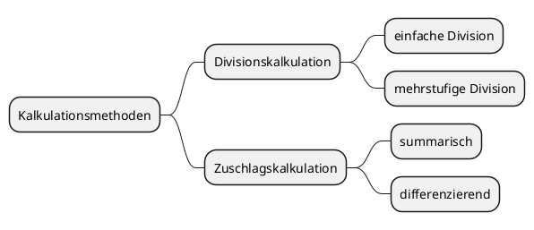

# Kosten-Leistungs-Rechnung

## 1. Kostenartenrechnung

### Leitfrage: „Welche Kosten sind in welcher Höhe angefallen?"

Die Kostenartenrechnung ist die **erste Stufe** der Kostenrechnung. Sie erfasst sämtliche in einem Unternehmen angefallenen Kosten systematisch und gliedert sie nach Art, Zurechenbarkeit und Beschäftigungsabhängigkeit.

### 1.1 Die drei Stufen der Kostenrechnung im Überblick

```plantuml
@startuml
!define RECTANGLE class

skinparam rectangle {
    BackgroundColor LightBlue
    BorderColor DarkBlue
    FontSize 12
}

rectangle "Kostenartenrechnung\n(Welche Kosten?)" as KAR
rectangle "Kostenstellenrechnung\n(Wo entstanden?)" as KSR
rectangle "Kostenträgerrechnung\n(Wofür entstanden?)" as KTR

KAR -right-> KSR
KSR -right-> KTR

@enduml
```



### 1.2 Wichtige Kostenarten im Handwerk

| Kostenart                  | Beispiele                                         |
| -------------------------- | ------------------------------------------------- |
| **Materialkosten**         | Roh-, Hilfs- und Betriebsstoffe                   |
| **Personalkosten**         | Löhne, Gehälter, Sozialabgaben                    |
| **Kalkulatorische Kosten** | Unternehmerlohn, kalk. Abschreibung, kalk. Zinsen |

---

> [!IMPORTANT]
> **Merke:**
>
> Materialkosten und Personalkosten sind **effektive Kosten** (aus der Buchführung). Kalkulatorische Kosten werden **nicht** in der Buchführung erfasst – sie müssen statistisch ermittelt werden.

---

### 1.3 Gliederung nach Zurechenbarkeit

| Begriff                | Definition                                                     | Beispiele                                         |
| ---------------------- | -------------------------------------------------------------- | ------------------------------------------------- |
| **Einzelkosten**       | Direkt einem Auftrag/Produkt zurechenbar                       | Fertigungsmaterial, Fertigungslöhne               |
| **Gemeinkosten**       | Nicht direkt zurechenbar; fallen für den Gesamtbetrieb an      | Miete, Strom, Versicherungen, Verwaltungsgehälter |
| **Sondereinzelkosten** | Direkt zurechenbar, aber keine Material- oder Lohneinzelkosten | Spezialwerkzeug für einen Auftrag                 |

### 1.4 Gliederung nach Beschäftigungsabhängigkeit

| Begriff             | Definition                                     | Beispiele                           |
| ------------------- | ---------------------------------------------- | ----------------------------------- |
| **Fixe Kosten**     | Unabhängig von der Auslastung/Produktionsmenge | Miete, Leasingrate, Grundgehälter   |
| **Variable Kosten** | Verändern sich mit der Beschäftigung           | Fertigungsmaterial, Fertigungslöhne |

---

> [!IMPORTANT]
> **Wichtige Zusammenhänge:**
>
> - Alle **Einzelkosten** sind gleichzeitig **variable Kosten**
> - Die meisten **Gemeinkosten** sind **fix**
> - Fixe Kosten sind immer auch Gemeinkosten

---

### 1.5 Wichtige Gemeinkosten im Handwerk (Auswahl)

- Hilfslöhne / Lohngemeinkosten
- Arbeitgeberbeiträge zur Sozialversicherung
- Miete, Pacht
- Strom, Gas, Wasser
- Fahrzeugkosten
- Werbekosten, Reisekosten
- Kalkulatorische Kosten (Unternehmerlohn, Abschreibungen, Zinsen)

### 1.6 Kalkulatorische Kosten – Was ist das?

Kalkulatorische Kosten sind Kosten, die **nicht oder nicht in der berechneten Höhe** in der Buchführung erscheinen, aber für eine realistische Kalkulation berücksichtigt werden müssen.

| Kalkulatorische Kostenart    | Erklärung                                                       |
| ---------------------------- | --------------------------------------------------------------- |
| **Kalk. Unternehmerlohn**    | Fiktives Gehalt des Inhabers für seine Mitarbeit                |
| **Kalk. Abschreibung**       | Abschreibung auf Basis von Wiederbeschaffungskosten             |
| **Kalk. Eigenkapitalzinsen** | Verzinsung des eingesetzten Eigenkapitals                       |
| **Kalk. Miete**              | Wenn eigene Räume genutzt werden (kein Mietaufwand in der BuFü) |

## 2. Kalkulation

### Ziel: Den richtigen Angebotspreis ermitteln

### 2.1 Überblick: Kalkulationsmethoden



### 2.2 Divisionskalkulation

**Anwendung:** Bei Serienfertigung oder einheitlichen Leistungen (z. B. Arbeitsstunden im Dienstleistungshandwerk)

**Prinzip:** Gesamtkosten werden durch die Anzahl der Leistungseinheiten geteilt.

$$\text{Stundenverrechnungssatz} = \frac{\text{Gesamtkosten (inkl. kalk. Kosten)}}{\text{verrechenbare Arbeitsstunden}}$$

**Kalkulationsschema (Divisionskalkulation):**

| Position                                        | Betrag         |
| ----------------------------------------------- | -------------- |
| Anzahl Arbeitsstunden × Stundenverrechnungssatz | = Selbstkosten |
| + Gewinn- und Wagniszuschlag (z. B. 10 %)       |                |
| = **Angebotspreis ohne USt.**                   |                |
| + 19 % Umsatzsteuer                             |                |
| = **Angebotspreis inkl. USt.**                  |                |

**Rechenbeispiel:**

- Gesamtkosten: 500.000 € + kalk. Kosten 200.000 € = 700.000 €
- Verrechenbare Stunden: 15.952 h
- Stundenverrechnungssatz: 700.000 € ÷ 15.952 h ≈ **43,88 €/h**
- Auftrag: 5 Stunden → Selbstkosten: 219,40 € → + 10 % Gewinn = 241,34 € → + 19 % USt. = **287,19 €**

### 2.3 Zuschlagskalkulation

**Anwendung:** Häufigste Methode im Handwerk! Geeignet für Produktion, Dienstleistung und Handel.

**Prinzip:** Kosten werden aufgegliedert in **Einzelkosten** (direkt zurechenbar) und **Gemeinkosten** (werden als Zuschlag verrechnet).

#### Summarische Zuschlagskalkulation (ein Zuschlagssatz):

$$\text{Gemeinkostenzuschlagssatz} = \frac{\text{Gemeinkostensumme}}{\text{Lohneinzelkosten}} \times 100$$

#### Differenzierende Zuschlagskalkulation (mehrere Zuschlagssätze):

**Kalkulationsschema:**

```
Materialeinzelkosten
+ x % Materialgemeinkosten (auf Materialeinzelkosten)
= Materialkosten

+ Lohneinzelkosten
+ x % Lohngemeinkosten (auf Lohneinzelkosten)
+ Sondereinzelkosten der Fertigung
= Herstellkosten

+ x % Verwaltungs- und Vertriebsgemeinkosten (auf Herstellkosten)
+ Sondereinzelkosten des Vertriebs
= Selbstkosten

+ x % Gewinn- und Wagniszuschlag (auf Selbstkosten)
= Angebotspreis ohne Umsatzsteuer

+ 19 % Umsatzsteuer
= Angebotspreis inkl. Umsatzsteuer
```

** Rechenbeispiel (differenzierende Zuschlagskalkulation):**

| Position                                                | Betrag         |
| ------------------------------------------------------- | -------------- |
| Materialeinzelkosten                                    | 800,00 €       |
| + 20 % Materialgemeinkosten                             | 160,00 €       |
| **= Materialkosten**                                    | **960,00 €**   |
| Lohneinzelkosten (Meister 5h × 30€ + Geselle 13h × 20€) | 410,00 €       |
| + 80 % Lohngemeinkosten                                 | 328,00 €       |
| **= Herstellkosten**                                    | **1.698,00 €** |
| + 40 % Verwaltungs-/Vertriebsgemeinkosten               | 679,20 €       |
| **= Selbstkosten**                                      | **2.377,20 €** |
| + 10 % Gewinn- und Wagniszuschlag                       | 237,72 €       |
| **= Angebotspreis ohne USt.**                           | **2.614,92 €** |
| + 19 % Umsatzsteuer                                     | 496,83 €       |
| **= Angebotspreis inkl. USt.**                          | **3.111,75 €** |

### 2.4 Arten der Kalkulation nach Zeitpunkt

| Art                     | Zeitpunkt            | Zweck                                |
| ----------------------- | -------------------- | ------------------------------------ |
| **Vorkalkulation**      | Vor dem Auftrag      | Angebotspreis ermitteln              |
| **Zwischenkalkulation** | Während des Auftrags | Kostenentwicklung überwachen         |
| **Nachkalkulation**     | Nach dem Auftrag     | Kostenkontrolle, Gewinnspanne prüfen |
| **Rückkalkulation**     | Bei Festpreisen      | Vom Marktpreis rückwärts rechnen     |

**Nachkalkulation – Gewinnspanne:**

```
Lieferpreis (ohne USt.)
– Materialeinzelkosten
– Lohneinzelkosten
– Gemeinkosten
= Gewinnspanne
```

## 3. Voll- und Teilkostenrechnung

### Kernfrage: Welche Kosten werden verrechnet?

### 3.1 Vollkostenrechnung

**Definition:** Alle anfallenden Kosten (fixe + variable) werden auf die Kostenträger verteilt.

**Einsatz:** Langfristige Preisentscheidungen, Investitionsentscheidungen

**Vorteil:** Vollständige Kostendeckung sichergestellt

**Nachteil:** Fixkosten werden auf Produkte verteilt → bei Zusatzaufträgen kann es zu Fehlentscheidungen führen

### 3.2 Teilkostenrechnung

**Definition:** Nur ein Teil der Kosten (in der Regel die **variablen Kosten** oder **Einzelkosten**) wird verrechnet. Fixkosten werden als Block behandelt.

**Einsatz:** Kurzfristige Entscheidungen (Zusatzaufträge, Preisuntergrenzen, Produktionsprogramm)

**Preisuntergrenzen:**

| Fristigkeit     | Preisuntergrenze                           |
| --------------- | ------------------------------------------ |
| **Kurzfristig** | Variable Stückkosten (Deckungsbeitrag ≥ 0) |
| **Langfristig** | Vollkosten (Selbstkosten)                  |

### 3.3 Deckungsbeitragsrechnung (als Form der Teilkostenrechnung)

**Definition:**

$$\text{Deckungsbeitrag (DB)} = \text{Umsatzerlöse} - \text{variable Kosten}$$

Der Deckungsbeitrag zeigt, wie viel vom Umsatz zur **Deckung der Fixkosten** zur Verfügung steht.

**Schema:**

```
Umsatzerlöse (Menge × Preis)
– variable Kosten
= Deckungsbeitrag (DB)
– fixe Kosten
= Gewinn / Verlust
```

**Entscheidungsregeln:**

- DB > 0 → Produkt trägt zur Fixkostendeckung bei → **kurzfristig behalten**
- DB < 0 → Produkt verursacht zusätzlichen Verlust → **aus dem Programm nehmen**
- Preis > variable Kosten → Zusatzauftrag **annehmen** (bei freien Kapazitäten)

### 3.4 Vergleich: Vollkosten vs. Teilkosten am Beispiel

**Situation:** Betrieb hat Hauptauftrag (100 Teile à 11.000 €). Zusatzauftrag: 20 Teile à 8.000 €. Gesamtkosten: 1.000.000 € (30 % variabel = 3.000 €/Stück).

|                          | Vollkostenrechnung           | Teilkostenrechnung          |
| ------------------------ | ---------------------------- | --------------------------- |
| Stückkosten              | 10.000 €                     | 3.000 € (variabel)          |
| Entscheidung             | ❌ Ablehnen (8.000 < 10.000) | ✅ Annehmen (8.000 > 3.000) |
| Gewinn mit Zusatzauftrag | 60.000 €                     | **200.000 €**               |

---

> [!IMPORTANT]
> **Merke:**
>
> Die Vollkostenrechnung hätte hier zur falschen Entscheidung geführt! Die Teilkostenrechnung zeigt: Der Zusatzauftrag erhöht den Gewinn, weil die Fixkosten bereits durch den Hauptauftrag gedeckt sind.

---

### 3.5 Produktionsprogramm-Entscheidung mit Deckungsbeiträgen

| Produkt | Menge | Preis | Variable Kosten | DB/Stück | Gesamt-DB   |
| ------- | ----- | ----- | --------------- | -------- | ----------- |
| A       | 200   | 10 €  | 3 €             | 7 €      | 1.400 €     |
| B       | 500   | 12 €  | 4 €             | 8 €      | 4.000 €     |
| C       | 100   | 6 €   | 7 €             | **-1 €** | **-100 €**  |
| D       | 700   | 15 €  | 6 €             | 9 €      | 6.300 €     |
|         |       |       | **Fixkosten**   |          | **9.700 €** |
|         |       |       | **Gewinn**      |          | **1.900 €** |

→ Nur Produkt C hat negativen DB → **nur C streichen** (nicht C + D!)

## 4. Gewinnschwelle – graphisch und rechnerisch

### Auch bekannt als: Break-even-Point

### 4.1 Definition

Die **Gewinnschwelle (Break-even-Point)** ist die Absatzmenge, bei der:

- Gesamterlöse = Gesamtkosten (kein Gewinn, kein Verlust)
- Deckungsbeitrag = Fixkosten

### 4.2 Rechnerische Ermittlung

$$\text{Gewinnschwelle (Menge)} = \frac{\text{Fixkosten}}{\text{Stückdeckungsbeitrag}}$$

$$\text{Stückdeckungsbeitrag} = \text{Verkaufspreis/Stück} - \text{variable Kosten/Stück}$$

**Rechenbeispiel:**

- Verkaufspreis: 11.000 €/Stück
- Variable Kosten: 3.000 €/Stück
- Fixkosten gesamt: 700.000 €

$$\text{Stückdeckungsbeitrag} = 11.000 - 3.000 = 8.000 \text{ €/Stück}$$

$$\text{Gewinnschwelle} = \frac{700.000}{8.000} = 87{,}5 \text{ Stück}$$

→ Ab **88 Stück** erzielt der Betrieb Gewinn.

### 4.3 Graphische Ermittlung

```
Kosten/Erlöse (€)
│                              /  ← Erlösfunktion (Preis × Menge)
│                           /
│                        /  ← GEWINN
│                     ✦ ← Break-even-Point (Gewinnschwelle)
│                  /  \
│               /      \
│            /    VERLUST
│         /
│      /  ← Gesamtkostenfunktion (Fixkosten + variable Kosten)
│   /
│ ─────────────────────────── ← Fixkosten (horizontal)
│
└─────────────────────────────────── Menge (Stück)
```

**So zeichnen Sie das Diagramm:**

1. **Fixkostengerade:** Horizontale Linie auf Höhe der Fixkosten (z. B. 700.000 €)
2. **Gesamtkostenfunktion:** Startet bei den Fixkosten, steigt mit den variablen Kosten
   - Punkt 1: (0 | Fixkosten)
   - Punkt 2: (aktuelle Menge | Gesamtkosten)
3. **Erlösfunktion:** Startet im Ursprung (0|0), steigt mit dem Preis
   - Punkt 2: (beliebige Menge | Menge × Preis)
4. **Schnittpunkt** von Erlös- und Gesamtkostenfunktion = **Break-even-Point**

### 4.4 Aussagen der Gewinnschwellenanalyse

| Bereich                | Bedeutung                                                             |
| ---------------------- | --------------------------------------------------------------------- |
| Menge < Gewinnschwelle | **Verlustzone** – Deckungsbeiträge reichen nicht zur Fixkostendeckung |
| Menge = Gewinnschwelle | **Gewinnschwelle** – Kosten = Erlöse, kein Gewinn/Verlust             |
| Menge > Gewinnschwelle | **Gewinnzone** – jede weitere Einheit bringt Gewinn                   |

---

> [!TIP]
> **Prüfungstipp:** Die Gewinnschwelle ist erreicht, wenn:
>
> - die Summe der Deckungsbeiträge den fixen Kosten entspricht **ODER**
> - die Summe aus fixen und variablen Kosten dem Umsatzerlös entspricht

---

## 5. Kennzahlenberechnung und Bewertung

### Kennzahlen = verdichtete Informationen zur Unternehmensanalyse

Kennzahlen sind absolute oder relative Größen, die einen Sachverhalt in verdichteter Form wiedergeben. Sie sind das wichtigste Instrument zur Jahresabschlussanalyse und dienen dem **innerbetrieblichen** (Zeitvergleich) und **zwischenbetrieblichen** (Branchenvergleich) Vergleich.

### 5.1 Kennzahlen zur Rentabilität

#### Umsatzrentabilität

$$\text{Umsatzrentabilität} = \frac{\text{Gewinn pro Jahr}}{\text{Umsatzerlöse}} \times 100 = \ldots \%$$

> Zeigt, wie viel Gewinn je Euro Umsatz erzielt wird. Stark branchenabhängig (Einzelhandel < 1 %, Dienstleistung > 10 %).

#### Eigenkapitalrentabilität

$$\text{Eigenkapitalrentabilität} = \frac{\text{Gewinn pro Jahr}}{\text{Eigenkapital}} \times 100 = \ldots \%$$

> Gibt an, wie hoch sich das Eigenkapital im Betrieb verzinst. Sollte deutlich über risikolosen Anlagen liegen.

#### Gesamtkapitalrentabilität

$$\text{Gesamtkapitalrentabilität} = \frac{\text{Gewinn + Fremdkapitalzinsen}}{\text{Gesamtkapital}} \times 100 = \ldots \%$$

> Unabhängig von der Finanzierungsstruktur – daher gut für Vergleiche geeignet.

### 5.2 Kennzahlen zur Kostenstruktur

#### Lohnintensität

$$\text{Lohnintensität} = \frac{\text{Personalaufwand}}{\text{Betriebsleistung}} \times 100 = \ldots \%$$

> Gibt den Anteil der Personalkosten am Umsatz an. Hohe Lohnintensität = personalintensiver Betrieb.

#### Materialintensität (Materialaufwandsquote)

$$\text{Materialintensität} = \frac{\text{Materialaufwand}}{\text{Betriebsleistung}} \times 100 = \ldots \%$$

> Liegt der Wert deutlich über dem Branchendurchschnitt, sollten Einsparpotenziale geprüft werden.

#### Verwaltungskostenquote

$$\text{Verwaltungskosten} = \frac{\text{Verwaltungskosten}}{\text{Betriebsleistung}} \times 100 = \ldots \%$$

> Informiert über Über- oder Unterorganisation im Verwaltungsbereich.

### 5.3 Kennzahlen zur Liquidität

| Kennzahl                       | Formel                                                                | Richtwert                                 |
| ------------------------------ | --------------------------------------------------------------------- | ----------------------------------------- |
| **Liquidität I** (1. Grades)   | Zahlungsmittel ÷ kurzfristige Verbindlichkeiten × 100                 | Werte unter 100 % nicht zwingend kritisch |
| **Liquidität II** (2. Grades)  | (Zahlungsmittel + Forderungen) ÷ kurzfristige Verbindlichkeiten × 100 | Sollte nahe 100 % liegen                  |
| **Liquidität III** (3. Grades) | Umlaufvermögen ÷ kurzfristige Verbindlichkeiten × 100                 | Sollte über 100 % liegen                  |

---

> [!IMPORTANT]
> Liquidität III < 100 % = Liquidität in jedem Fall unzureichend!

---

### 5.4 Weitere wichtige Kennzahlen

#### Anlagenintensität

$$\text{Anlagenintensität} = \frac{\text{Anlagevermögen}}{\text{Gesamtvermögen (Bilanzsumme)}} \times 100 = \ldots \%$$

#### Lagerumschlagshäufigkeit

$$\text{Lagerumschlagshäufigkeit} = \frac{\text{Materialaufwand}}{\text{Materialbestand}}$$

#### Lagerdauer

$$\text{Lagerdauer} = \frac{\text{Materialbestand} \times 360}{\text{Materialaufwand}} = \ldots \text{ Tage}$$

### 5.5 Bewertung von Kennzahlen – Vergleichsmöglichkeiten

| Vergleichsart          | Beschreibung                                            |
| ---------------------- | ------------------------------------------------------- |
| **Zeitvergleich**      | Vergleich mit eigenen Vorjahreswerten → Trends erkennen |
| **Branchenvergleich**  | Vergleich mit ähnlichen Betrieben der gleichen Branche  |
| **Soll-Ist-Vergleich** | Vergleich mit selbst gesetzten Zielwerten               |

---

> [!IMPORTANT]
> **Merke:** Einzelne Kennzahlen haben nur begrenzte Aussagekraft. Erst im Vergleich (Branche, Vorjahr) werden Stärken und Schwächen sichtbar!

---

## 📝 Schnellübersicht: Wichtige Formeln auf einen Blick

| Formel                          | Berechnung                                                            |
| ------------------------------- | --------------------------------------------------------------------- |
| Stundenverrechnungssatz         | Gesamtkosten ÷ verrechenbare Stunden                                  |
| Gemeinkostenzuschlag (auf Lohn) | Gemeinkostensumme ÷ Lohneinzelkosten × 100                            |
| Deckungsbeitrag                 | Umsatzerlöse − variable Kosten                                        |
| Gewinnschwelle                  | Fixkosten ÷ Stückdeckungsbeitrag                                      |
| Stückdeckungsbeitrag            | Verkaufspreis − variable Kosten/Stück                                 |
| Umsatzrentabilität              | Gewinn ÷ Umsatz × 100                                                 |
| Eigenkapitalrentabilität        | Gewinn ÷ Eigenkapital × 100                                           |
| Lohnintensität                  | Personalaufwand ÷ Betriebsleistung × 100                              |
| Materialintensität              | Materialaufwand ÷ Betriebsleistung × 100                              |
| Liquidität I                    | Zahlungsmittel ÷ kurzfristige Verbindlichkeiten × 100                 |
| Liquidität II                   | (Zahlungsmittel + Forderungen) ÷ kurzfristige Verbindlichkeiten × 100 |
| Liquidität III                  | Umlaufvermögen ÷ kurzfristige Verbindlichkeiten × 100                 |
