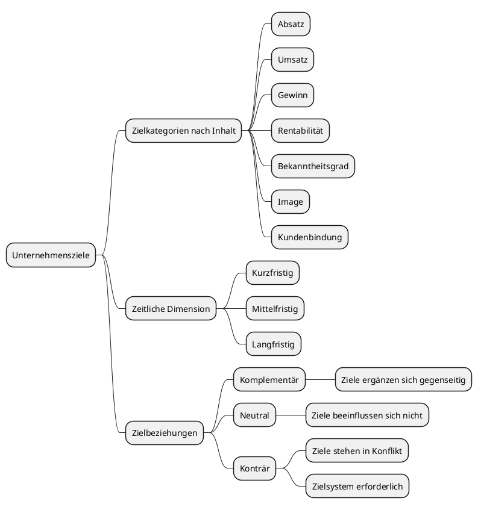

# Marketing

## 1. Unternehmensziele

---

> [!IMPORTANT]
> **Wichtig:** Ziele sind durch menschliches Handeln angestrebte zukünftige Zustände. Sie sind ein Maßstab, der es ermöglicht, Arbeitsergebnisse zu bewerten und geben die Richtung vor, in die sich ein Unternehmen entwickeln soll.

---

**Wichtige Zielkategorien nach Inhalt:** Absatz, Umsatz, Gewinn, Rentabilität, Bekanntheitsgrad, Image, Kundenbindung.

Nach der zeitlichen Dimension unterscheidet man kurzfristige, mittelfristige und langfristige Ziele.

**Zielbeziehungen:** Ziele können sich gegenseitig ergänzen (_komplementär_), neutral sein oder in Konflikt stehen (_konträr_). Deshalb ist ein Zielsystem notwendig, das die Beziehungen der einzelnen Ziele schriftlich dokumentiert.

**Beispiel eines Zielsystems:** Einkommensquelle sichern → Gewinn erhöhen / Fortbestand sichern → Umsatz erhöhen → Kundenbindung / Neukunden gewinnen → Qualität verbessern / Service erhöhen / Marketing intensivieren.

## 2. Planungsbereiche

Die Unternehmensplanung umfasst sechs wichtigste Bereiche, die aufeinander abgestimmt werden müssen:

- **Beschaffung:** Material, Maschinen, Gebäude, Informationen
- **Produktion:** Mengen, Zeiten, Verfahren
- **Absatz:** Sortiment, Preise, Marktauftritt, Mengen
- **Finanzen:** Kapitalbedarf, Kapitalstruktur, Liquidität
- **Investitionen:** Wirtschaftlichkeit, Rentabilität
- **Personal:** Anzahl, Arbeitszeiten, Entlohnung

Die Abstimmung der Planungsbereiche erfolgt durch eine vernetzte Planung, bei der alle Bereiche auf die übergeordneten Unternehmensziele ausgerichtet werden.

## 3. Planungsphasen

Die Unternehmensplanung sollte nach einem festen Schema ablaufen und schriftlich dokumentiert werden. Die sechs Phasen sind:

1. **Zielformulierung:** Was soll erreicht werden? Prüfung der Realisierbarkeit und möglicher Zielkonflikte.
2. **Problemstellung:** Das zu lösende Problem klar analysieren und in Teilprobleme aufgliedern.
3. **Alternativensuche:** Mögliche Lösungswege ermitteln.
4. **Prognose der Auswirkungen:** Konsequenzen der einzelnen Alternativen abschätzen.
5. **Bewertung der Alternativen:** Die Alternativen nach den Unternehmenszielen beurteilen.
6. **Entscheidung:** Die beste Alternative auswählen und umsetzen.

Außerdem unterscheidet man nach dem Planungshorizont: operative Planung (bis 1 Jahr, konkret und detailliert) und strategische Planung (länger als 1 Jahr, qualitativ ausgerichtet, Handlungsziele).

## 4. Absatzgebiete im Handwerk

Handwerksbetriebe sind in der Regel in einem regional begrenzten Markt tätig, der sich auf einen bestimmten Radius um den Betriebsstandort eingrenzen lässt. Faktoren wie Siedlungsdichte und Verkehrserschließung spielen dabei eine wichtige Rolle.

Zunehmend erschließen Betriebe auch Möglichkeiten von Onlineshops und Onlineplattformen, die keine strengen regionalen Grenzen kennen. Allerdings eignen sich nicht alle Handwerksleistungen dafür, insbesondere wenn Serviceleistungen wie Kundendienst, Wartung und Reparatur damit verbunden sind.

## 5. Absatzmöglichkeiten – Wovon hängen diese ab?

Die Absatzmöglichkeiten hängen insbesondere von folgenden Faktoren ab (Absatzmarktbeurteilung):

Bewertung der allgemeinen Marktsituation (volkswirtschaftliche Einflussgrößen): Entwicklung der Inflationsrate, Zinsniveaus, private und staatliche Konsumausgaben, Investitionsneigung, Wechselkurse.

- **Spezielle Absatzpotenziale:** Verbrauchergewohnheiten in einer Region.
- **Kaufkraftentwicklung im Absatzgebiet:** Einkommensstruktur der Bevölkerung.
- **Ermittlung des Marktvolumens in einer Region:** Veränderung der Einwohnerzahl, Umsatz pro Kopf der Bevölkerung.
- **Marktbestimmungsfaktor:** Anzahl der Kunden pro Einwohnerzahl (Marktbesetzungsfaktor).
- **Konkurrenzsituation:** Dichte, Stärken und Schwächen der Konkurrenz.

## 6. Absatzmarktbeurteilung

Eine gründliche Marktanalyse sowie eine genaue Prüfung aller Fakten für die Beurteilung der Absatzgebiete und Absatzmöglichkeiten sind wichtige Voraussetzungen für eine erfolgreiche Gründung und die weitere Zukunftsentwicklung eines Handwerksbetriebes.

Die Marktanalyse bezieht sich auf: mögliche Zielgruppen bzw. Kunden, die Wettbewerbssituation hinsichtlich Produkten und Dienstleistungen sowie deren Anbietern, die Zukunftsperspektiven am Markt und die bestimmenden Vertriebswege.

Informationsquellen: Konjunkturberichte der Handwerkskammern, Branchenstatistiken, Betriebsvergleiche von Fachverbänden, Kundendaten, eigene Recherche.

## 7. Standortfaktoren

Von der richtigen Standortwahl hängt in den meisten Handwerkszweigen der langfristige wirtschaftliche Erfolg ab. Man unterscheidet drei Kategorien:

**Beschaffungsbezogene Faktoren:** Grundstücke, Gewerbeflächenangebot, Betriebseinrichtung, Arbeitskräfte, finanzielle Mittel, Material- und Rohstoffbeschaffung, Energieversorgung, Breitbandversorgung.

**Produktionsbezogene Faktoren:** soziale und politische Rahmenbedingungen, geologische und ökologische Rahmenbedingungen, technologische Bedingungen.

**Absatzorientierte Faktoren:** Kundennähe, Kaufkraft der Kunden, Kundenpotenzial, Verbrauchergewohnheiten, Absatzkonkurrenz, Vertriebswege, Verkehrsverbindungen (Parkmöglichkeiten, öffentliche Anbindung, Ladestationen).

Dazu kommen "weiche" Standortfaktoren wie persönliche, freizeitbezogene und kulturelle Angebote an einem Ort.

## 8. Unternehmensleitbild und Leitsätze (Unternehmenskultur)

---

> [!IMPORTANT]
> **Merke:** Unternehmenskultur ist die Gesamtheit von Traditionen, Werten, Regeln, Glaubenssätzen und Haltungen, die den Rahmen für alles bilden, was in einem Unternehmen gedacht oder getan wird. Sie beeinflusst das Unternehmensimage entscheidend.

---

Das Unternehmensleitbild ist eine schriftliche Beschreibung des unternehmerischen Selbstverständnisses, basierend auf strategischen Grundsätzen, Zielen, Wertvorstellungen und zentralen Verhaltensregeln.

Es beantwortet: Wer bin ich (**Mission**)? Was will ich erreichen (**Vision**)? Wie will ich es erreichen (**Werte**)?

Die vier Gestaltungselemente der Unternehmenskultur sind:

1. **Symbole** (z.B. Logo, Meisterstatus, Zertifikate)
2. **Rituale** (z.B. Weihnachtsfeier, Betriebsausflug)
3. **Normen** (Unternehmensgrundsätze, Verhaltensregeln)
4. **Werte** (z.B. Umweltschutz, Nachhaltigkeit, soziales Engagement).

Unternehmensgrundsätze legen gewünschtes Verhalten von Mitarbeitern fest und richten das Handeln der gesamten Belegschaft einheitlich aus, sodass ein einheitliches Gesamtbild (Image) entsteht.

## 9. Befragungsmöglichkeiten – Vorteile und Nachteile

Die Befragung gilt als die wichtigste Methode der Informationsbeschaffung im Marketing. Es gibt vier gebräuchliche Wege:

#### Schriftliche Befragung

- **Vorteile:** gute Repräsentativität, Möglichkeit komplexerer Fragen, vorformulierte Antworten möglich.
- **Nachteile:** teurere und aufwendige Methode, geringe Rücklaufquote.

#### Passantenbefragung (mündlich)

- **Vorteile:** relativ kostengünstig, Möglichkeit genauer Nachfragen.
- **Nachteile:** geringe Repräsentativität, Anwendung von Antwortalternativen schwierig.

#### Telefonische Befragung:

- **Vorteile:** relativ geringer Zeitaufwand, hohe Repräsentativität.
- **Nachteile:** Interviews werden häufig abgebrochen, Antwortalternativen schwierig anzuwenden.

#### Onlinebefragung:

- **Vorteile:** schnelle Umsetzung, geringe Kosten, Daten und Auswertungen zeitnah verfügbar.
- **Nachteile:** geringe Repräsentativität, Abbruch leicht möglich, technische Voraussetzungen notwendig.

---

> [!TIP]
> **Tipp:** In der Praxis ist oft eine telefonisch unterstützte Onlinebefragung der geeignetste Weg im Handwerk.

---

## 10. Stärkung der Kundenorientierung

Kundenorientierung ist die Ausrichtung aller marktrelevanten Maßnahmen an den Wünschen, Bedürfnissen und Problemen des Kunden. Sie ist eine zentrale Aufgabe der Betriebsführung.

**Wichtige Leitsätze der Kundenorientierung:**

- Mit Kompetenz überzeugen
- Mit Information, Beratung und Leistung Kunden binden
- Mit Kulanz Kunden behalten
- Mit Geschick verlorene Kunden zurückgewinnen

**Konkrete Maßnahmen zur Stärkung der Kundenorientierung:**

- sauber, gepflegt und freundlich auftreten
- Kunden mit Namen begrüßen
- ausführlich beraten
- ständige Erreichbarkeit sicherstellen (Anrufbeantworter, Mobilfunk, E-Mail)
- Reklamationen nachgehen und fehlerhafte Arbeit ausbessern
- Kundendatei anlegen und Kundenpflege betreiben
- offensive Öffentlichkeitsarbeit (Tag der offenen Tür, Pressemeldungen)
- Kostenvoranschläge sorgfältig erstellen und einhalten

Voraussetzung: Ein kundenorientiertes Personalmanagement, bei dem alle Mitarbeiter das Programm mittragen und im Alltag praktizieren.

## 11. Stärken-Schwächen-Analyse und SWOT-Analyse

Die Stärken-Schwächen-Analyse (interne Unternehmensanalyse) ermittelt, wo das eigene Unternehmen besser oder schlechter als die Konkurrenz ist. Beurteilungsbereiche: Beschaffung, Produktion, Absatz, Unternehmensführung, Personal, Finanzen, Rechnungswesen, Strukturfaktoren (Standort, Marktposition, Erfolgssituation).

**Ergebnis:** Die Stärken weiter ausbauen und Schwächen reduzieren.

Die SWOT-Analyse verbindet die interne Stärken-Schwächen-Analyse mit der externen Chancen-Risiken-Analyse (Umfeldanalyse):

**S** = Strengths (Stärken), **W** = Weaknesses (Schwächen), **O** = Opportunities (Chancen), **T** = Threats (Risiken/Bedrohungen)

Daraus ergeben sich vier Strategien:

1. **SO-Strategie:** Stärken nutzen, um Chancen zu nutzen.
2. **ST-Strategie:** Stärken einsetzen, um Risiken zu minimieren.
3. **WO-Strategie:** Schwächen abbauen, um Chancen zu nutzen.
4. **WT-Strategie:** Schwächen abbauen, um Risiken vorzubeugen.

### Praxisbeispiel: „Bäckerei“

**Ziel:** Positionierung im Markt und Ausbau der Kundenbindung gegenüber Großbäckereien und Supermärkten.

| Bereich                                                                         | Beschreibung                                                                                                                                                                                      |
| ------------------------------------------------------------------------------- | ------------------------------------------------------------------------------------------------------------------------------------------------------------------------------------------------- |
| **Strengths** (Stärken) (Intern: Was können wir besonders gut?)             | • Eigener Sauerteig und traditionelle, handwerkliche Backkunst • Hohe Qualität und regionale Bio-Zutaten • Stammkundschaft und hohes Vertrauen vor Ort                                    |
| **Weaknesses** (Schwächen) (Intern: Wo gibt es Verbesserungsbedarf?)        | • Hohe Produktionskosten (Preise liegen über denen von Supermärkten) • Begrenzte Produktionskapazität und beengte Räumlichkeiten • Kaum Online-Präsenz oder digitale Bestellmöglichkeiten |
| **Opportunities** (Chancen) (Extern: Welche Markttrends können wir nutzen?) | • Wachsende Nachfrage nach regionalen und klimafreundlichen Lebensmitteln • Trend zu Click & Collect (Online bestellen, vor Ort abholen) • Kooperationen mit lokalen Bio-Höfen            |
| **Threats** (Risiken) (Extern: Was gefährdet unser Geschäft?)               | • Steigende Energiekosten und Rohstoffpreise • Preiskampf durch Discounter und Billig-Bio-Ketten • Fachkräftemangel im Bäckerhandwerk                                                     |

### Ableitung der Strategien (Kombination der Faktoren)

Aus dieser Matrix werden konkrete Maßnahmen abgeleitet:

1. **Stärken-Chancen-Strategie:** Die hohe Qualität und regionale Herkunft nutzen, um die wachsende Nachfrage nach nachhaltigen Lebensmitteln zu bedienen (z.B. Marketing-Kampagne „Aus der Region – für die Region“).
2. **Schwächen-Chancen-Strategie:** Die Einführung eines Click-&-Collect-Systems, um trotz begrenzter Ladenfläche effizienter zu verkaufen und neue, jüngere Zielgruppen anzusprechen.
3. **Stärken-Risiken-Strategie:** Die eigenen Stärken (Qualität, Tradition) in den Vordergrund stellen, um Preiserhöhungen für den Kunden transparent und rechtfertigbar zu machen (Kundenbindung gegen Discounter).
4. **Schwächen-Risiken-Strategie:** Effizienzsteigerung in der Backstube, um den steigenden Energie- und Rohstoffkosten entgegenzuwirken und den Margenverlust aufzufangen.

## 12. Ziele der Werbung und Werbemittel

---

> [!IMPORTANT]
> **Ziele der Werbung:** Absatzsicherung, Absatzsteigerung, Produkteinführung, Marktanteilserweiterung, Bedarfsdeckung, Steuerung des Bekanntheitsgrades des Betriebes, Zielgruppenansprache.

---

### Arten der Werbung

**Nach Adressat:** direkte Werbung (persönliche Ansprache des Endverbrauchers) und indirekte Werbung (verkaufsfördernde Maßnahmen gegenüber Händlern).

**Nach Träger:** Einzelwerbung, Gemeinschaftswerbung, Verbundwerbung (mehrere Unternehmen verschiedener Wirtschaftsstufen), Sammelwerbung (z.B. alle Handwerker in einem Wohngebiet).

**Nach Objekt:** Produktwerbung (stellt ein bestimmtes Produkt in den Vordergrund) und Unternehmenswerbung (bezieht sich auf den Betrieb und seine Leistungsfähigkeit).

**Wichtige Werbemittel:**

- Beschriftung der Firmenfahrzeuge
- Firmenzeichen/Logo
- Briefpapier und E-Mail-Signatur
- Außenwerbung am Betriebsgebäude
- Baustellenschilder
- Schaufenstergestaltung
- Leuchtreklame
- Homepage und Suchmaschinenoptimierung
- Onlineshops
- Bewertungsportale
- lokale Rundfunk- und Fernsehsender
- Newsletter

---

> [!IMPORTANT]
> **Anforderungen an Werbung:** Grundsätze von Wahrheit und Klarheit einhalten, rechtliche Aspekte beachten (UWG, DSGVO, Datenschutzhinweise, Impressumspflicht).

---

## 13. Marketinginstrumente (Marketing-Mix)

Die vier Marketinginstrumente (die "4 P") werden nicht isoliert, sondern kombiniert als Marketing-Mix eingesetzt:

1. **Produkt- und Sortimentspolitik (Product):** Aufgabe ist es, ein an den Bedürfnissen der Nachfrage orientiertes Angebot zu erstellen. Das Leistungsprogramm umfasst Haupt- und Nebenleistungen sowie Kundendienstleistungen (Reparatur, Ersatzteilversorgung, Finanzierungsvermittlung, Lieferservice). Das Produkt- und Leistungsprogramm ist immer aktuell den Marktbedingungen anzupassen.
2. **Preis- und Konditionenpolitik (Price):** Bestimmungsfaktoren sind Kostenrechnung/Kalkulation, Nachfrage und Wettbewerbssituation. In der Einführungsphase sollte ein vernünftiger Kompromiss zwischen kostenorientierter, nachfrageorientierter und wettbewerbsorientierter Preisbildung gefunden werden.
3. **Kommunikations- und Werbepolitik (Promotion):** Umfasst alle Entscheidungen zur Gestaltung und Übermittlung von Informationen an Kunden oder potenzielle Kunden. Beinhaltet Werbung, Verkaufsförderung (Salespromotion) und Öffentlichkeitsarbeit (Public Relations). Öffentlichkeitsarbeit dient nicht der unmittelbaren Umsatzsteigerung, sondern dem Aufbau eines positiven Images.
4. **Vertriebspolitik (Place):** Entscheidung über direkten Vertrieb, indirekten Vertrieb oder Onlinevertrieb. Besondere Vertriebsform ist das Franchising (einheitliches Marketingkonzept, Vertrag zwischen Franchisegeber und Franchisenehmer). Zu einer erfolgreichen Vertriebsorganisation gehört geschultes Personal für die Fachberatung.
